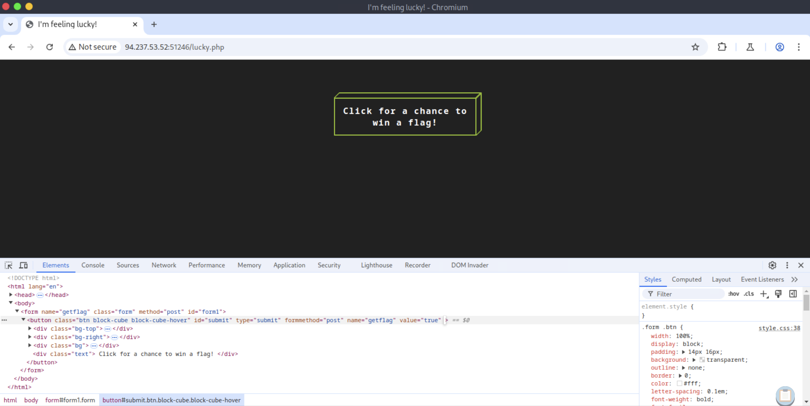
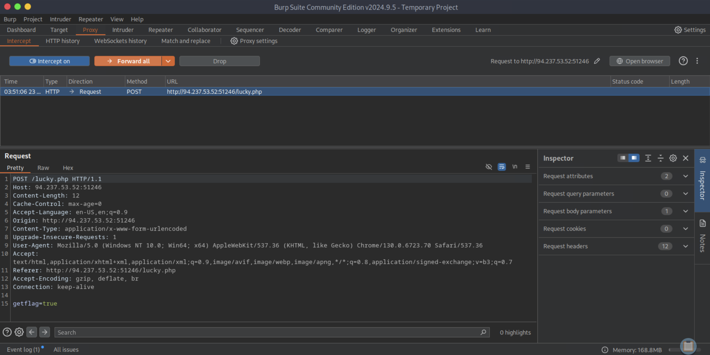
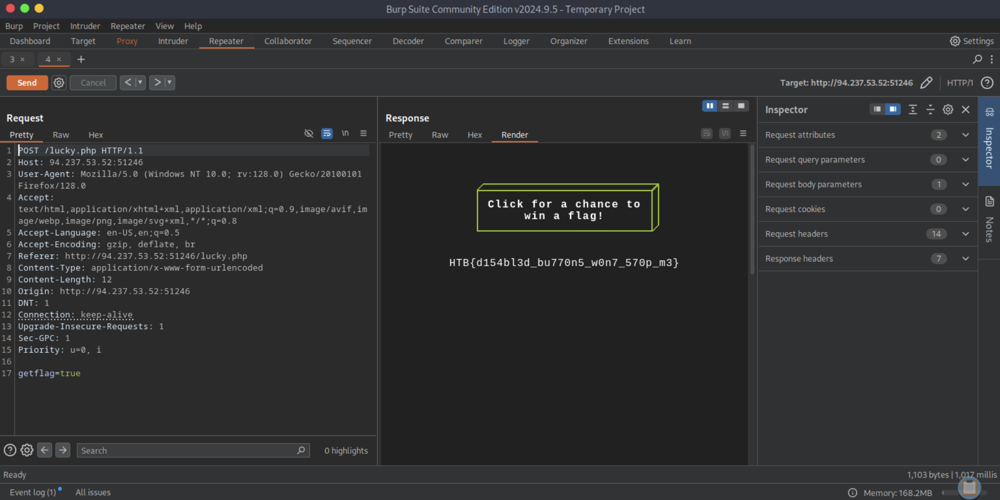
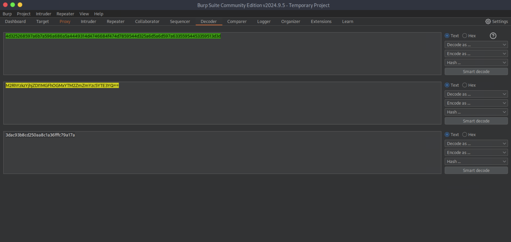
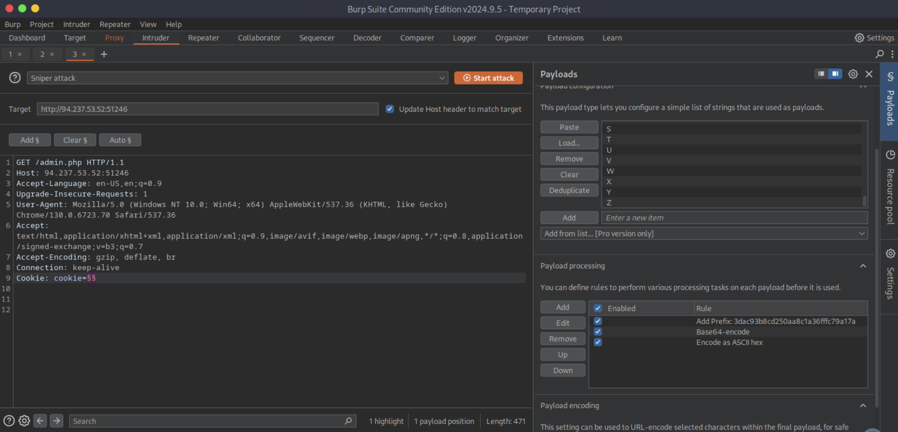
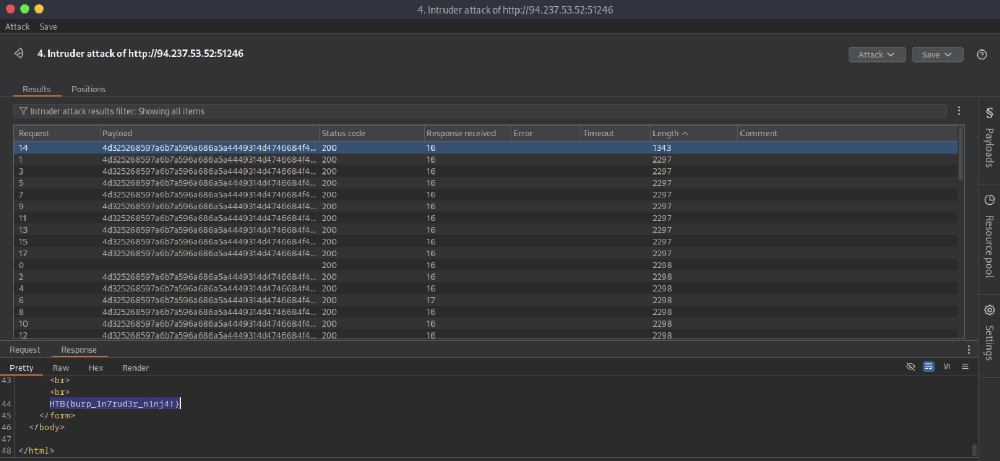
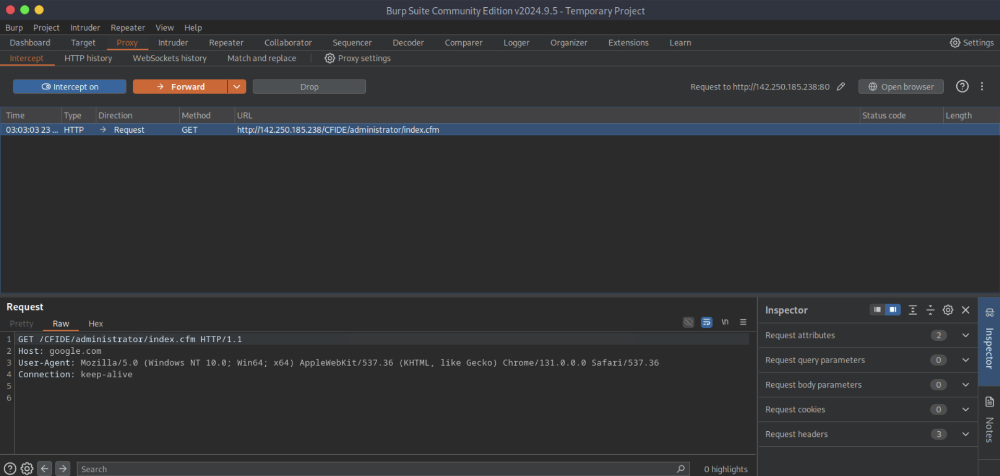

# [Using Web Proxies](https://academy.hackthebox.com/module/details/110)

## Skills Assessment

We are performing internal penetration testing for a local company. As you come across their internal web applications, you are presented with different situations where Burp/ZAP may be helpful. Read each of the scenarios in the questions below, and determine the features that would be the most useful for each case. Then, use it to help you in reaching the specified goal.

### Questions

#### Question #01

**Question**

The `/lucky.php` page has a button that appears to be disabled. Try to enable the button, and then click it to get the flag.

```
┌─[eu-academy-1]─[10.10.14.99]─[htb-ac-1461567@htb-xoqqgu02eb]─[~]
└──╼ [★]$ whatweb http://94.237.53.52:51246/

http://94.237.53.52:51246/ [200 OK] Apache[2.4.41], Country[FINLAND][FI], HTTPServer[Ubuntu Linux][Apache/2.4.41 (Ubuntu)], IP[94.237.53.52]
```

```
┌─[eu-academy-1]─[10.10.14.99]─[htb-ac-1461567@htb-xoqqgu02eb]─[~]
└──╼ [★]$ curl http://94.237.53.52:51246/lucky.php

[SNIP]

<body>
    <form name='getflag' class='form' method='post' id='form1'>
        <button class='btn block-cube block-cube-hover' id='submit' type='submit' formmethod='post' name='getflag' value='true' disabled>
            <div class='bg-top'>
                <div class='bg-inner'></div>
            </div>
            <div class='bg-right'>
                <div class='bg-inner'></div>
            </div>
            <div class='bg'>
                <div class='bg-inner'></div>
            </div>
            <div class='text'>
                Click for a chance to win a flag!
            </div>
        </button>
    </form>
</body>

[SNIP]
```







**Answer**

```
HTB{d154bl3d_bu770n5_w0n7_570p_m3}
```

#### Question #02

**Question**

The `/admin.php` page uses a cookie that has been encoded multiple times. Try to decode the cookie until you get a value with 31-characters. Submit the value as the answer.

```
┌─[eu-academy-1]─[10.10.14.99]─[htb-ac-1461567@htb-xoqqgu02eb]─[~]
└──╼ [★]$ curl -I http://94.237.53.52:51246/admin.php

HTTP/1.1 200 OK
Date: Fri, 23 May 2025 07:53:29 GMT
Server: Apache/2.4.41 (Ubuntu)
Set-Cookie: PHPSESSID=4pdltc0177g0l3s8ec9qfrealr; path=/
Expires: Thu, 19 Nov 1981 08:52:00 GMT
Cache-Control: no-store, no-cache, must-revalidate
Pragma: no-cache
Set-Cookie: cookie=4d325268597a6b7a596a686a5a4449314d4746684f474d7859544d325a6d5a6d597a63355954453359513d3d
Content-Type: text/html; charset=UTF-8
```



**Answer**

```
3dac93b8cd250aa8c1a36fffc79a17a
```

#### Question #03

**Question**

Once you decode the cookie, you will notice that it is only 31 characters long, which appears to be an md5 hash missing its last character. So, try to fuzz the last character of the decoded md5 cookie with all alpha-numeric characters, while encoding each request with the encoding methods you identified above. (You may use the `alphanum-case.txt` wordlist from SecLists for the payload)

```
┌─[eu-academy-1]─[10.10.14.99]─[htb-ac-1461567@htb-xoqqgu02eb]─[~]
└──╼ [★]$ locate alphanum-case.txt

/usr/share/seclists/Fuzzing/alphanum-case.txt
```





**Answer**

```
HTB{burp_1n7rud3r_n1nj4!}
```

#### Question #04

**Question**

You are using the `auxiliary/scanner/http/coldfusion_locale_traversal` tool within Metasploit, but it is not working properly for you. You decide to capture the request sent by Metasploit so you can manually verify it and repeat it. Once you capture the request, what is the `XXXXX` directory being called in `/XXXXX/administrator/...`?

```
┌─[eu-academy-1]─[10.10.14.99]─[htb-ac-1461567@htb-xoqqgu02eb]─[~]
└──╼ [★]$ msfconsole -q

[msf](Jobs:0 Agents:0) >> use auxiliary/scanner/http/coldfusion_locale_traversal
[msf](Jobs:0 Agents:0) auxiliary(scanner/http/coldfusion_locale_traversal) >> set RHOSTS google.com
RHOSTS => google.com
[msf](Jobs:0 Agents:0) auxiliary(scanner/http/coldfusion_locale_traversal) >> set RPORT 80
RPORT => 80
[msf](Jobs:0 Agents:0) auxiliary(scanner/http/coldfusion_locale_traversal) >> set PROXIES HTTP:127.0.0.1:8080
PROXIES => HTTP:127.0.0.1:8080
[msf](Jobs:0 Agents:0) auxiliary(scanner/http/coldfusion_locale_traversal) >> run
```



**Answer**

```
CFIDE
```

---
---