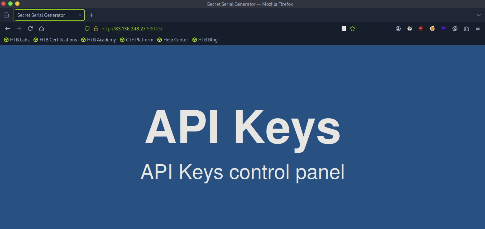
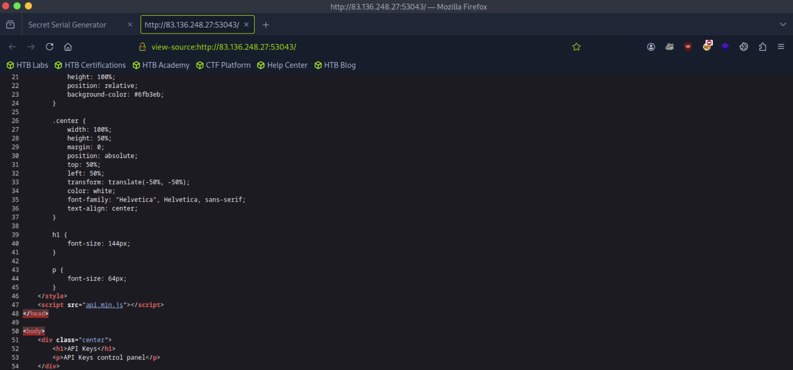
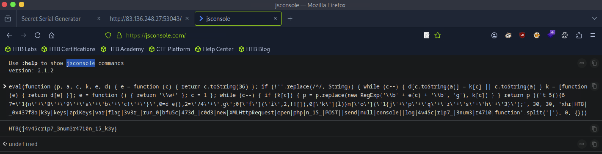
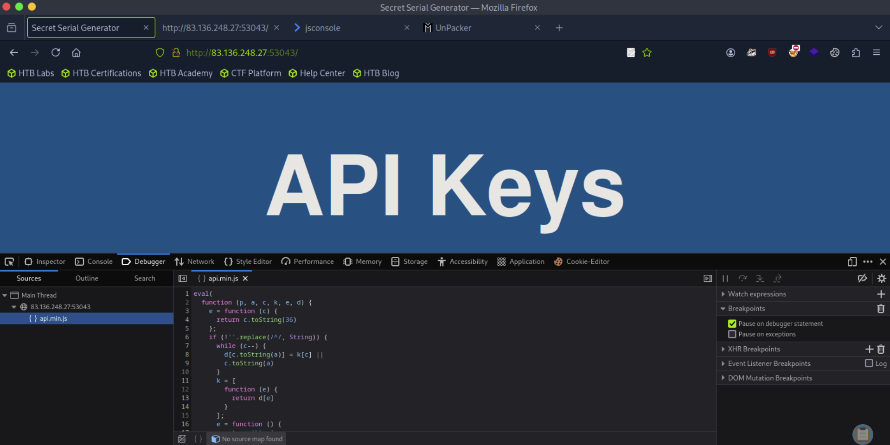
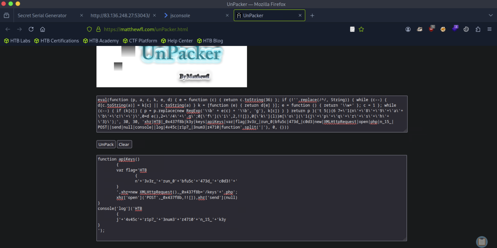
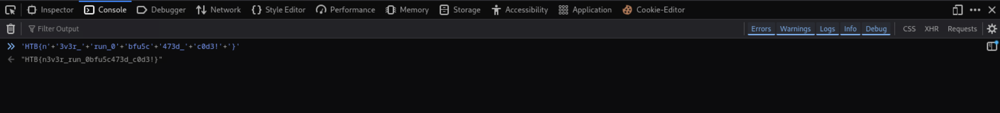

# [JavaScript Deobfuscation](https://academy.hackthebox.com/module/details/41)

## Skills Assessment

During our Penetration Test, we came across a web server that contains JavaScript and APIs. We need to determine their functionality to understand how it can negatively affect our customer.

Find a way to hijack an admin's session. Once you do that, answer the two questions below.

### Questions

#### Question #01

**Question**

Try to study the HTML code of the webpage, and identify used JavaScript code within it. What is the name of the JavaScript file being used?





**Answer**

```
api.min.js
```

#### Question #02

**Question**

Once you find the JavaScript code, try to run it to see if it does any interesting functions. Did you get something in return?

```
┌─[eu-academy-1]─[10.10.15.8]─[htb-ac-1461567@htb-tnfxobdbh4]─[~]
└──╼ [★]$ curl http://83.136.248.27:53043/api.min.js

eval(function (p, a, c, k, e, d) { e = function (c) { return c.toString(36) }; if (!''.replace(/^/, String)) { while (c--) { d[c.toString(a)] = k[c] || c.toString(a) } k = [function (e) { return d[e] }]; e = function () { return '\\w+' }; c = 1 }; while (c--) { if (k[c]) { p = p.replace(new RegExp('\\b' + e(c) + '\\b', 'g'), k[c]) } } return p }('t 5(){6 7=\'1{n\'+\'8\'+\'9\'+\'a\'+\'b\'+\'c!\'+\'}\',0=d e(),2=\'/4\'+\'.g\';0[\'f\'](\'i\',2,!![]),0[\'k\'](l)}m[\'o\'](\'1{j\'+\'p\'+\'q\'+\'r\'+\'s\'+\'h\'+\'3}\');', 30, 30, 'xhr|HTB|_0x437f8b|k3y|keys|apiKeys|var|flag|3v3r_|run_0|bfu5c|473d_|c0d3|new|XMLHttpRequest|open|php|n_15_|POST||send|null|console||log|4v45c|r1p7_|3num3|r4710|function'.split('|'), 0, {}))
```



**Answer**

```
HTB{j4v45cr1p7_3num3r4710n_15_k3y}
```

#### Question #03

**Question**

As you may have noticed, the JavaScript code is obfuscated. Try applying the skills you learned in this module to deobfuscate the code, and retrieve the `flag` variable.





```javascript
function apiKeys()
	{
	var flag='HTB
		{
		n'+'3v3r_'+'run_0'+'bfu5c'+'473d_'+'c0d3!'+'
	}
	',xhr=new XMLHttpRequest(),_0x437f8b='/keys'+'.php';
	xhr['open']('POST',_0x437f8b,!![]),xhr['send'](null)
}
console['log']('HTB
	{
	j'+'4v45c'+'r1p7_'+'3num3'+'r4710'+'n_15_'+'k3y
}
');
```



**Answer**

```
HTB{n3v3r_run_0bfu5c473d_c0d3!}
```

#### Question #04

**Question**

Try to analyze the deobfuscated JavaScript code, and understand its main functionality. Once you do, try to replicate what it's doing to get a secret key. What is the key?

```javascript
function apiKeys() {
    var flag='HTB{n3v3r_run_0bfu5c473d_c0d3!}',
    xhr=new XMLHttpRequest(),_0x437f8b='/keys.php';
    xhr['open']('POST',_0x437f8b,!![]),
    xhr['send'](null)
}
console['log']('HTB{j4v45cr1p7_3num3r4710n_15_k3y}');
```

```javascript
function apiKeys() {
    var flag = 'HTB{n3v3r_run_0bfu5c473d_c0d3!}';
    var xhr = new XMLHttpRequest();
    var endpoint = '/keys.php';
    
    xhr.open('POST', endpoint, true);
    xhr.send(null);
}

console.log('HTB{j4v45cr1p7_3num3r4710n_15_k3y}');
```

```
┌─[eu-academy-1]─[10.10.15.8]─[htb-ac-1461567@htb-tnfxobdbh4]─[~]
└──╼ [★]$ curl http://83.136.248.27:53043/keys.php -X POST 

4150495f70336e5f37333537316e365f31355f66756e
```

**Answer**

```
4150495f70336e5f37333537316e365f31355f66756e
```

#### Question #05

**Question**

Once you have the secret key, try to decide it's encoding method, and decode it. Then send a POST request to the same previous page with the decoded key as "key=DECODED_KEY". What is the flag you got?

```
┌─[eu-academy-1]─[10.10.15.8]─[htb-ac-1461567@htb-tnfxobdbh4]─[~]
└──╼ [★]$ echo -n '4150495f70336e5f37333537316e365f31355f66756e' | xxd -p -r

API_p3n_73571n6_15_fun

┌─[eu-academy-1]─[10.10.15.8]─[htb-ac-1461567@htb-tnfxobdbh4]─[~]
└──╼ [★]$ curl http://83.136.248.27:53043/keys.php -X POST -d 'key=API_p3n_73571n6_15_fun'

HTB{r34dy_70_h4ck_my_w4y_1n_2_HTB}
```

**Answer**

```
HTB{r34dy_70_h4ck_my_w4y_1n_2_HTB}
```

---
---
