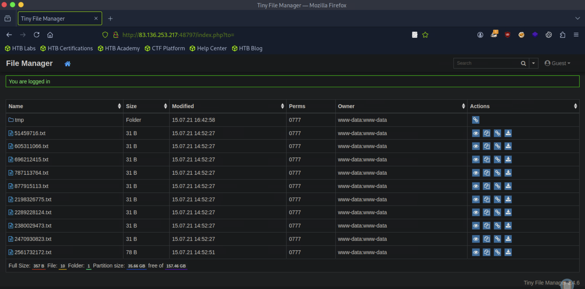
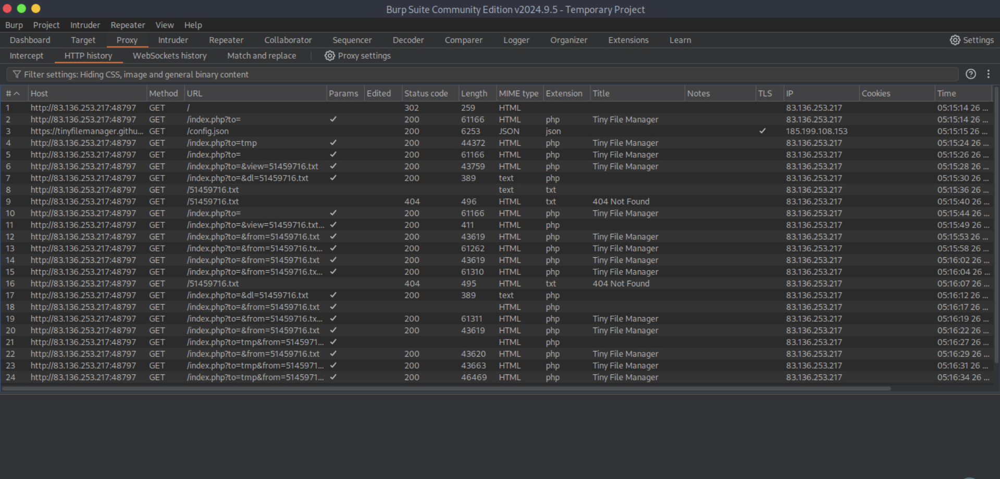
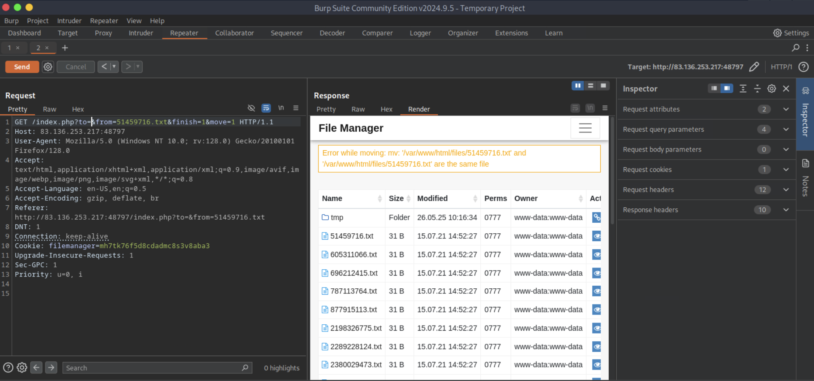
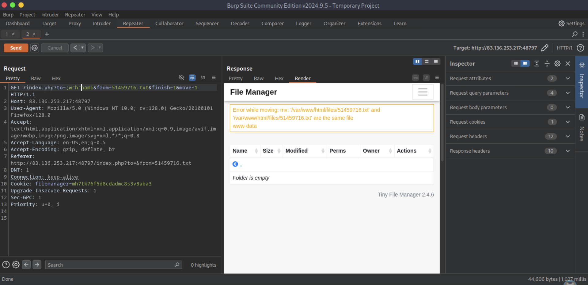
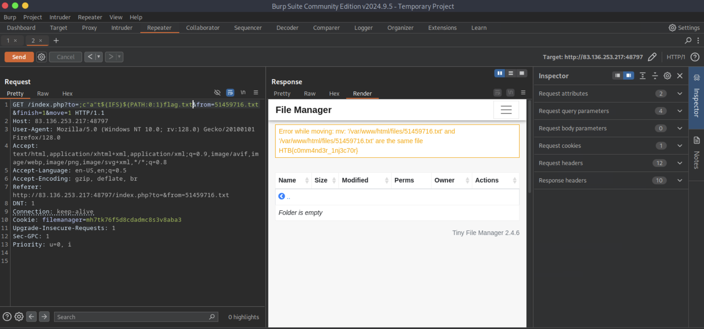

# [Command Injections](https://academy.hackthebox.com/module/details/109)

## Skills Assessment

You are contracted to perform a penetration test for a company, and through your pentest, you stumble upon an interesting file manager web application. As file managers tend to execute system commands, you are interested in testing for command injection vulnerabilities.

Use the various techniques presented in this module to detect a command injection vulnerability and then exploit it, evading any filters in place.

### Questions

#### Question #01

**Question**

What is the content of `/flag.txt`?












**Answer**

```
HTB{c0mm4nd3r_1nj3c70r}
```

---
---
