# [File Upload Attacks](https://academy.hackthebox.com/module/details/136)

## Skills Assessment

You are contracted to perform a penetration test for a company's e-commerce web application. The web application is in its early stages, so you will only be testing any file upload forms you can find.

Try to utilize what you learned in this module to understand how the upload form works and how to bypass various validations in place (if any) to gain remote code execution on the back-end server.

**Extra Exercise**

Try to note down the main security issues found with the web application and the necessary security measures to mitigate these issues and prevent further exploitation.

### Questions

#### Question #01

**Question**

Try to exploit the upload form to read the flag found at the root directory `/`.

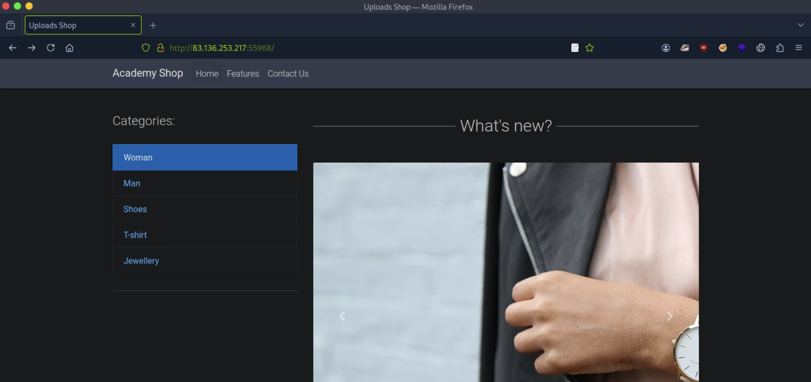

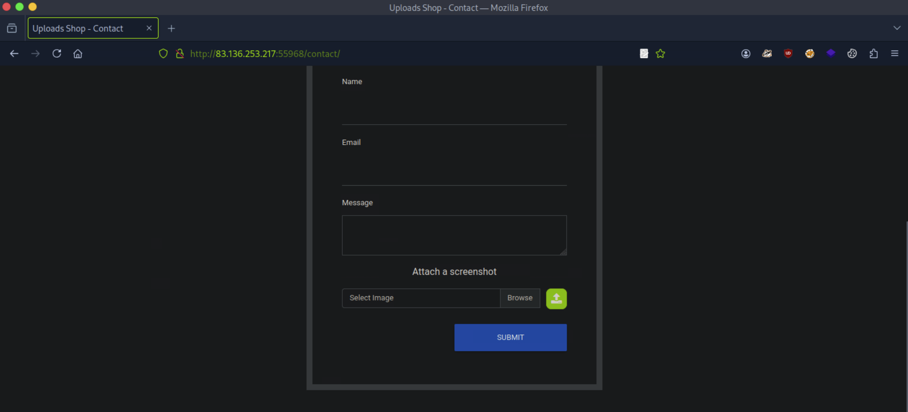

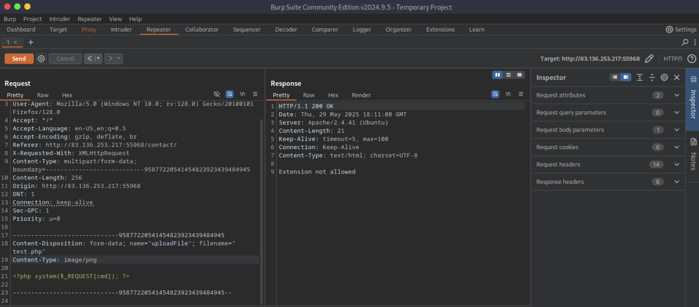

```
┌─[eu-academy-1]─[10.10.15.8]─[htb-ac-1461567@htb-w2arhmpril]─[~]
└──╼ [★]$ python3 -c "from PIL import Image; Image.new('RGBA', (1, 1), (0, 0, 0, 0)).save('test.png')"

┌─[eu-academy-1]─[10.10.15.8]─[htb-ac-1461567@htb-w2arhmpril]─[~]
└──╼ [★]$ file test.png 

test.png: PNG image data, 1 x 1, 8-bit/color RGBA, non-interlaced
```

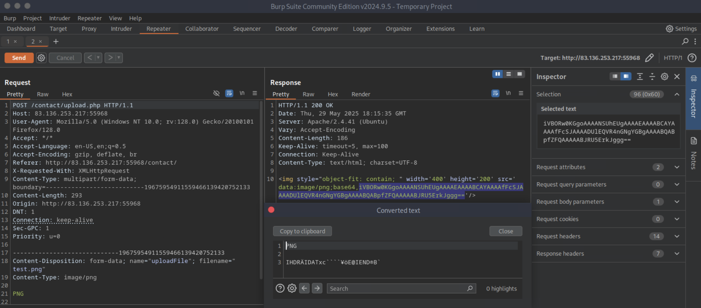

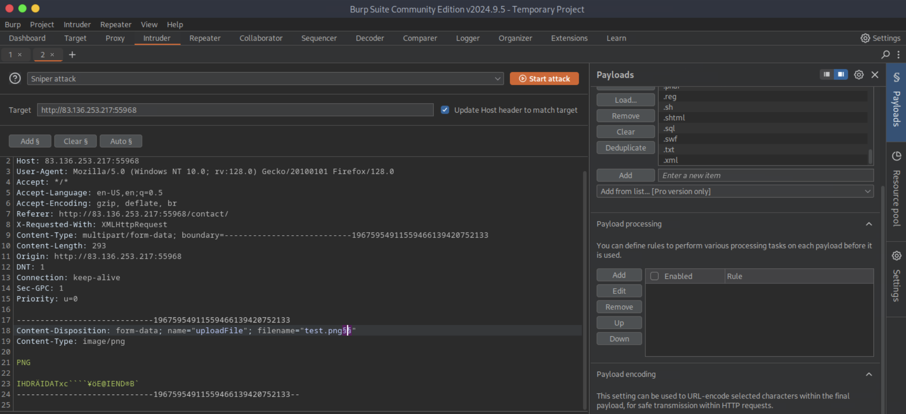

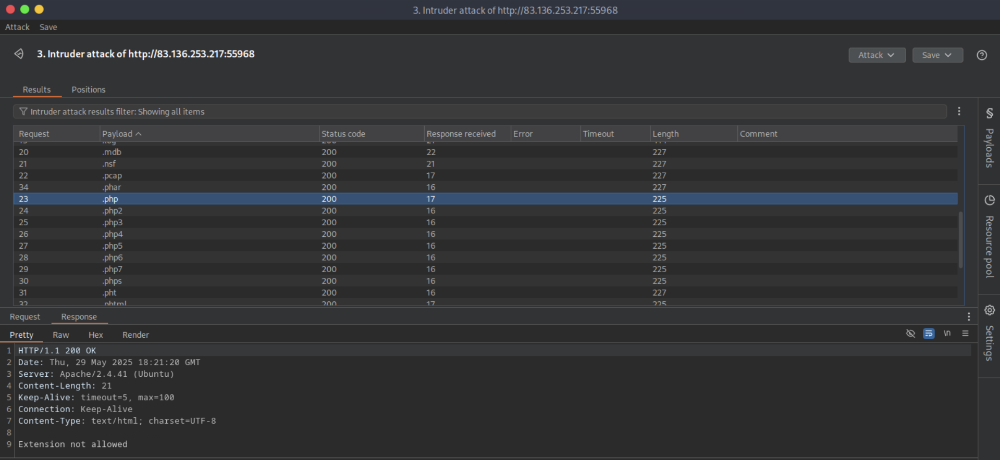

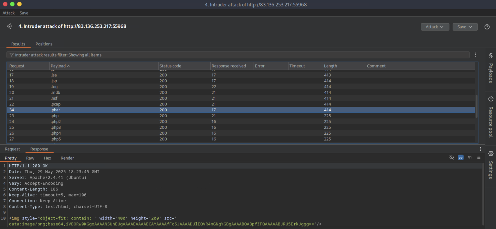

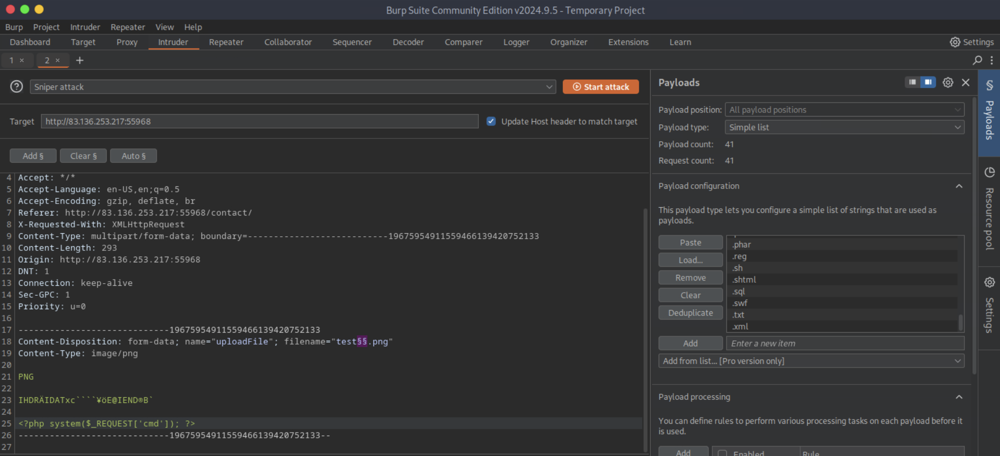

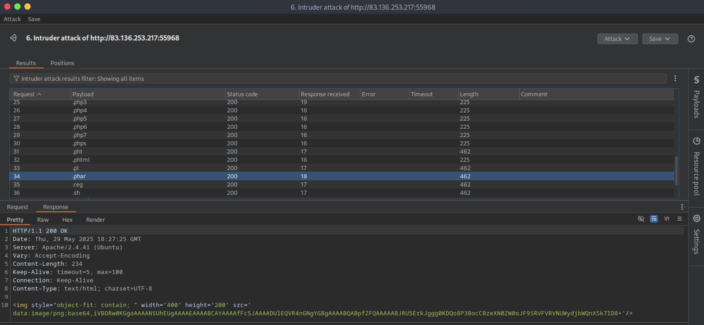

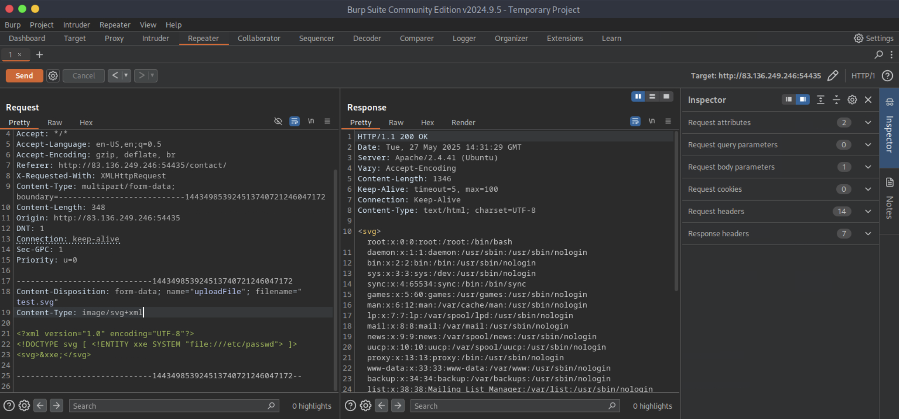

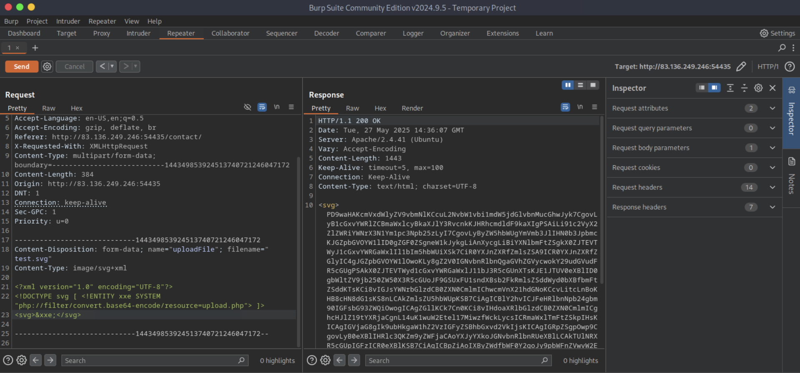

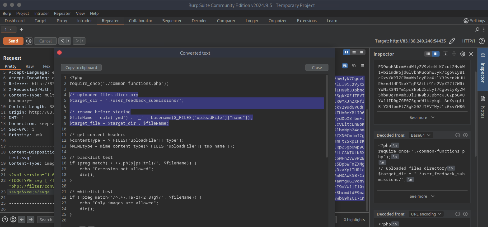

```php
<?php
require_once('./common-functions.php');

// uploaded files directory
$target_dir = "./user_feedback_submissions/";

// rename before storing
$fileName = date('ymd') . '_' . basename($_FILES["uploadFile"]["name"]);
$target_file = $target_dir . $fileName;

// get content headers
$contentType = $_FILES['uploadFile']['type'];
$MIMEtype = mime_content_type($_FILES['uploadFile']['tmp_name']);

// blacklist test
if (preg_match('/.+\.ph(p|ps|tml)/', $fileName)) {
    echo "Extension not allowed";
    die();
}

// whitelist test
if (!preg_match('/^.+\.[a-z]{2,3}g$/', $fileName)) {
    echo "Only images are allowed";
    die();
}

// type test
foreach (array($contentType, $MIMEtype) as $type) {
    if (!preg_match('/image\/[a-z]{2,3}g/', $type)) {
        echo "Only images are allowed";
        die();
    }
}

// size test
if ($_FILES["uploadFile"]["size"] > 500000) {
    echo "File too large";
    die();
}

if (move_uploaded_file($_FILES["uploadFile"]["tmp_name"], $target_file)) {
    displayHTMLImage($target_file);
} else {
    echo "File failed to upload";
}
```

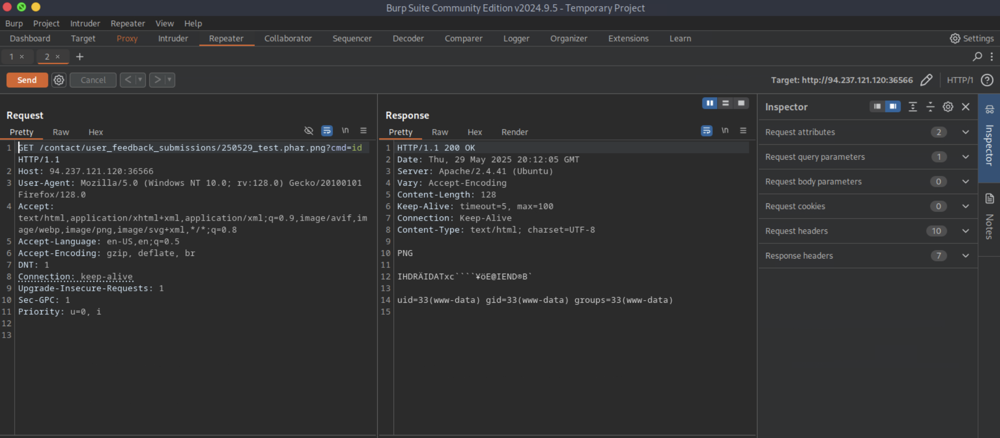

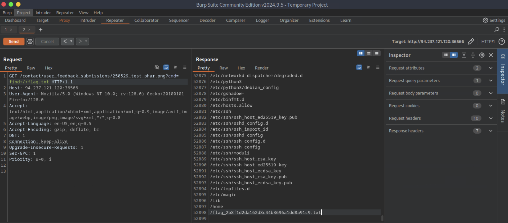

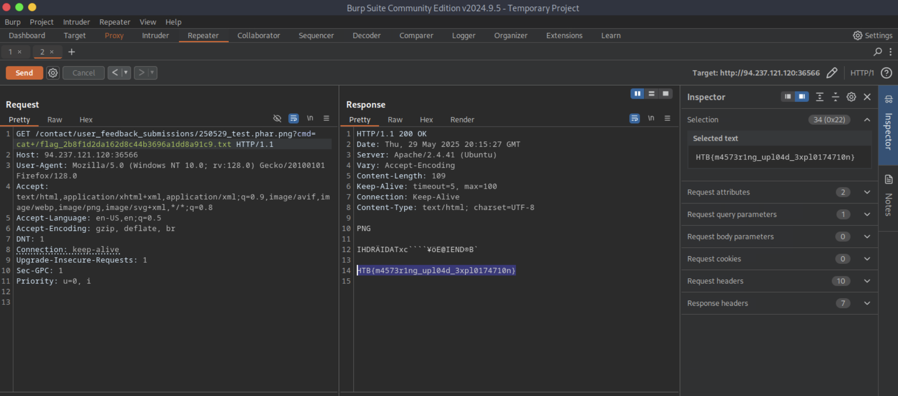

**Answer**

```
HTB{m4573r1ng_upl04d_3xpl0174710n}
```

---
---
