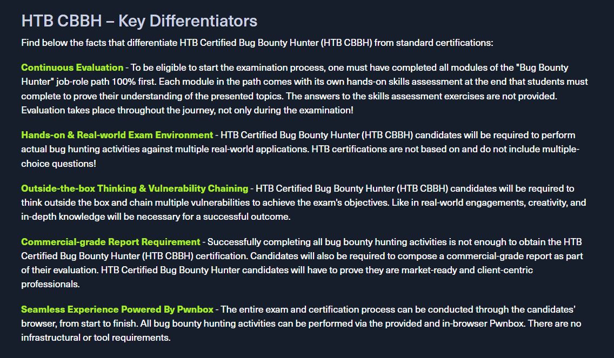

# Certified Bug Bounty Hunter (CBBH) - Study Material

	

## Introduction

This repository is dedicated to documenting my preparation for the **HTB Certified Bug Bounty Hunter (CBBH)** exam. It includes structured notes, methodology references, and practical walkthroughs focused on real-world bug bounty techniques and web application exploitation.

The content is aligned with the CBBH exam objectives, covering:
- **Bug bounty hunting processes and methodologies**
- **Information gathering and reconnaissance**
- **Static and dynamic analysis of web applications and APIs**
- **Manual and automated vulnerability discovery**
- **Exploitation of common vulnerability classes**
- **Vulnerability reporting and communication**

Each section is enriched with real examples, tool usage, request/response analysis, and exploitation steps to provide a hands-on learning experience. The goal is not only to pass the exam but also to develop a practical mindset for real-world bug bounty programs.

Whether you're preparing for the CBBH certification or seeking to improve your skills in web application security, this repository can serve as both a study guide and a technical reference throughout your journey into offensive web security.

## Learning Path Topics

### 01 Web Requests

This module introduces the topic of HTTP web requests and how different web applications utilize them to communicate with their backends.

### 02 Introduction to Web Applications

In the Introduction to Web Applications module, you will learn all of the basics of how web applications work and begin to look at them from an information security perspective.

### 03 [Using Web Proxies](./03_web_proxies.md)

Web application penetration testing frameworks are an essential part of any web penetration test. This module will teach you two of the best frameworks: Burp Suite and OWASP ZAP.

- [x] Web Proxy
- [x] Web Fuzzer
- [x] Web Scanner

### 04 [Information Gathering - Web Edition](./04_information_gathering_web.md)

This module equips learners with essential web reconnaissance skills, crucial for ethical hacking and penetration testing. It explores both active and passive techniques, including DNS enumeration, web crawling, analysis of web archives and HTTP headers, and fingerprinting web technologies.

- [x] WHOIS
- [x] DNS & Subdomains
- [x] Fingerprinting
- [x] Crawling
- [x] Search Engine Discovery
- [x] Web Archives
- [x] Automating Recon

### 05 [Attacking Web Applications with Ffuf](./05_attacking_web_applications_with_ffuf.md)

This module covers the fundamental enumeration skills of web fuzzing and directory brute forcing using the Ffuf tool. The techniques learned in this module will help us in locating hidden pages, directories, and parameters when targeting web applications.

- [x] Directory/Page Fuzzing
- [x] Domain Fuzzing
- [x] Parameter Fuzzing

### 06 [JavaScript Deobfuscation](./06_.md)

This module will take you step-by-step through the fundamentals of JavaScript Deobfuscation until you can deobfuscate basic JavaScript code and understand its purpose.

- [x] 

### 07 [Cross-Site Scripting (XSS)](./08_.md)

Cross-Site Scripting (XSS) vulnerabilities are among the most common web application vulnerabilities. An XSS vulnerability may allow an attacker to execute arbitrary JavaScript code within the target's browser and result in complete web application compromise if chained together with other vulnerabilities. This module will teach you how to identify XSS vulnerabilities and exploit them.

### 08 [SQL Injection Fundamentals](./08_.md)

Databases are an important part of web application infrastructure and SQL (Structured Query Language) to store, retrieve, and manipulate information stored in them. SQL injection is a code injection technique used to take advantage of coding vulnerabilities and inject SQL queries via an application to bypass authentication, retrieve data from the back-end database, or achieve code execution on the underlying server.

### 09 [SQLMap Essentials](./09_.md)

The SQLMap Essentials module will teach you the basics of using SQLMap to discover various types of SQL Injection vulnerabilities, all the way to the advanced enumeration of databases to retrieve all data of interest.

### 10 [Command Injections](./10_.md)

Command injection vulnerabilities can be leveraged to compromise a hosting server and its entire network. This module will teach you how to identify and exploit command injection vulnerabilities and how to use various filter bypassing techniques to avoid security mitigations.

### 11 [File Upload Attacks](./11_.md)

Arbitrary file uploads are among the most critical web vulnerabilities. These flaws enable attackers to upload malicious files, execute arbitrary commands on the back-end server, and even take control over the entire server and all web applications hosted on it and potentially gain access to sensitive data or cause a service disruption.

### 12 [Server-side Attacks](./12_.md)

A backend that handles user-supplied input insecurely can lead to devastating security vulnerabilities such as sensitive information disclosure and remote code execution. This module covers how to identify and exploit server-side bugs, including Server-Side Request Forgery (SSRF), Server-Side Template Injection (SSTI), and Server-Side Includes (SSI) injection attacks.

### 13 [Login Brute Forcing](./13_.md)

The module contains an exploration of brute-forcing techniques, including the use of tools like Hydra and Medusa, and the importance of strong password practices. It covers various attack scenarios, such as targeting SSH, FTP, and web login forms.

### 14 [Broken Authentication](./14_.md)

Authentication is probably the most straightforward and prevalent measure used to secure access to resources, and it's the first line of defense against unauthorized access. Broken authentication is listed as #7 on the 2021 OWASP Top 10 Web Application Security Risks, falling under the broader category of Identification and Authentication failures. A vulnerability or misconfiguration at the authentication stage can impact an application's overall security.

### 15 [Web Attacks](./15_.md)

This module covers three common web vulnerabilities, HTTP Verb Tampering, IDOR, and XXE, each of which can have a significant impact on a company's systems. We will cover how to identify, exploit, and prevent each of them through various methods.

### 16 [File Inclusion](./16_.md)

File Inclusion is a common web application vulnerability, which can be easily overlooked as part of a web application's functionality.

### 17 [Session Security](./17_.md)

Maintaining and keeping track of a user's session is an integral part of web applications. It is an area that requires extensive testing to ensure it is set up robustly and securely. This module covers the most common attacks and vulnerabilities that can affect web application sessions, such as Session Hijacking, Session Fixation, Cross-Site Request Forgery, Cross-Site Scripting, and Open Redirects.

### 18 [Web Service & API Attacks](./18_.md)

Web services and APIs are frequently exposed to provide certain functionalities in a programmatic way between heterogeneous devices and software components. Both web services and APIs can assist in integrating different applications or facilitate separation within a given application. This module covers how to identify the functionality a web service or API offers and exploit any security-related inefficiencies.

### 19 [Hacking WordPress](./19_.md)

WordPress is an open-source Content Management System (CMS) that can be used for multiple purposes.

## 20 Bug Bounty Hunting Process

Bug bounty programs encourage security researchers to identify bugs and submit vulnerability reports. Getting into the world of bug bounty hunting without any prior experience can be a daunting task, though. This module covers the bug bounty hunting process to help you start bug bounty hunting in an organized and well-structured way. It's all about effectiveness and professionally communicating your findings.

---

---
---
